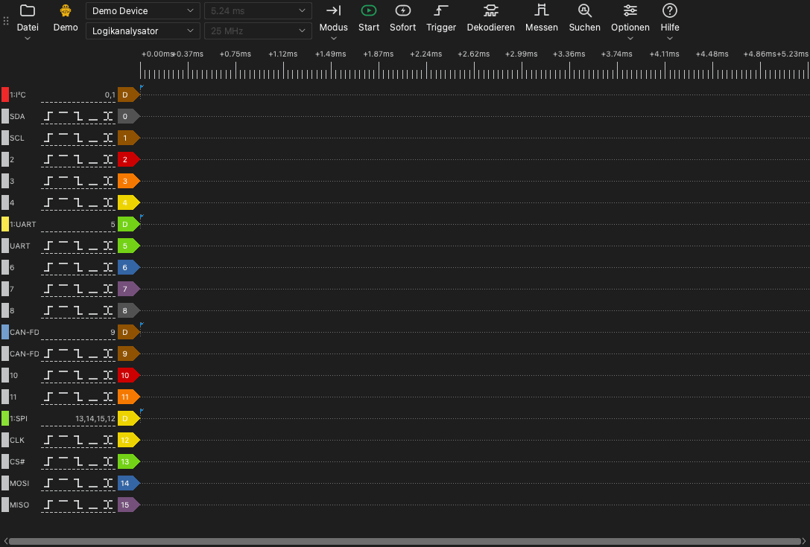

# Das Hauptfenster

## Teile des Hauptfensters

Das Hauptfenster hat diese Teile:

- **Symbolleiste.** Die Symbolleiste enthält die Bedienelemente für das Gerät, die Erfassung und die Werkzeuge.
- **Signalbereich.** Der Signalbereich zeigt eine Zeile für jeden Kanal. Über den Zeilen ist ein Zeitlineal.
- **Kanalbeschriftungen.** Eine Beschriftung links von jeder Zeile zeigt die Kanalnummer, den Namen und die Trigger-Schaltflächen.
- **Docks.** Ein Dock ist ein Bereich an der Seite des Signalbereichs. Die Werkzeuge für den Trigger, die Dekoder, die Messungen und die Suche öffnen sich in Docks.

## Die Symbolleiste

Die Symbolleiste hat diese Elemente, vom Anfang bis zum Ende:

| Element | Funktion |
| --- | --- |
| **Datei** | Ein Menü, um Daten zu öffnen, zu speichern und zu exportieren und um Sitzungen zu speichern. Siehe [Dateien und Sitzungen](12-files.md). |
| Gerätetyp | Eine Beschriftung, die die Verbindung zeigt: **USB 2.0**, **USB 3.0**, **Demo** oder **Datei**. |
| Geräteliste | Das Gerät, das die App verwendet. Wählen Sie hier ein anderes Gerät oder ein Demo-Gerät aus. |
| Gerätemodus | **Logikanalysator**, **Oszilloskop** oder **Datenerfassung**. Die Liste zeigt nur die Modi, die für das Gerät verfügbar sind. |
| Abtastdauer | Die Zeitdauer einer Erfassung. |
| Abtastrate | Die Anzahl der Abtastwerte pro Sekunde für jeden Kanal. |
| **Modus** | Der Erfassungsmodus: **Einzeln**, **Wiederholt** oder **Schleife**. |
| **Start** | Startet eine Erfassung. Während einer Erfassung wechselt diese Schaltfläche zu **Stopp**. |
| **Sofort** | Startet eine Erfassung, die nicht auf den Trigger wartet. |
| **Trigger** | Öffnet das Trigger-Dock. |
| **Dekodieren** | Öffnet das Dekoder-Dock. |
| **Messen** | Öffnet das Mess-Dock. |
| **Suchen** | Öffnet die Suchleiste. |
| **Optionen** | Ein Menü mit **Geräteoptionen...** und dem Menü **Anzeige**. |
| **Hilfe** | Ein Menü mit der Sprache, diesem Handbuch, der Update-Seite, den Log-Optionen und der Seite für Fehlerberichte. |

Die Beschriftung des Gerätetyps zeigt diese Werte:

- **USB 3.0**: Das Gerät verwendet eine USB-3.0-Verbindung.
- **USB 2.0**: Das Gerät verwendet eine USB-2.0-Verbindung. Wenn das Gerät eine USB-3.0-Verbindung hat, schließen Sie es an einen USB-3.0-Anschluss an. Eine USB-2.0-Verbindung verringert die maximale Abtastrate im Stream-Modus.
- **Demo**: Das Gerät ist ein Demo-Gerät. Das Demo-Gerät erzeugt Testsignale. Verwenden Sie es, um die Funktionen der App auszuprobieren.
- **Datei**: Die App zeigt Daten aus einer Datei. Es gibt kein Gerät.

## Tastenkürzel

| Taste | Funktion |
| --- | --- |
| `S` | Eine Erfassung starten oder stoppen. |
| `I` | Eine Sofort-Erfassung starten oder stoppen. Im Oszilloskop-Modus eine Erfassung ausführen und stoppen. |
| `T` | Das Trigger-Dock öffnen oder schließen. |
| `D` | Das Dekoder-Dock öffnen oder schließen. |
| `M` | Das Mess-Dock öffnen oder schließen. |
| `R` | Die Suchleiste öffnen oder schließen. |
| `O` | Das Fenster **Geräteoptionen** öffnen. |
| `Page Up` | Den Signalverlauf um eine Fensterbreite nach links bewegen. |
| `Page Down` | Den Signalverlauf um eine Fensterbreite nach rechts bewegen. |
| `←` | Vergrößern. |
| `→` | Verkleinern. |
| `0`, `1` | Im Oszilloskop-Modus den Skalenregler von Kanal 0 oder Kanal 1 auswählen oder freigeben. |
| `↑`, `↓` | Im Oszilloskop-Modus die vertikale Skala des ausgewählten Kanals ändern. |

Die Tastenkürzel funktionieren, wenn der Signalbereich den Tastaturfokus hat.
