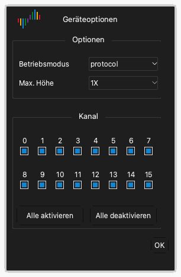

# Geräteoptionen

## Die Geräteoptionen öffnen

1. Klicken Sie in der Symbolleiste auf **Optionen** › **Geräteoptionen...**. Sie können auch `O` drücken.
2. Ändern Sie die Einstellungen im Fenster **Geräteoptionen**.
3. Klicken Sie auf **OK**.

Die Einstellungen im Fenster sind für jedes Gerätemodell anders. Dieses Kapitel beschreibt die Einstellungen des DSLogic Plus.

> [!NOTE]
> Sie können die Geräteoptionen während einer Erfassung nicht ändern.

## Betriebsmodus

Die Einstellung **Betriebsmodus** wählt aus, wie das Gerät Daten an den Computer sendet.

**Puffermodus.** Das Gerät speichert die Abtastwerte während der Erfassung in seinem internen Speicher. Nach der Erfassung sendet das Gerät die Daten über USB an den Computer. Der Speicher ist schneller als USB. Darum gibt der Puffermodus die höchsten Abtastraten. Die Kapazität des Speichers begrenzt die Länge der Erfassung. Verwenden Sie den Puffermodus für schnelle Signale und kurze Erfassungen.

**Stream-Modus.** Das Gerät sendet die Abtastwerte während der Erfassung an den Computer. Der Speicher des Computers begrenzt die Länge der Erfassung. Sie können die Daten während der Erfassung sehen. Die Geschwindigkeit der USB-Verbindung begrenzt die Abtastrate. Verwenden Sie den Stream-Modus für langsame Signale und lange Erfassungen.

**Interner Test.** Dieser Modus ist nur für Tests des Geräts. Verwenden Sie ihn nicht für Messungen.

## Stoppoptionen

Die Einstellung **Stoppoptionen** gilt nur für den Puffermodus. Sie legt fest, wie die App arbeitet, wenn Sie eine Erfassung vor dem Ende stoppen.

- **Sofort stoppen**: Die App holt die Daten nicht vom Gerät. Die App zeigt keine Daten.
- **Erfasste Daten hochladen**: Die App holt die Daten, die das Gerät vor dem Stopp aufgezeichnet hat. Die App zeigt diese Daten.

## Schwellenpegel

Die Einstellung **Schwellenpegel** ist die Spannung, die einen Low-Pegel von einem High-Pegel trennt. Ein Signal über der Schwelle ist ein High-Pegel. Ein Signal unter der Schwelle ist ein Low-Pegel.

Sie können einen Wert von 0,0 V bis 5,0 V in Schritten von 0,1 V einstellen. Stellen Sie die Schwelle auf etwa 50 % der Logikspannung der Schaltung ein. Für eine 3,3-V-Schaltung stellen Sie etwa 1,6 V ein.

## Filterziele

Die Einstellung **Filterziele** entfernt kurze Impulse aus den Daten.

- **Keine**: Die App zeigt alle Abtastwerte.
- **1 Abtasttakt**: Die App entfernt jeden Impuls, der kürzer als eine Abtastperiode ist.

## Maximale Höhe

Die Einstellung **Max. Höhe** legt die maximale Höhe jeder Kanalzeile im Signalbereich fest. **1X** ist eine Einheit der Höhe. Verwenden Sie einen größeren Wert, wenn Sie nur eine kleine Anzahl von Kanälen zeigen.

## RLE-Komprimierung aktivieren

Wenn Sie **RLE-Komprimierung aktivieren** auswählen, komprimiert das Gerät die Daten in seinem Speicher (Lauflängenkodierung). Diese Einstellung gilt nur für den Puffermodus. Wenn die Signale eine kleine Anzahl von Flanken haben, kann das Gerät eine längere Erfassung in seinem Speicher halten. Wenn die Signale viele Flanken haben, gibt die Komprimierung keine größere Länge.

## Externen Takt verwenden

Wenn Sie **Externen Takt verwenden** auswählen, tastet das Gerät die Kanäle bei jeder Taktflanke auf der Leitung CK ab. Das Gerät verwendet seinen internen Takt nicht. Verwenden Sie diese Einstellung, um einen Bus aufzuzeichnen, der ein Taktsignal hat.

## Fallende Taktflanke verwenden

Diese Einstellung gilt nur mit **Externen Takt verwenden**. Normalerweise tastet das Gerät die Kanäle bei der steigenden Flanke des Takts ab. Wenn Sie **Fallende Taktflanke verwenden** auswählen, tastet das Gerät die Kanäle bei der fallenden Flanke des Takts ab.

## Kanalmodus

Der Kanalmodus legt die Anzahl der Kanäle fest, die das Gerät verwenden kann. Er legt auch die maximale Abtastrate fest. Eine kleinere Anzahl von Kanälen gibt eine höhere maximale Abtastrate. Wählen Sie den Kanalmodus aus, der zur Anzahl und zur Frequenz Ihrer Signale passt.

Für das DSLogic Plus sind dies die Kanalmodi:

| Betriebsmodus | Kanalmodus | Maximale Abtastrate |
| --- | --- | --- |
| Puffermodus | Kanäle 0 bis 15 | 100 MHz |
| Puffermodus | Kanäle 0 bis 7 | 200 MHz |
| Puffermodus | Kanäle 0 bis 3 | 400 MHz |
| Stream-Modus | 16 Kanäle | 20 MHz |
| Stream-Modus | 12 Kanäle | 25 MHz |
| Stream-Modus | 6 Kanäle | 50 MHz |
| Stream-Modus | 3 Kanäle | 100 MHz |

## Kanäle aktivieren und deaktivieren

Unter den Kanalmodi zeigt das Fenster ein Kontrollkästchen für jeden Kanal.

1. Wählen Sie das Kontrollkästchen jedes Kanals aus, den Sie verwenden.
2. Deaktivieren Sie das Kontrollkästchen jedes Kanals, den Sie nicht verwenden.
3. Um alle Kanäle auszuwählen, klicken Sie auf **Alle ein**. Um alle Kanäle abzuwählen, klicken Sie auf **Alle aus**.

Im Stream-Modus kann eine kleinere Anzahl aktivierter Kanäle eine höhere Abtastrate ermöglichen.
