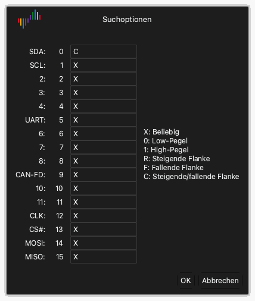

# Den Signalverlauf untersuchen

Nach einer Erfassung zeigt der Signalbereich die Daten jedes Kanals als Signalverlauf.

## Den Signalverlauf nach links oder rechts bewegen

Verwenden Sie eine dieser Methoden:

- **Ziehen.** Setzen Sie den Zeiger auf den Signalverlauf. Halten Sie die linke Maustaste gedrückt und bewegen Sie die Maus nach links oder rechts.
- **Schnelles Ziehen.** Ziehen Sie den Signalverlauf schnell und lassen Sie die Maustaste los. Der Signalverlauf bewegt sich weiter. Dann wird er langsamer und hält an. Um diese Funktion ein- oder auszuschalten, verwenden Sie **Signal durch Ziehen mit der Maus scrollen** in den Anzeigeoptionen. Siehe [Die App installieren und starten](02-install.md).
- **Bildlaufleiste.** Ziehen Sie die Bildlaufleiste am unteren Rand des Fensters.
- **Tastatur.** Drücken Sie `Page Up` oder `Page Down`. Der Signalverlauf bewegt sich um eine Fensterbreite.

## Vergrößern und verkleinern

Verwenden Sie eine dieser Methoden:

- **Mausrad.** Setzen Sie den Zeiger auf den Signalverlauf und drehen Sie das Mausrad. Der Zeiger bleibt in der Mitte des Zooms.
- **Bereichszoom.** Halten Sie die rechte Maustaste gedrückt und ziehen Sie über den Signalverlauf. Lassen Sie die Taste los. Die App vergrößert den Bereich, den Sie ausgewählt haben.
- **Gesamtansicht.** Doppelklicken Sie mit der rechten Maustaste auf den Signalverlauf. Die App zeigt alle Daten. Doppelklicken Sie erneut mit der rechten Maustaste, um zum vorherigen Zoom zurückzugehen.
- **Tastatur.** Drücken Sie `←`, um zu vergrößern. Drücken Sie `→`, um zu verkleinern.

## Ein Muster finden

Die Suche findet ein Muster aus Pegeln und Flanken auf den Kanälen.

1. Klicken Sie in der Symbolleiste auf **Suchen** oder drücken Sie `R`. Die Suchleiste öffnet sich am unteren Rand des Fensters.
2. Klicken Sie auf das Suchfeld. Das Fenster **Suchoptionen** öffnet sich.
3. Geben Sie für jeden Kanal eines der Zeichen `X`, `0`, `1`, `R`, `F` oder `C` ein. [Trigger](07-trigger.md) gibt die Funktion jedes Zeichens an.
4. Klicken Sie auf **OK**.
5. Klicken Sie auf die Pfeil-Schaltflächen in der Suchleiste, um zum vorherigen oder zum nächsten Ergebnis zu gehen.

Geben Sie zum Beispiel `C` für Kanal 0 und `X` für alle anderen Kanäle ein. Die Suche findet dann jede Flanke auf Kanal 0.

## Einen Kanal ändern

Jeder Kanal hat eine Beschriftung links im Signalbereich. Die Beschriftung zeigt die Farbe, den Namen und die Nummer des Kanals.

### Die Farbe ändern

1. Klicken Sie auf den Farbbereich der Kanalbeschriftung.
2. Wählen Sie eine Farbe aus.
3. Klicken Sie auf **OK**.

### Den Namen ändern

1. Klicken Sie auf den Namen in der Kanalbeschriftung.
2. Geben Sie einen neuen Namen ein.
3. Drücken Sie `Return`.

### Die Reihenfolge der Kanäle ändern

Wenn Sie den Zeiger auf eine Kanalbeschriftung setzen, zeigt der Zeiger einen Pfeil. Verwenden Sie eine dieser Methoden, um den Kanal zu verschieben:

- Halten Sie die linke Maustaste auf der Beschriftung gedrückt und ziehen Sie den Kanal nach oben oder unten. Lassen Sie die Taste an der neuen Position los.
- Klicken Sie auf die Beschriftung, um den Kanal auszuwählen. Bewegen Sie die Maus. Der Kanal bewegt sich mit der Maus. Klicken Sie erneut, um den Kanal an der neuen Position abzulegen.
- Halten Sie `Command` gedrückt und klicken Sie auf mehrere Beschriftungen. Bewegen Sie die Maus. Die ausgewählten Kanäle bewegen sich mit der Maus. Klicken Sie erneut, um sie abzulegen.
