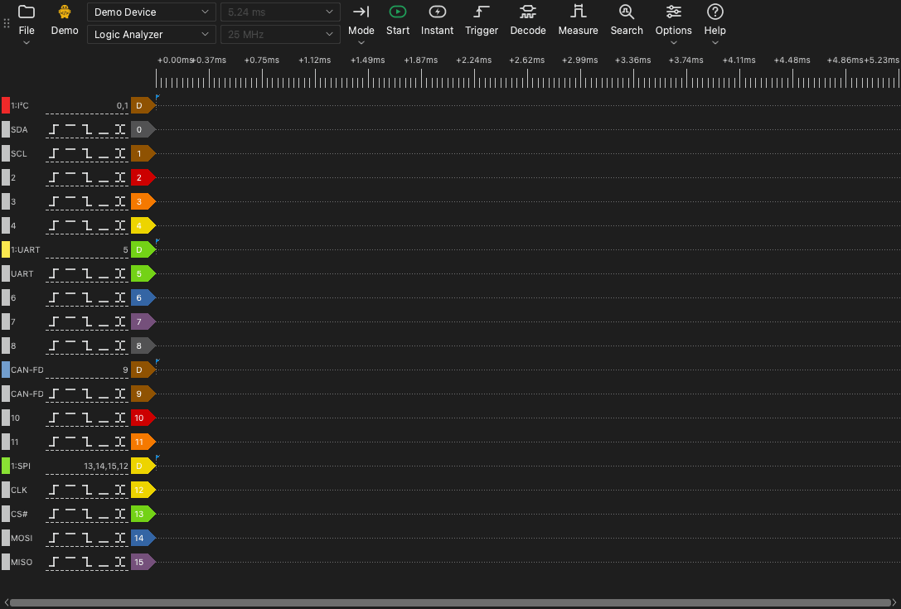

# The main window

## Parts of the main window

The main window has these parts:

- **Toolbar.** The toolbar has the controls for the device, the capture and the tools.
- **Waveform area.** The waveform area shows one row for each channel. A time ruler is above the rows.
- **Channel labels.** A label on the left of each row shows the channel number, the name and the trigger buttons.
- **Docks.** A dock is a panel at the side of the waveform area. The tools for the trigger, the decoders, the measurements and the search open in docks.

## The toolbar

The toolbar has these items, from the start to the end:

| Item | Function |
| --- | --- |
| **File** | A menu to open, save and export data and to save sessions. Refer to [Files and sessions](12-files.md). |
| Device type | A label that shows the connection: **USB 2.0**, **USB 3.0**, **Demo** or **File**. |
| Device list | The device that the app uses. Select a different device or a demo device here. |
| Device mode | **Logic Analyzer**, **Oscilloscope** or **Data Acquisition**. The list shows only the modes that are available for the device. |
| Sample duration | The time length of a capture. |
| Sample rate | The number of samples in each second, for each channel. |
| **Mode** | The capture mode: **Single**, **Repetitive** or **Loop**. |
| **Start** | Starts a capture. During a capture, this button changes to **Stop**. |
| **Instant** | Starts a capture that does not wait for the trigger. |
| **Trigger** | Opens the trigger dock. |
| **Decode** | Opens the decoder dock. |
| **Measure** | Opens the measurement dock. |
| **Search** | Opens the search bar. |
| **Options** | A menu with **Device Options...** and the **Display** menu. |
| **Help** | A menu with the language, this manual, the update page, the log options and the problem report page. |

The device type label shows these values:

- **USB 3.0**: The device uses a USB 3.0 connection.
- **USB 2.0**: The device uses a USB 2.0 connection. If the device has a USB 3.0 connection, connect it to a USB 3.0 port. A USB 2.0 connection decreases the maximum sample rate in stream mode.
- **Demo**: The device is a demo device. The demo device makes test signals. Use it to try the functions of the app.
- **File**: The app shows data from a file. There is no device.

## Keyboard shortcuts

| Key | Function |
| --- | --- |
| `S` | Start or stop a capture. |
| `I` | Start or stop an instant capture. In oscilloscope mode, do one capture and stop. |
| `T` | Open or close the trigger dock. |
| `D` | Open or close the decoder dock. |
| `M` | Open or close the measurement dock. |
| `R` | Open or close the search bar. |
| `O` | Open the **Device Options** window. |
| `Page Up` | Move the waveform one window width to the left. |
| `Page Down` | Move the waveform one window width to the right. |
| `←` | Zoom in. |
| `→` | Zoom out. |
| `0`, `1` | In oscilloscope mode, select or release the scale control of channel 0 or channel 1. |
| `↑`, `↓` | In oscilloscope mode, change the vertical scale of the selected channel. |

The shortcuts operate when the waveform area has the keyboard focus.
