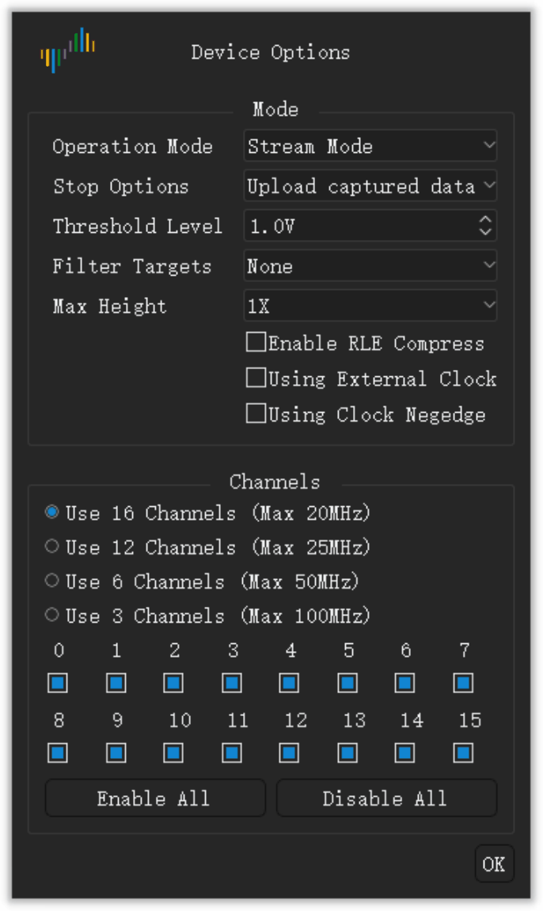

# Device options

## Open the device options

1. Click **Options** › **Device Options...** on the toolbar. You can also press `O`.
2. Change the settings in the **Device Options** window.
3. Click **OK**.

The settings in the window are different for each device model. This chapter gives the settings of the DSLogic Plus.

> [!NOTE]
> You cannot change the device options during a capture.

<!-- TODO: new screenshot -->

## Operation mode

The **Operation Mode** setting selects how the device sends data to the computer.

**Buffer Mode.** The device keeps the samples in its internal memory during the capture. After the capture, the device sends the data to the computer through USB. The memory is faster than USB. Thus, buffer mode gives the highest sample rates. The capacity of the memory limits the length of the capture. Use buffer mode for fast signals and short captures.

**Stream Mode.** The device sends the samples to the computer during the capture. The memory of the computer limits the length of the capture. You can see the data during the capture. The speed of the USB connection limits the sample rate. Use stream mode for slow signals and long captures.

**Internal Test.** This mode is for tests of the device only. Do not use it for measurements.

## Stop options

The **Stop Options** setting applies to buffer mode only. It sets how the app operates when you stop a capture before the end.

- **Stop immediately**: The app does not get the data from the device. The app shows no data.
- **Upload captured data**: The app gets the data that the device recorded before the stop. The app shows this data.

## Threshold level

The **Threshold Level** setting is the voltage that divides a low level from a high level. A signal above the threshold is a high level. A signal below the threshold is a low level.

You can set a value from 0.0 V to 5.0 V in steps of 0.1 V. Set the threshold to about 50% of the logic voltage of the circuit. For a 3.3 V circuit, set about 1.6 V.

## Filter targets

The **Filter Targets** setting removes short pulses from the data.

- **None**: The app shows all the samples.
- **1 Sample Clock**: The app removes each pulse that is shorter than one sample period.

## Max height

The **Max Height** setting sets the maximum height of each channel row in the waveform area. **1X** is one unit of height. Use a larger value when you show only a small number of channels.

## Enable RLE Compress

When you select **Enable RLE Compress**, the device compresses the data in its memory (run-length encoding). This setting applies to buffer mode only. If the signals have a small number of edges, the device can keep a longer capture in its memory. If the signals have many edges, the compression gives no increase in length.

## Using External Clock

When you select **Using External Clock**, the device samples the channels at each clock edge on the CK wire. The device does not use its internal clock. Use this setting to record a bus that has a clock signal.

## Using Clock Negedge

This setting applies only with **Using External Clock**. Usually, the device samples the channels on the rising edge of the clock. When you select **Using Clock Negedge**, the device samples the channels on the falling edge of the clock.

## Channel mode

The channel mode sets the number of channels that the device can use. It also sets the maximum sample rate. A smaller number of channels gives a higher maximum sample rate. Select the channel mode that agrees with the number and the frequency of your signals.

For the DSLogic Plus, the channel modes are:

| Operation mode | Channel mode | Maximum sample rate |
| --- | --- | --- |
| Buffer mode | Channels 0 to 15 | 100 MHz |
| Buffer mode | Channels 0 to 7 | 200 MHz |
| Buffer mode | Channels 0 to 3 | 400 MHz |
| Stream mode | 16 channels | 20 MHz |
| Stream mode | 12 channels | 25 MHz |
| Stream mode | 6 channels | 50 MHz |
| Stream mode | 3 channels | 100 MHz |

## Enable and disable channels

Below the channel modes, the window shows a check box for each channel.

1. Select the check box of each channel that you use.
2. Clear the check box of each channel that you do not use.
3. To select all the channels, click **Enable All**. To clear all the channels, click **Disable All**.

In stream mode, a smaller number of enabled channels can let you use a higher sample rate.
