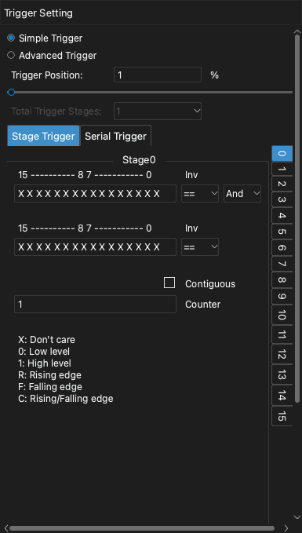
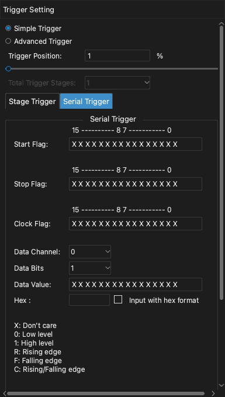

# Triggers

A trigger is a condition in the signals. When the condition occurs, the device marks that time as the trigger point. The trigger lets you capture the part of the signal that you want to examine.

The app has two types of trigger:

- **Simple Trigger**: An edge or a level on one or more channels.
- **Advanced Trigger**: A sequence of conditions, or a value on a serial bus.

To open the trigger dock, click **Trigger** on the toolbar or press `T`.

> [!NOTE]
> If the signal does not agree with the trigger condition, the capture continues to wait. To see the signal without the trigger, click **Instant**. To stop the wait, click **Stop**.

## Trigger position

The **Trigger Position** setting sets where the trigger point is in the capture. The value is a percentage of the sample duration.

- A small value, for example 10%, shows more of the signal after the trigger.
- A large value, for example 90%, shows more of the signal before the trigger.

The trigger position uses the memory of the device. Thus, you can set it only in buffer mode. In stream mode, the trigger position is always about 1%.

<!-- TODO: new screenshot -->

## Simple trigger

Each channel label in the waveform area has five trigger buttons. From left to right, the buttons are:

1. Rising edge
2. High level
3. Falling edge
4. Low level
5. Rising edge or falling edge

To set a simple trigger, do these steps:

1. Open the trigger dock.
2. Select **Simple Trigger**.
3. On the label of a channel, click the trigger button that you want. The button shows in a different color.
4. To remove the trigger from a channel, click the same button again.
5. Set the **Trigger Position**.

If you set a trigger on more than one channel, all the conditions must occur at the same sample (logical AND).

## Advanced trigger

> [!NOTE]
> The advanced trigger is available only in buffer mode. To use it, set **Operation Mode** to **Buffer Mode**. Refer to [Device options](05-device-options.md).

To use the advanced trigger, select **Advanced Trigger** in the trigger dock. Then select the **Stage Trigger** tab or the **Serial Trigger** tab.

### Values for each channel

The stage trigger and the serial trigger use a row of 16 characters. Each character is the condition for one channel. The character on the right is channel 0. The character on the left is channel 15.

| Character | Condition |
| --- | --- |
| `X` | All values (the channel has no effect). |
| `0` | Low level. |
| `1` | High level. |
| `R` | Rising edge. |
| `F` | Falling edge. |
| `C` | Rising edge or falling edge. |

### Stage trigger

A stage trigger is a sequence of conditions. Each condition is a stage. The device examines stage 0 first. When the condition of a stage occurs, the device goes to the next stage. The trigger occurs when the last stage is complete. You can use up to 16 stages.

Each stage has these settings:

- Two rows of channel conditions.
- For each row, `==` or `!=`. With `==`, the condition occurs when the channels agree with the row. With `!=`, the condition occurs when the channels do not agree with the row.
- **And** or **Or**. This setting connects the two rows.
- **Counter**: The number of times that the condition must occur before the stage is complete.
- **Contiguous**: When you select this check box, the condition must occur in samples that follow each other without a break.

To set a stage trigger, do these steps:

1. In **Total Trigger Stages**, select the number of stages.
2. In the list of stages on the right, click stage 0.
3. Type the channel conditions in the first row.
4. If necessary, type the channel conditions in the second row and select **And** or **Or**.
5. Type a value in **Counter**.
6. Do steps 2 to 5 again for each other stage.

These are three examples.

**Example 1.** Trigger when channel 0 stays high for more than 1000 samples:

1. Set **Total Trigger Stages** to 1.
2. In stage 0, type `1` for channel 0 in the first row.
3. Select **Contiguous**.
4. Set **Counter** to 1000.

**Example 2.** Trigger on a rising edge on channel 0 or a falling edge on channel 1:

1. Set **Total Trigger Stages** to 1.
2. In stage 0, type `R` for channel 0 in the first row.
3. Type `F` for channel 1 in the second row.
4. Select **Or**.

**Example 3.** Trigger on a rising edge on channel 0, then 100 falling edges on channel 1, then a high level on channel 2:

1. Set **Total Trigger Stages** to 3.
2. In stage 0, type `R` for channel 0.
3. In stage 1, type `F` for channel 1. Set **Counter** to 100.
4. In stage 2, type `1` for channel 2.

### Serial trigger

A serial trigger finds a data value on a serial bus. It operates as a shift register. These are the settings:

- **Start Flag**: The condition that starts the serial trigger.
- **Stop Flag**: The condition that clears the shift register.
- **Clock Flag**: The condition that adds one bit to the shift register.
- **Data Channel**: The channel that transmits the data.
- **Data Bits**: The number of bits in the value.
- **Data Value**: The value that causes the trigger.

After the start flag occurs, the device reads the data channel at each clock flag. The device moves this bit into the shift register. When the last bits of the shift register are equal to **Data Value**, the trigger occurs. When the stop flag occurs, the device clears the shift register.

**Example 4.** Trigger when the value `010000100` occurs on an I2C bus. Channel 0 is SCL and channel 1 is SDA.

1. Set **Start Flag** to a falling edge on SDA while SCL is high: `F1` in the two characters on the right.
2. Set **Stop Flag** to a rising edge on SDA while SCL is high: `R1`.
3. Set **Clock Flag** to a rising edge on SCL: `R` for channel 0.
4. Set **Data Channel** to 1.
5. Set **Data Bits** to 9.
6. Type `010000100` in **Data Value**.

**Example 5.** Trigger when the value `0x1234` occurs on MOSI of an SPI bus. Channel 0 is CS#, channel 1 is CLK, channel 2 is MISO and channel 3 is MOSI.

1. Set **Start Flag** to a falling edge on CS#: `F` for channel 0.
2. Set **Stop Flag** to a rising edge on CS#: `R` for channel 0.
3. Set **Clock Flag** to a rising edge on CLK: `R` for channel 1.
4. Set **Data Channel** to 3.
5. Set **Data Bits** to 16.
6. Type `0001001000110100` in **Data Value**.

To type the value in hexadecimal, select **Input with hex format**. Then type the value in the **Hex** field.
