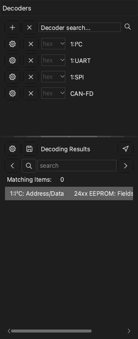

# Protocol decoders

A protocol decoder reads the data of a capture and finds the frames of a protocol, for example UART, I2C or SPI. The app shows the result as a new row above the channels. The app has more than 100 decoders.

To open the decoder dock, click **Decode** on the toolbar or press `D`. The dock has two parts:

- The decoder list, with the **Decoder search...** field at the top.
- The **Decoding Results** list. This list shows each item from the decoder as a row of text.

## Add a decoder

> [!NOTE]
> A decoder with the prefix `0:` is a smaller version. It does not show the bits. You cannot add a higher protocol on it. It decodes faster and uses less memory.

1. Click the **Decoder search...** field. The list of decoders opens.
2. Type a part of the protocol name, for example `I2C`. The list shows only the decoders that agree with the text.
3. Click the decoder. The **Decoder Options** window opens.
4. Set the channels of the protocol. For example, set **SCL** and **SDA** for I2C.
5. Set the protocol options, for example the baud rate of a UART.
6. Select the rows of results that the app shows.
7. If necessary, set the decode region. Refer to [Decode a part of the capture](#decode-region).
8. Click **OK**.

The app decodes the data and shows the results on a new row in the waveform area.

To add more decoders, do the procedure again for each decoder.

To change the settings of a decoder, click the settings button of that decoder in the dock.

## Add a stacked decoder

Some protocols use a lower protocol. For example, the 24xx EEPROM protocol uses I2C. When you add the higher protocol, the app also adds the lower protocols.

1. In the **Decoder search...** field, type the name of the higher protocol, for example `24xx`.
2. Click the decoder.
3. In the **Decoder Options** window, set the options for each protocol layer.
4. Click **OK**.

The results show the frames of the lower protocol and the commands and data of the higher protocol.

## Decode a part of the capture {#decode-region}

Usually, the app decodes all the data. To decode only a part, set a start cursor and an end cursor. For example, you can ignore the noise at a reset of the circuit. A shorter area also decreases the decode time.

1. Add two cursors at the start and at the end of the area. Refer to [Measurements](10-measure.md).
2. Open the **Decoder Options** window of the decoder.
3. In the **Start** list, select the start cursor.
4. In the **End** list, select the end cursor.
5. Click **OK**.

## Read the results list

The **Decoding Results** list shows the items from the decoder in time sequence. Click a row to move the waveform to that item.

To change the columns that the list shows, click the settings button at the top of the list.

## Find a text in the results

1. Type a text in the search field of the **Decoding Results** list.
2. Click the right arrow to go to the next row that contains the text. Click the left arrow to go to the previous row.

The waveform moves to the item of each row that the search finds. If you click a row first, the search starts at that row.

To find a sequence of bytes, put the sign `-` between the bytes. For example, `70-70-70` finds three bytes with the value 70 that follow each other.

> [!NOTE]
> The search for a sequence of bytes operates only with the UART, I2C and SPI decoders.

## Export the results

1. Click the save button at the top of the **Decoding Results** list. The **Protocol Export** window opens.
2. In **Export Format**, select CSV or TXT.
3. Select each column that you want to export. The app puts all the columns in one file, in time sequence.
4. Click **OK**.
5. Select the folder and type the file name.
6. Click **Save**.

## Delete a decoder

- To delete one decoder, click the **×** button on the row of that decoder.
- To delete all the decoders, click the **×** button at the top of the dock, next to the **+** button.
