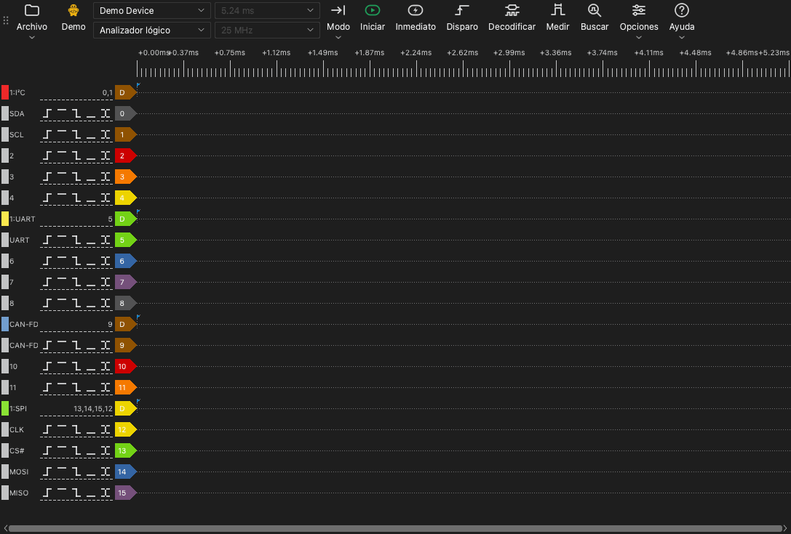

# La ventana principal

## Partes de la ventana principal

La ventana principal tiene estas partes:

- **Barra de herramientas.** La barra de herramientas tiene los controles del dispositivo, de la captura y de las herramientas.
- **Área de formas de onda.** El área de formas de onda muestra una fila para cada canal. Una regla de tiempo está encima de las filas.
- **Etiquetas de canal.** Una etiqueta a la izquierda de cada fila muestra el número del canal, el nombre y los botones de disparo.
- **Paneles.** Un panel es una zona al lado del área de formas de onda. Las herramientas de disparo, decodificación, medición y búsqueda se abren en paneles.

## La barra de herramientas

La barra de herramientas tiene estos elementos, del principio al final:

| Elemento | Función |
| --- | --- |
| **Archivo** | Un menú para abrir, guardar y exportar datos y para guardar sesiones. Consulte [Archivos y sesiones](12-files.md). |
| Tipo de dispositivo | Una etiqueta que muestra la conexión: **USB 2.0**, **USB 3.0**, **Demo** o **Archivo**. |
| Lista de dispositivos | El dispositivo que usa la aplicación. Seleccione aquí otro dispositivo o un dispositivo de demostración. |
| Modo del dispositivo | **Analizador lógico**, **Osciloscopio** o **Adquisición de datos**. La lista muestra solo los modos disponibles para el dispositivo. |
| Duración de muestreo | La duración de una captura. |
| Frecuencia de muestreo | El número de muestras por segundo, para cada canal. |
| **Modo** | El modo de captura: **Único**, **Repetitivo** o **Bucle**. |
| **Iniciar** | Inicia una captura. Durante una captura, este botón cambia a **Detener**. |
| **Inmediato** | Inicia una captura que no espera el disparo. |
| **Disparo** | Abre el panel de disparo. |
| **Decodificar** | Abre el panel de decodificadores. |
| **Medir** | Abre el panel de medición. |
| **Buscar** | Abre la barra de búsqueda. |
| **Opciones** | Un menú con **Opciones del dispositivo...** y el menú **Pantalla**. |
| **Ayuda** | Un menú con el idioma, este manual, la página de actualizaciones, las opciones de registro y la página para informar de problemas. |

La etiqueta del tipo de dispositivo muestra estos valores:

- **USB 3.0**: El dispositivo usa una conexión USB 3.0.
- **USB 2.0**: El dispositivo usa una conexión USB 2.0. Si el dispositivo tiene una conexión USB 3.0, conéctelo a un puerto USB 3.0. Una conexión USB 2.0 reduce la frecuencia de muestreo máxima en modo Stream.
- **Demo**: El dispositivo es un dispositivo de demostración. El dispositivo de demostración produce señales de prueba. Úselo para probar las funciones de la aplicación.
- **Archivo**: La aplicación muestra los datos de un archivo. No hay ningún dispositivo.

## Atajos de teclado

| Tecla | Función |
| --- | --- |
| `S` | Iniciar o detener una captura. |
| `I` | Iniciar o detener una captura inmediata. En modo osciloscopio, hacer una captura y detener. |
| `T` | Abrir o cerrar el panel de disparo. |
| `D` | Abrir o cerrar el panel de decodificadores. |
| `M` | Abrir o cerrar el panel de medición. |
| `R` | Abrir o cerrar la barra de búsqueda. |
| `O` | Abrir la ventana **Opciones del dispositivo**. |
| `Page Up` | Mover la forma de onda un ancho de ventana hacia la izquierda. |
| `Page Down` | Mover la forma de onda un ancho de ventana hacia la derecha. |
| `←` | Acercar. |
| `→` | Alejar. |
| `0`, `1` | En modo osciloscopio, seleccionar o liberar el control de escala del canal 0 o del canal 1. |
| `↑`, `↓` | En modo osciloscopio, cambiar la escala vertical del canal seleccionado. |

Los atajos funcionan cuando el área de formas de onda tiene el foco del teclado.
