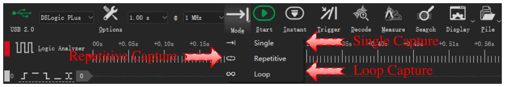

# Capturar datos

Antes de iniciar una captura, ajuste estos elementos:

1. Las opciones del dispositivo. Consulte [Opciones del dispositivo](05-device-options.md).
2. La frecuencia y la duración de muestreo. Consulte [Frecuencia y duración de muestreo](06-sample-rate.md).
3. El disparo, si es necesario. Consulte [Disparos](07-trigger.md).
4. El modo de captura. Consulte [Modos de captura](#capture-modes).

## Iniciar una captura

Hay dos tipos de captura:

- **Iniciar** inicia una captura estándar. El dispositivo espera el disparo si ajustó un disparo.
- **Inmediato** inicia una captura de inmediato. El dispositivo no usa los ajustes de disparo.

Para iniciar una captura estándar, haga clic en **Iniciar** o pulse `S`. Para iniciar una captura inmediata, haga clic en **Inmediato** o pulse `I`. Durante una captura, el botón cambia a **Detener**. Haga clic en **Detener** para detener la captura.

### Secuencia de una captura estándar en modo Buffer

1. Usted hace clic en **Iniciar**.
2. La aplicación envía los ajustes al dispositivo.
3. Si no hay disparo, el dispositivo empieza a registrar de inmediato. Si hay un disparo, el dispositivo espera el disparo.
4. El dispositivo registra hasta el final de la duración de muestreo o hasta que su memoria está llena.
5. El dispositivo envía los datos al ordenador.
6. La aplicación muestra la forma de onda en el área de formas de onda.

### Secuencia de una captura estándar en modo Stream

1. Usted hace clic en **Iniciar**.
2. La aplicación envía los ajustes al dispositivo.
3. Si hay un disparo, el dispositivo espera el disparo. En modo bucle, el dispositivo no usa el disparo.
4. El dispositivo envía los datos al ordenador durante la captura.
5. La aplicación muestra la forma de onda durante la captura.
6. La captura se detiene al final de la duración de muestreo. En modo bucle, la captura continúa hasta que usted hace clic en **Detener**.

## Usar la captura inmediata

La captura inmediata es igual que la captura estándar, pero no usa los ajustes de disparo. Úsela en estos casos:

- La captura estándar espera mucho tiempo porque la condición de disparo no ocurre.
- Quiere ver las señales en este momento.
- Quiere examinar las señales antes de cambiar el disparo.

Si no hay señal, una captura estándar espera en la posición del disparo. El estado muestra **¡Esperando disparo!**. Una captura inmediata registra las señales de inmediato.

## Modos de captura {#capture-modes}

Para seleccionar el modo de captura, haga clic en **Modo** en la barra de herramientas. Después, seleccione uno de estos elementos:

| Modo de captura | Modo Buffer | Modo Stream |
| --- | --- | --- |
| **Único** | Sí | Sí |
| **Repetitivo** | Sí | Sí |
| **Bucle** | No | Sí |

<!-- TODO: new screenshot -->

### Único

El dispositivo hace una captura. Después, la captura se detiene.

En modo Buffer, la aplicación muestra la forma de onda después de la captura. En modo Stream, la aplicación muestra la forma de onda durante la captura.

Use este modo para capturar una condición de señal o la forma de onda en este momento.

### Repetitivo

El dispositivo hace una captura. Después, inicia la captura siguiente automáticamente. Esto continúa hasta que usted hace clic en **Detener**.

En modo Buffer, la aplicación muestra una ventana para el intervalo entre capturas. Puede ajustar un valor de 0,1 s a 10 s.

Use este modo para ver una condición de señal que ocurre muchas veces. Por ejemplo, úselo para ver las señales después de cada reinicio del circuito o después de cada pulsación de un botón. Úselo junto con un disparo.

### Bucle

Este modo solo está disponible en modo Stream. La captura continúa hasta que usted hace clic en **Detener**. Cuando los datos son más largos que la duración de muestreo, los primeros datos salen de la ventana por la izquierda. Los datos más recientes entran por la derecha. La aplicación descarta los datos que salen.

Use este modo cuando no sabe el momento de la condición de señal. Mire la forma de onda durante la captura. Cuando vea la condición, haga clic en **Detener**.

> [!NOTE]
> En modo bucle, el dispositivo no usa los ajustes de disparo.

## Estado de la captura

Durante una captura, el área de formas de onda muestra el estado:

- **¡Esperando disparo!**: El dispositivo espera la condición de disparo.
- **¡Disparado!**: El disparo ocurrió.
- **% capturado**: El porcentaje de la captura que está completo.

Después de una captura, la parte de abajo del área de formas de onda muestra **Hora del disparo**.
