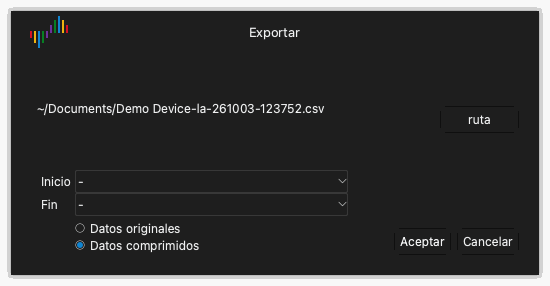

# Archivos y sesiones

Haga clic en **Archivo** en la barra de herramientas para abrir el menú de archivos. El menú tiene estos elementos:

- **Config.**: un menú para cargar y guardar sesiones.
- **Abrir...**: abrir un archivo de datos.
- **Guardar...**: guardar los datos de la captura.
- **Exportar...**: exportar los datos a otro formato.
- **Captura de pantalla...**: guardar una imagen de la ventana.

## Sesiones

Un archivo de sesión contiene los ajustes, pero no los datos de la captura. Una sesión incluye las opciones del dispositivo, los canales activados, los nombres y colores de los canales y los ajustes de disparo. Un archivo de sesión tiene la extensión `.dsc`.

### Guardar una sesión

1. Haga clic en **Archivo** › **Config.** › **Guardar sesión**.
2. Seleccione la carpeta y escriba el nombre del archivo.
3. Haga clic en **Guardar**.

### Cargar una sesión

1. Haga clic en **Archivo** › **Config.** › **Cargar sesión**.
2. Seleccione el archivo de sesión.
3. Haga clic en **Abrir**.

### Volver a los ajustes iniciales

Haga clic en **Archivo** › **Config.** › **Cargar sesión por defecto**. La aplicación pone todos los ajustes del dispositivo en sus valores iniciales.

La aplicación guarda los ajustes automáticamente cuando usted sale. Cuando inicia la aplicación otra vez, carga los ajustes de la última sesión.

## Guardar los datos

1. Haga clic en **Archivo** › **Guardar...**.
2. Seleccione la carpeta y escriba el nombre del archivo.
3. Haga clic en **Guardar**.

La aplicación guarda los datos y los ajustes en un archivo con la extensión `.dsl`. Puede abrir este archivo otra vez en Logic Analyze.

> [!CAUTION]
> La aplicación no guarda los datos automáticamente. Guarde los datos antes de iniciar una captura nueva o de salir de la aplicación. Una captura nueva sustituye los datos de la captura anterior.

## Abrir un archivo de datos

1. Haga clic en **Archivo** › **Abrir...**.
2. Seleccione un archivo con la extensión `.dsl`.
3. Haga clic en **Abrir**.

La aplicación muestra los datos en el área de formas de onda. La etiqueta del tipo de dispositivo muestra **Archivo**.

## Exportar los datos

La exportación crea un archivo que otros programas pueden leer.

1. Haga clic en **Archivo** › **Exportar...**. Se abre la ventana **Exportar**.
2. Haga clic en **ruta**.
3. Seleccione la carpeta, escriba el nombre del archivo y seleccione el formato.
4. Haga clic en **Guardar**.
5. Si el formato es CSV, seleccione **Datos originales** o **Datos comprimidos**. Los datos comprimidos contienen una fila solo para cada cambio de valor.
6. Haga clic en **OK**.

En modo analizador lógico, estos formatos están disponibles:

| Formato | Extensión | Uso |
| --- | --- | --- |
| CSV | `.csv` | Hojas de cálculo y scripts. |
| VCD | `.vcd` | Programas de formas de onda, por ejemplo GTKWave. |
| Gnuplot | `.gnuplot` | El programa Gnuplot. |
| srzip | `.srzip` | Programas de sigrok, por ejemplo PulseView. |

En modo osciloscopio y en modo adquisición de datos, solo está disponible CSV.

## Guardar una imagen de la ventana

1. Haga clic en **Archivo** › **Captura de pantalla...**.
2. Seleccione la carpeta y escriba el nombre del archivo.
3. Seleccione PNG o JPEG.
4. Haga clic en **Guardar**.
