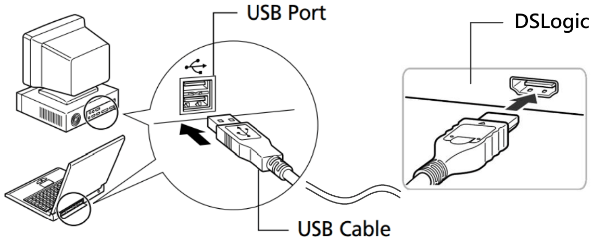
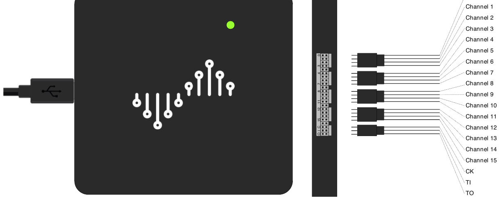
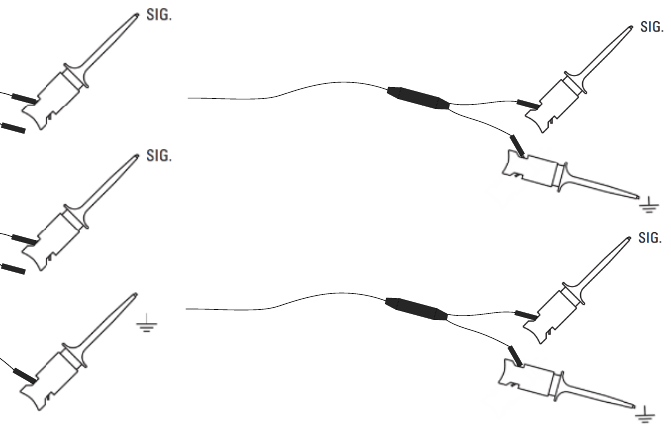

# Connecter le DSLogic Plus

## Connecter le câble USB

> [!NOTE]
> Utilisez le câble USB fourni avec l'appareil ou un câble USB court de bonne qualité. Connectez le câble directement à un port de l'ordinateur. Un concentrateur USB ou un câble long peut provoquer des erreurs dans une capture.

1. Connectez le câble USB au DSLogic Plus.
2. Connectez l'autre extrémité du câble USB à un port USB de l'ordinateur.
3. Vérifiez que le voyant du DSLogic Plus s'allume. Avant le démarrage de l'application, le voyant est rouge.
4. Démarrez Logic Analyze.
5. Vérifiez que le voyant devient vert.
6. Vérifiez que la liste des appareils de la barre d'outils affiche **DSLogic Plus**.

Si la liste des appareils n'affiche pas l'appareil, faites ces étapes :

1. Débranchez le câble USB de l'ordinateur.
2. Attendez 5 secondes.
3. Connectez le câble USB à un autre port USB.
4. Si la liste des appareils n'affiche pas l'appareil après l'étape 3, quittez l'application et démarrez-la de nouveau.

> [!NOTE]
> Un seul programme à la fois peut utiliser l'appareil. Si `dslcap` ou un autre programme utilise l'appareil, l'application ne le trouve pas.

## Connecter le câble de sondes

Le câble de sondes a 16 fils de voie. Chaque fil de voie a un blindage, une extrémité de signal et une extrémité de masse. Les couleurs des fils identifient les voies 0 à 15. Un fil supplémentaire porte ces signaux :

- **CK** : L'entrée d'une horloge externe. Utilisez-la uniquement avec le paramètre **Utiliser l'horloge externe**.
- **TI** : L'entrée d'un signal de déclenchement externe.
- **TO** : La sortie du signal de déclenchement. L'appareil envoie une impulsion sur TO quand le déclenchement se produit.

En général, vous ne connectez pas les fils CK, TI et TO.

1. Connectez le câble de sondes au connecteur d'entrée du DSLogic Plus.
2. Enfoncez complètement le connecteur dans l'appareil.

## Connecter les voies au circuit

> [!WARNING]
> Ne connectez pas les sondes à la tension du secteur. Ne connectez pas les sondes à un circuit qui a une connexion électrique avec la tension du secteur. La tension peut provoquer des blessures ou la mort.

> [!CAUTION]
> Avant de connecter un fil de masse, vérifiez que la masse du circuit et la masse de l'ordinateur ont la même tension. Une différence de tension peut provoquer un courant élevé qui peut endommager l'équipement.

1. Coupez l'alimentation du circuit que vous mesurez.
2. Connectez au moins un fil de masse à la masse du circuit.
3. Connectez chaque fil de voie que vous utilisez à un signal du circuit.
4. Vérifiez qu'aucune sonde ne touche un autre contact.
5. Rétablissez l'alimentation du circuit.

Pour les signaux d'une fréquence inférieure à 5 MHz, un seul fil de masse pour toutes les voies suffit. Pour les signaux d'une fréquence plus élevée, connectez l'extrémité de masse de chaque fil de voie à la masse près de son signal. Des connexions de masse courtes donnent des fronts de signal propres.

## Déconnecter le DSLogic Plus

> [!CAUTION]
> Ne débranchez pas le câble USB pendant une capture. Si vous le débranchez, les données de la capture peuvent contenir des erreurs.

1. Arrêtez la capture. Cliquez sur **Arrêter** si ce bouton est affiché dans la barre d'outils.
2. Coupez l'alimentation du circuit.
3. Déconnectez les sondes du circuit.
4. Débranchez le câble USB.
