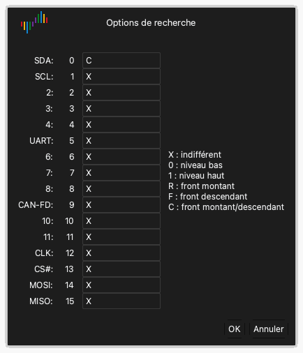

# Examiner la forme d'onde

Après une capture, la zone des formes d'onde affiche les données de chaque voie sous forme de forme d'onde.

## Déplacer la forme d'onde vers la gauche ou vers la droite

Utilisez une de ces méthodes :

- **Glisser.** Placez le pointeur sur la forme d'onde. Maintenez le bouton gauche de la souris enfoncé et déplacez la souris vers la gauche ou vers la droite.
- **Glisser rapide.** Faites glisser la forme d'onde rapidement et relâchez le bouton de la souris. La forme d'onde continue à se déplacer. Ensuite, elle ralentit et s'arrête. Pour activer ou désactiver cette fonction, utilisez **Défilement de la forme d'onde par glisser** dans les options d'affichage. Consultez [Installer et démarrer l'application](02-install.md).
- **Barre de défilement.** Faites glisser la barre de défilement en bas de la fenêtre.
- **Clavier.** Appuyez sur `Page Up` ou `Page Down`. La forme d'onde se déplace d'une largeur de fenêtre.

## Zoom avant et zoom arrière

Utilisez une de ces méthodes :

- **Molette de la souris.** Placez le pointeur sur la forme d'onde et tournez la molette de la souris. Le pointeur reste au centre du zoom.
- **Zoom sur une zone.** Maintenez le bouton droit de la souris enfoncé et faites-le glisser sur la forme d'onde. Relâchez le bouton. L'application fait un zoom avant sur la zone sélectionnée.
- **Vue complète.** Double-cliquez sur la forme d'onde avec le bouton droit de la souris. L'application affiche toutes les données. Double-cliquez de nouveau avec le bouton droit de la souris pour revenir au zoom précédent.
- **Clavier.** Appuyez sur `←` pour un zoom avant. Appuyez sur `→` pour un zoom arrière.

## Trouver un motif

La recherche trouve un motif de niveaux et de fronts sur les voies.

1. Cliquez sur **Chercher** dans la barre d'outils ou appuyez sur `R`. La barre de recherche s'ouvre en bas de la fenêtre.
2. Cliquez dans le champ de recherche. La fenêtre **Options de recherche** s'ouvre.
3. Pour chaque voie, saisissez un des caractères `X`, `0`, `1`, `R`, `F` ou `C`. [Déclenchements](07-trigger.md) donne la fonction de chaque caractère.
4. Cliquez sur **OK**.
5. Cliquez sur les boutons fléchés de la barre de recherche pour aller au résultat précédent ou au résultat suivant.

Par exemple, saisissez `C` pour la voie 0 et `X` pour toutes les autres voies. La recherche trouve alors chaque front de la voie 0.

## Modifier une voie

Chaque voie a une étiquette à gauche de la zone des formes d'onde. L'étiquette affiche la couleur, le nom et le numéro de la voie.

### Changer la couleur

1. Cliquez sur la zone de couleur de l'étiquette de voie.
2. Sélectionnez une couleur.
3. Cliquez sur **OK**.

### Changer le nom

1. Cliquez sur le nom dans l'étiquette de voie.
2. Saisissez un nouveau nom.
3. Appuyez sur `Return`.

### Changer l'ordre des voies

Quand vous placez le pointeur sur une étiquette de voie, le pointeur affiche une flèche. Utilisez une de ces méthodes pour déplacer la voie :

- Maintenez le bouton gauche de la souris enfoncé sur l'étiquette et faites glisser la voie vers le haut ou vers le bas. Relâchez le bouton à la nouvelle position.
- Cliquez sur l'étiquette pour sélectionner la voie. Déplacez la souris. La voie se déplace avec la souris. Cliquez de nouveau pour relâcher la voie à la nouvelle position.
- Maintenez `Command` enfoncée et cliquez sur plusieurs étiquettes. Déplacez la souris. Les voies sélectionnées se déplacent avec la souris. Cliquez de nouveau pour les relâcher.
