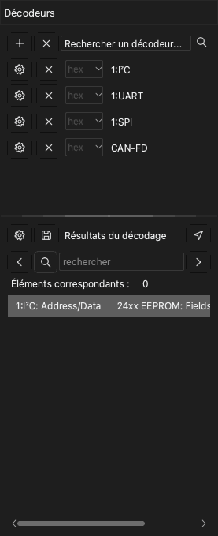

# Décodeurs de protocole

Un décodeur de protocole lit les données d'une capture et trouve les trames d'un protocole, par exemple UART, I2C ou SPI. L'application affiche le résultat sur une nouvelle ligne au-dessus des voies. L'application a plus de 100 décodeurs.

Pour ouvrir le panneau des décodeurs, cliquez sur **Décoder** dans la barre d'outils ou appuyez sur `D`. Le panneau a deux parties :

- La liste des décodeurs, avec le champ **Rechercher un décodeur...** en haut.
- La liste **Résultats du décodage**. Cette liste affiche chaque élément du décodeur sur une ligne de texte.

## Ajouter un décodeur

> [!NOTE]
> Un décodeur avec le préfixe `0:` est une version réduite. Il n'affiche pas les bits. Vous ne pouvez pas ajouter un protocole de niveau supérieur sur ce décodeur. Il décode plus vite et utilise moins de mémoire.

1. Cliquez dans le champ **Rechercher un décodeur...**. La liste des décodeurs s'ouvre.
2. Saisissez une partie du nom du protocole, par exemple `I2C`. La liste affiche uniquement les décodeurs qui correspondent au texte.
3. Cliquez sur le décodeur. La fenêtre **Options du décodeur** s'ouvre.
4. Réglez les voies du protocole. Par exemple, réglez **SCL** et **SDA** pour I2C.
5. Réglez les options du protocole, par exemple le débit en bauds d'un UART.
6. Sélectionnez les lignes de résultats que l'application affiche.
7. Si nécessaire, réglez la zone de décodage. Consultez [Décoder une partie de la capture](#decode-region).
8. Cliquez sur **OK**.

L'application décode les données et affiche les résultats sur une nouvelle ligne dans la zone des formes d'onde.

Pour ajouter d'autres décodeurs, refaites la procédure pour chaque décodeur.

Pour changer les paramètres d'un décodeur, cliquez sur le bouton des paramètres de ce décodeur dans le panneau.

## Ajouter un décodeur empilé

Certains protocoles utilisent un protocole de niveau inférieur. Par exemple, le protocole 24xx EEPROM utilise I2C. Quand vous ajoutez le protocole de niveau supérieur, l'application ajoute aussi les protocoles de niveau inférieur.

1. Dans le champ **Rechercher un décodeur...**, saisissez le nom du protocole de niveau supérieur, par exemple `24xx`.
2. Cliquez sur le décodeur.
3. Dans la fenêtre **Options du décodeur**, réglez les options de chaque couche de protocole.
4. Cliquez sur **OK**.

Les résultats affichent les trames du protocole de niveau inférieur et les commandes et données du protocole de niveau supérieur.

## Décoder une partie de la capture {#decode-region}

En général, l'application décode toutes les données. Pour décoder seulement une partie, réglez un curseur de début et un curseur de fin. Par exemple, vous pouvez ignorer le bruit lors d'une réinitialisation du circuit. Une zone plus courte diminue aussi le temps de décodage.

1. Ajoutez deux curseurs au début et à la fin de la zone. Consultez [Mesures](10-measure.md).
2. Ouvrez la fenêtre **Options du décodeur** du décodeur.
3. Dans la liste **Début**, sélectionnez le curseur de début.
4. Dans la liste **Fin**, sélectionnez le curseur de fin.
5. Cliquez sur **OK**.

## Lire la liste des résultats

La liste **Résultats du décodage** affiche les éléments du décodeur dans l'ordre chronologique. Cliquez sur une ligne pour déplacer la forme d'onde sur cet élément.

Pour changer les colonnes de la liste, cliquez sur le bouton des paramètres en haut de la liste.

## Trouver un texte dans les résultats

1. Saisissez un texte dans le champ de recherche de la liste **Résultats du décodage**.
2. Cliquez sur la flèche droite pour aller à la ligne suivante qui contient le texte. Cliquez sur la flèche gauche pour aller à la ligne précédente.

La forme d'onde se déplace sur l'élément de chaque ligne que la recherche trouve. Si vous cliquez d'abord sur une ligne, la recherche commence à cette ligne.

Pour trouver une suite d'octets, placez le signe `-` entre les octets. Par exemple, `70-70-70` trouve trois octets consécutifs de valeur 70.

> [!NOTE]
> La recherche d'une suite d'octets fonctionne uniquement avec les décodeurs UART, I2C et SPI.

## Exporter les résultats

1. Cliquez sur le bouton d'enregistrement en haut de la liste **Résultats du décodage**. La fenêtre **Exportation du protocole** s'ouvre.
2. Dans **Format d'exportation**, sélectionnez CSV ou TXT.
3. Sélectionnez chaque colonne à exporter. L'application place toutes les colonnes dans un seul fichier, dans l'ordre chronologique.
4. Cliquez sur **OK**.
5. Sélectionnez le dossier et saisissez le nom du fichier.
6. Cliquez sur **Enregistrer**.

## Supprimer un décodeur

- Pour supprimer un décodeur, cliquez sur le bouton **×** de la ligne de ce décodeur.
- Pour supprimer tous les décodeurs, cliquez sur le bouton **×** en haut du panneau, à côté du bouton **+**.
