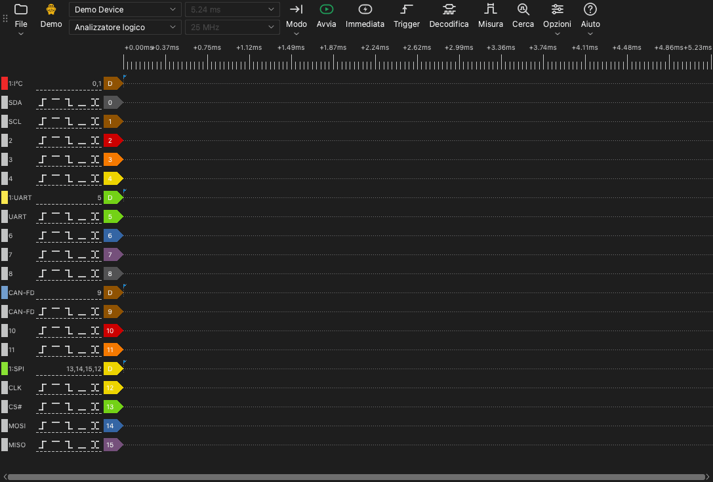

# La finestra principale

## Parti della finestra principale

La finestra principale ha queste parti:

- **Barra degli strumenti.** La barra degli strumenti contiene i comandi per il dispositivo, l'acquisizione e gli strumenti.
- **Area delle forme d'onda.** L'area delle forme d'onda mostra una riga per ogni canale. Sopra le righe c'è un righello del tempo.
- **Etichette dei canali.** Un'etichetta a sinistra di ogni riga mostra il numero del canale, il nome e i pulsanti di trigger.
- **Pannelli.** Un pannello è una zona a lato dell'area delle forme d'onda. Gli strumenti per il trigger, i decodificatori, le misure e la ricerca si aprono nei pannelli.

## La barra degli strumenti

La barra degli strumenti contiene questi elementi, dall'inizio alla fine:

| Elemento | Funzione |
| --- | --- |
| **File** | Un menu per aprire, salvare ed esportare dati e per salvare sessioni. Vedere [File e sessioni](12-files.md). |
| Tipo di dispositivo | Un'etichetta che mostra il collegamento: **USB 2.0**, **USB 3.0**, **Demo** o **File**. |
| Elenco dei dispositivi | Il dispositivo che l'applicazione usa. Selezionare qui un altro dispositivo o un dispositivo demo. |
| Modalità del dispositivo | **Analizzatore logico**, **Oscilloscopio** o **Acquisizione dati**. L'elenco mostra solo le modalità disponibili per il dispositivo. |
| Durata di campionamento | La durata di un'acquisizione. |
| Frequenza di campionamento | Il numero di campioni al secondo, per ogni canale. |
| **Modo** | La modalità di acquisizione: **Singola**, **Ripetuta** o **Loop**. |
| **Avvia** | Avvia un'acquisizione. Durante un'acquisizione, questo pulsante diventa **Arresta**. |
| **Immediata** | Avvia un'acquisizione che non attende il trigger. |
| **Trigger** | Apre il pannello del trigger. |
| **Decodifica** | Apre il pannello dei decodificatori. |
| **Misura** | Apre il pannello delle misure. |
| **Cerca** | Apre la barra di ricerca. |
| **Opzioni** | Un menu con **Opzioni dispositivo...** e il menu **Display**. |
| **Aiuto** | Un menu con la lingua, questo manuale, la pagina degli aggiornamenti, le opzioni log e la pagina per segnalare problemi. |

L'etichetta del tipo di dispositivo mostra questi valori:

- **USB 3.0**: Il dispositivo usa un collegamento USB 3.0.
- **USB 2.0**: Il dispositivo usa un collegamento USB 2.0. Se il dispositivo ha un collegamento USB 3.0, collegarlo a una porta USB 3.0. Un collegamento USB 2.0 riduce la frequenza di campionamento massima in modalità streaming.
- **Demo**: Il dispositivo è un dispositivo demo. Il dispositivo demo genera segnali di prova. Usarlo per provare le funzioni dell'applicazione.
- **File**: L'applicazione mostra i dati di un file. Non c'è alcun dispositivo.

## Scorciatoie da tastiera

| Tasto | Funzione |
| --- | --- |
| `S` | Avviare o arrestare un'acquisizione. |
| `I` | Avviare o arrestare un'acquisizione immediata. In modalità oscilloscopio, eseguire un'acquisizione e arrestare. |
| `T` | Aprire o chiudere il pannello del trigger. |
| `D` | Aprire o chiudere il pannello dei decodificatori. |
| `M` | Aprire o chiudere il pannello delle misure. |
| `R` | Aprire o chiudere la barra di ricerca. |
| `O` | Aprire la finestra **Opzioni dispositivo**. |
| `Page Up` | Spostare la forma d'onda a sinistra di una larghezza di finestra. |
| `Page Down` | Spostare la forma d'onda a destra di una larghezza di finestra. |
| `←` | Ingrandire. |
| `→` | Ridurre. |
| `0`, `1` | In modalità oscilloscopio, selezionare o rilasciare il comando di scala del canale 0 o del canale 1. |
| `↑`, `↓` | In modalità oscilloscopio, cambiare la scala verticale del canale selezionato. |

Le scorciatoie funzionano quando l'area delle forme d'onda ha il focus della tastiera.
