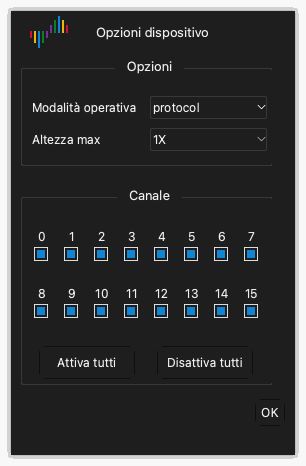

# Opzioni del dispositivo

## Aprire le opzioni del dispositivo

1. Fare clic su **Opzioni** › **Opzioni dispositivo...** nella barra degli strumenti. È anche possibile premere `O`.
2. Cambiare le impostazioni nella finestra **Opzioni dispositivo**.
3. Fare clic su **OK**.

Le impostazioni della finestra sono diverse per ogni modello di dispositivo. Questo capitolo dà le impostazioni del DSLogic Plus.

> [!NOTE]
> Non è possibile cambiare le opzioni del dispositivo durante un'acquisizione.

## Modalità operativa

L'impostazione **Modalità operativa** seleziona come il dispositivo invia i dati al computer.

**Modalità buffer.** Il dispositivo conserva i campioni nella sua memoria interna durante l'acquisizione. Dopo l'acquisizione, il dispositivo invia i dati al computer tramite USB. La memoria è più veloce dell'USB. Per questo la modalità buffer dà le frequenze di campionamento più alte. La capacità della memoria limita la lunghezza dell'acquisizione. Usare la modalità buffer per segnali veloci e acquisizioni brevi.

**Modalità streaming.** Il dispositivo invia i campioni al computer durante l'acquisizione. La memoria del computer limita la lunghezza dell'acquisizione. È possibile vedere i dati durante l'acquisizione. La velocità del collegamento USB limita la frequenza di campionamento. Usare la modalità streaming per segnali lenti e acquisizioni lunghe.

**Test interno.** Questa modalità serve solo per i test del dispositivo. Non usarla per le misure.

## Opzioni di arresto

L'impostazione **Opzioni di arresto** si applica solo alla modalità buffer. Definisce come funziona l'applicazione quando si arresta un'acquisizione prima della fine.

- **Arresta subito**: L'applicazione non riceve i dati dal dispositivo. L'applicazione non mostra dati.
- **Trasferisci i dati acquisiti**: L'applicazione riceve i dati che il dispositivo ha registrato prima dell'arresto. L'applicazione mostra questi dati.

## Livello di soglia

L'impostazione **Livello di soglia** è la tensione che separa un livello basso da un livello alto. Un segnale sopra la soglia è un livello alto. Un segnale sotto la soglia è un livello basso.

È possibile impostare un valore da 0,0 V a 5,0 V a passi di 0,1 V. Impostare la soglia a circa il 50% della tensione logica del circuito. Per un circuito a 3,3 V, impostare circa 1,6 V.

## Impostazioni filtro

L'impostazione **Impostazioni filtro** rimuove gli impulsi brevi dai dati.

- **Nessuno**: L'applicazione mostra tutti i campioni.
- **1 ciclo di campionamento**: L'applicazione rimuove ogni impulso più breve di un periodo di campionamento.

## Altezza massima

L'impostazione **Altezza max** definisce l'altezza massima di ogni riga di canale nell'area delle forme d'onda. **1X** è un'unità di altezza. Usare un valore più grande quando si mostra solo un piccolo numero di canali.

## Abilita compressione RLE

Quando si seleziona **Abilita compressione RLE**, il dispositivo comprime i dati nella sua memoria (codifica run-length). Questa impostazione si applica solo alla modalità buffer. Se i segnali hanno pochi fronti, il dispositivo può conservare un'acquisizione più lunga nella sua memoria. Se i segnali hanno molti fronti, la compressione non aumenta la lunghezza.

## Usa clock esterno

Quando si seleziona **Usa clock esterno**, il dispositivo campiona i canali a ogni fronte di clock sul filo CK. Il dispositivo non usa il suo clock interno. Usare questa impostazione per registrare un bus che ha un segnale di clock.

## Usa fronte di discesa del clock

Questa impostazione si applica solo con **Usa clock esterno**. Di solito il dispositivo campiona i canali sul fronte di salita del clock. Quando si seleziona **Usa fronte di discesa del clock**, il dispositivo campiona i canali sul fronte di discesa del clock.

## Modalità canali

La modalità canali definisce il numero di canali che il dispositivo può usare. Definisce anche la frequenza di campionamento massima. Un numero minore di canali dà una frequenza di campionamento massima più alta. Selezionare la modalità canali adatta al numero e alla frequenza dei segnali.

Per il DSLogic Plus, le modalità canali sono:

| Modalità operativa | Modalità canali | Frequenza di campionamento massima |
| --- | --- | --- |
| Modalità buffer | Canali da 0 a 15 | 100 MHz |
| Modalità buffer | Canali da 0 a 7 | 200 MHz |
| Modalità buffer | Canali da 0 a 3 | 400 MHz |
| Modalità streaming | 16 canali | 20 MHz |
| Modalità streaming | 12 canali | 25 MHz |
| Modalità streaming | 6 canali | 50 MHz |
| Modalità streaming | 3 canali | 100 MHz |

## Attivare e disattivare i canali

Sotto le modalità canali, la finestra mostra una casella di controllo per ogni canale.

1. Selezionare la casella di ogni canale usato.
2. Deselezionare la casella di ogni canale non usato.
3. Per selezionare tutti i canali, fare clic su **Attiva tutti**. Per deselezionare tutti i canali, fare clic su **Disattiva tutti**.

In modalità streaming, un numero minore di canali attivi può permettere di usare una frequenza di campionamento più alta.
