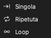

# Acquisire dati

Prima di avviare un'acquisizione, impostare questi elementi:

1. Le opzioni del dispositivo. Vedere [Opzioni del dispositivo](05-device-options.md).
2. La frequenza e la durata di campionamento. Vedere [Frequenza e durata di campionamento](06-sample-rate.md).
3. Il trigger, se necessario. Vedere [Trigger](07-trigger.md).
4. La modalità di acquisizione. Vedere [Modalità di acquisizione](#capture-modes).

## Avviare un'acquisizione

Ci sono due tipi di acquisizione:

- **Avvia** avvia un'acquisizione standard. Il dispositivo attende il trigger se è impostato un trigger.
- **Immediata** avvia subito un'acquisizione. Il dispositivo non usa le impostazioni del trigger.

Per avviare un'acquisizione standard, fare clic su **Avvia** o premere `S`. Per avviare un'acquisizione immediata, fare clic su **Immediata** o premere `I`. Durante un'acquisizione, il pulsante diventa **Arresta**. Fare clic su **Arresta** per arrestare l'acquisizione.

### Sequenza di un'acquisizione standard in modalità buffer

1. L'utente fa clic su **Avvia**.
2. L'applicazione invia le impostazioni al dispositivo.
3. Se non c'è un trigger, il dispositivo inizia subito a registrare. Se c'è un trigger, il dispositivo attende il trigger.
4. Il dispositivo registra fino alla fine della durata di campionamento o fino a quando la sua memoria è piena.
5. Il dispositivo invia i dati al computer.
6. L'applicazione mostra la forma d'onda nell'area delle forme d'onda.

### Sequenza di un'acquisizione standard in modalità streaming

1. L'utente fa clic su **Avvia**.
2. L'applicazione invia le impostazioni al dispositivo.
3. Se c'è un trigger, il dispositivo attende il trigger. In modalità loop, il dispositivo non usa il trigger.
4. Il dispositivo invia i dati al computer durante l'acquisizione.
5. L'applicazione mostra la forma d'onda durante l'acquisizione.
6. L'acquisizione si arresta alla fine della durata di campionamento. In modalità loop, l'acquisizione continua fino a quando l'utente fa clic su **Arresta**.

## Usare l'acquisizione immediata

L'acquisizione immediata è uguale all'acquisizione standard, ma non usa le impostazioni del trigger. Usarla in questi casi:

- L'acquisizione standard attende a lungo perché la condizione di trigger non si verifica.
- Si vogliono vedere i segnali in questo momento.
- Si vogliono esaminare i segnali prima di cambiare il trigger.

Se non c'è segnale, un'acquisizione standard attende alla posizione del trigger. Lo stato mostra **In attesa del trigger!**. Un'acquisizione immediata registra subito i segnali.

## Modalità di acquisizione {#capture-modes}

Per selezionare la modalità di acquisizione, fare clic su **Modo** nella barra degli strumenti. Poi selezionare uno di questi elementi:

| Modalità di acquisizione | Modalità buffer | Modalità streaming |
| --- | --- | --- |
| **Singola** | Sì | Sì |
| **Ripetuta** | Sì | Sì |
| **Loop** | No | Sì |

### Singola

Il dispositivo esegue un'acquisizione. Poi l'acquisizione si arresta.

In modalità buffer, l'applicazione mostra la forma d'onda dopo l'acquisizione. In modalità streaming, l'applicazione mostra la forma d'onda durante l'acquisizione.

Usare questa modalità per acquisire una condizione di segnale o la forma d'onda in questo momento.

### Ripetuta

Il dispositivo esegue un'acquisizione. Poi avvia automaticamente l'acquisizione successiva. Questo continua fino a quando l'utente fa clic su **Arresta**.

In modalità buffer, l'applicazione mostra una finestra per l'intervallo tra le acquisizioni. È possibile impostare un valore da 0,1 s a 10 s.

Usare questa modalità per vedere una condizione di segnale che si verifica molte volte. Per esempio, usarla per vedere i segnali dopo ogni reset del circuito o dopo ogni pressione di un pulsante. Usarla insieme a un trigger.

### Loop

Questa modalità è disponibile solo in modalità streaming. L'acquisizione continua fino a quando l'utente fa clic su **Arresta**. Quando i dati sono più lunghi della durata di campionamento, i primi dati escono dalla finestra a sinistra. I dati più recenti entrano a destra. L'applicazione elimina i dati che escono.

Usare questa modalità quando non si conosce il momento della condizione di segnale. Guardare la forma d'onda durante l'acquisizione. Quando si vede la condizione, fare clic su **Arresta**.

> [!NOTE]
> In modalità loop, il dispositivo non usa le impostazioni del trigger.

## Stato dell'acquisizione

Durante un'acquisizione, l'area delle forme d'onda mostra lo stato:

- **In attesa del trigger!**: Il dispositivo attende la condizione di trigger.
- **Trigger avvenuto!**: Il trigger si è verificato.
- **% acquisito**: La percentuale dell'acquisizione completata.

Dopo un'acquisizione, la parte in basso dell'area delle forme d'onda mostra **Tempo di trigger**.
