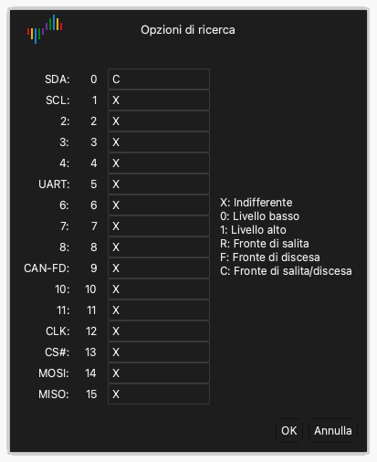

# Esaminare la forma d'onda

Dopo un'acquisizione, l'area delle forme d'onda mostra i dati di ogni canale come forma d'onda.

## Spostare la forma d'onda a sinistra o a destra

Usare uno di questi metodi:

- **Trascinamento.** Posizionare il puntatore sulla forma d'onda. Tenere premuto il pulsante sinistro del mouse e spostare il mouse a sinistra o a destra.
- **Trascinamento rapido.** Trascinare rapidamente la forma d'onda e rilasciare il pulsante del mouse. La forma d'onda continua a muoversi. Poi rallenta e si ferma. Per attivare o disattivare questa funzione, usare **Scorrimento forma d'onda trascinando con il mouse** nelle opzioni di visualizzazione. Vedere [Installare e avviare l'applicazione](02-install.md).
- **Barra di scorrimento.** Trascinare la barra di scorrimento in basso nella finestra.
- **Tastiera.** Premere `Page Up` o `Page Down`. La forma d'onda si sposta di una larghezza di finestra.

## Ingrandire e ridurre

Usare uno di questi metodi:

- **Rotellina del mouse.** Posizionare il puntatore sulla forma d'onda e girare la rotellina del mouse. Il puntatore resta al centro dello zoom.
- **Zoom di un'area.** Tenere premuto il pulsante destro del mouse e trascinare sulla forma d'onda. Rilasciare il pulsante. L'applicazione ingrandisce l'area selezionata.
- **Vista completa.** Fare doppio clic sulla forma d'onda con il pulsante destro del mouse. L'applicazione mostra tutti i dati. Fare di nuovo doppio clic con il pulsante destro del mouse per tornare allo zoom precedente.
- **Tastiera.** Premere `←` per ingrandire. Premere `→` per ridurre.

## Trovare un pattern

La ricerca trova un pattern di livelli e fronti sui canali.

1. Fare clic su **Cerca** nella barra degli strumenti o premere `R`. La barra di ricerca si apre in basso nella finestra.
2. Fare clic sul campo di ricerca. Si apre la finestra **Opzioni di ricerca**.
3. Per ogni canale, digitare uno dei caratteri `X`, `0`, `1`, `R`, `F` o `C`. [Trigger](07-trigger.md) dà la funzione di ogni carattere.
4. Fare clic su **OK**.
5. Fare clic sui pulsanti freccia della barra di ricerca per andare al risultato precedente o al risultato successivo.

Per esempio, digitare `C` per il canale 0 e `X` per tutti gli altri canali. La ricerca trova allora ogni fronte del canale 0.

## Modificare un canale

Ogni canale ha un'etichetta a sinistra dell'area delle forme d'onda. L'etichetta mostra il colore, il nome e il numero del canale.

### Cambiare il colore

1. Fare clic sulla zona del colore nell'etichetta del canale.
2. Selezionare un colore.
3. Fare clic su **OK**.

### Cambiare il nome

1. Fare clic sul nome nell'etichetta del canale.
2. Digitare un nuovo nome.
3. Premere `Return`.

### Cambiare l'ordine dei canali

Quando si posiziona il puntatore su un'etichetta di canale, il puntatore mostra una freccia. Usare uno di questi metodi per spostare il canale:

- Tenere premuto il pulsante sinistro del mouse sull'etichetta e trascinare il canale verso l'alto o verso il basso. Rilasciare il pulsante nella nuova posizione.
- Fare clic sull'etichetta per selezionare il canale. Spostare il mouse. Il canale si sposta con il mouse. Fare di nuovo clic per rilasciare il canale nella nuova posizione.
- Tenere premuto `Command` e fare clic su più etichette. Spostare il mouse. I canali selezionati si spostano con il mouse. Fare di nuovo clic per rilasciarli.
