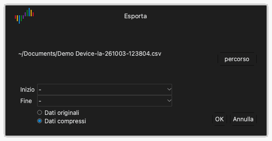

# File e sessioni

Fare clic su **File** nella barra degli strumenti per aprire il menu dei file. Il menu contiene questi elementi:

- **Config**: un menu per caricare e salvare sessioni.
- **Apri...**: aprire un file di dati.
- **Salva...**: salvare i dati dell'acquisizione.
- **Esporta...**: esportare i dati in un altro formato.
- **Schermata...**: salvare un'immagine della finestra.

## Sessioni

Un file di sessione contiene le impostazioni, ma non i dati dell'acquisizione. Una sessione contiene le opzioni del dispositivo, i canali attivi, i nomi e i colori dei canali e le impostazioni del trigger. Un file di sessione ha l'estensione `.dsc`.

### Salvare una sessione

1. Fare clic su **File** › **Config** › **Salva sessione**.
2. Selezionare la cartella e digitare il nome del file.
3. Fare clic su **Salva**.

### Caricare una sessione

1. Fare clic su **File** › **Config** › **Carica sessione**.
2. Selezionare il file di sessione.
3. Fare clic su **Apri**.

### Tornare alle impostazioni iniziali

Fare clic su **File** › **Config** › **Carica sessione predefinita**. L'applicazione riporta tutte le impostazioni del dispositivo ai valori iniziali.

L'applicazione salva automaticamente le impostazioni all'uscita. Al successivo avvio, l'applicazione carica le impostazioni dell'ultima sessione.

## Salvare i dati

1. Fare clic su **File** › **Salva...**.
2. Selezionare la cartella e digitare il nome del file.
3. Fare clic su **Salva**.

L'applicazione salva i dati e le impostazioni in un file con l'estensione `.dsl`. È possibile aprire di nuovo questo file in Logic Analyze.

> [!CAUTION]
> L'applicazione non salva i dati automaticamente. Salvare i dati prima di avviare una nuova acquisizione o di uscire dall'applicazione. Una nuova acquisizione sostituisce i dati dell'acquisizione precedente.

## Aprire un file di dati

1. Fare clic su **File** › **Apri...**.
2. Selezionare un file con l'estensione `.dsl`.
3. Fare clic su **Apri**.

L'applicazione mostra i dati nell'area delle forme d'onda. L'etichetta del tipo di dispositivo mostra **File**.

## Esportare i dati

L'esportazione crea un file che altri programmi possono leggere.

1. Fare clic su **File** › **Esporta...**. Si apre la finestra **Esporta**.
2. Fare clic su **percorso**.
3. Selezionare la cartella, digitare il nome del file e selezionare il formato.
4. Fare clic su **Salva**.
5. Se il formato è CSV, selezionare **Dati originali** o **Dati compressi**. I dati compressi contengono una riga solo per ogni cambio di valore.
6. Fare clic su **OK**.

In modalità analizzatore logico, sono disponibili questi formati:

| Formato | Estensione | Uso |
| --- | --- | --- |
| CSV | `.csv` | Fogli di calcolo e script. |
| VCD | `.vcd` | Programmi per forme d'onda, per esempio GTKWave. |
| Gnuplot | `.gnuplot` | Il programma Gnuplot. |
| srzip | `.srzip` | Programmi sigrok, per esempio PulseView. |

In modalità oscilloscopio e in modalità acquisizione dati, è disponibile solo CSV.

## Salvare un'immagine della finestra

1. Fare clic su **File** › **Schermata...**.
2. Selezionare la cartella e digitare il nome del file.
3. Selezionare PNG o JPEG.
4. Fare clic su **Salva**.
