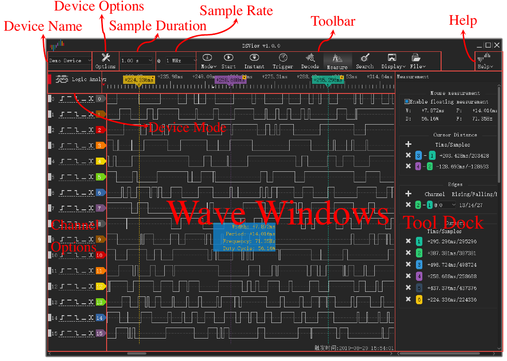

# メインウィンドウ

## メインウィンドウの各部

メインウィンドウには次の部分があります。

- **ツールバー。** ツールバーには、デバイス、キャプチャ、ツールの操作部品があります。
- **波形エリア。** 波形エリアには、チャンネルごとに 1 行が表示されます。行の上にタイムルーラがあります。
- **チャンネルラベル。** 各行の左のラベルに、チャンネル番号、名前、トリガボタンが表示されます。
- **ドック。** ドックは、波形エリアの横にあるパネルです。トリガ、デコーダ、測定、検索のツールはドックで開きます。

<!-- TODO: new screenshot -->

## ツールバー

ツールバーには、先頭から順に次の項目があります。

| 項目 | 機能 |
| --- | --- |
| **ファイル** | データの読み込み、保存、エクスポートと、セッションの保存のためのメニュー。[ファイルとセッション](12-files.md)を参照してください。 |
| デバイスの種類 | 接続を示すラベル：**USB 2.0**、**USB 3.0**、**デモ**、**ファイル**。 |
| デバイスの一覧 | アプリが使うデバイス。ここで別のデバイスまたはデモデバイスを選択します。 |
| デバイスモード | **ロジックアナライザ**、**オシロスコープ**、**データ収集**。一覧には、そのデバイスで使えるモードだけが表示されます。 |
| サンプル時間 | 1 回のキャプチャの時間の長さ。 |
| サンプルレート | 各チャンネルの 1 秒あたりのサンプル数。 |
| **モード** | キャプチャモード：**単発**、**繰り返し**、**ループ**。 |
| **開始** | キャプチャを開始します。キャプチャ中、このボタンは **停止** に変わります。 |
| **即時** | トリガを待たないキャプチャを開始します。 |
| **トリガ** | トリガのドックを開きます。 |
| **デコード** | デコーダのドックを開きます。 |
| **測定** | 測定のドックを開きます。 |
| **検索** | 検索バーを開きます。 |
| **オプション** | **デバイスオプション...** と **表示** メニューがあるメニュー。 |
| **ヘルプ** | 言語、このマニュアル、更新ページ、ログ設定、問題報告ページがあるメニュー。 |

デバイスの種類のラベルには次の値が表示されます。

- **USB 3.0**：デバイスは USB 3.0 接続を使います。
- **USB 2.0**：デバイスは USB 2.0 接続を使います。デバイスに USB 3.0 接続がある場合は、USB 3.0 ポートに接続します。ストリームモードでは、USB 2.0 接続で最大サンプルレートが下がります。
- **デモ**：デバイスはデモデバイスです。デモデバイスはテスト信号を作ります。アプリの機能を試すのに使います。
- **ファイル**：アプリはファイルのデータを表示します。デバイスはありません。

## キーボードショートカット

| キー | 機能 |
| --- | --- |
| `S` | キャプチャを開始または停止します。 |
| `I` | 即時キャプチャを開始または停止します。オシロスコープモードでは、1 回キャプチャして停止します。 |
| `T` | トリガのドックを開くか閉じます。 |
| `D` | デコーダのドックを開くか閉じます。 |
| `M` | 測定のドックを開くか閉じます。 |
| `R` | 検索バーを開くか閉じます。 |
| `O` | **デバイスオプション** ウィンドウを開きます。 |
| `Page Up` | 波形をウィンドウ幅 1 つ分、左に動かします。 |
| `Page Down` | 波形をウィンドウ幅 1 つ分、右に動かします。 |
| `←` | ズームインします。 |
| `→` | ズームアウトします。 |
| `0`, `1` | オシロスコープモードで、チャンネル 0 またはチャンネル 1 のスケール操作を選択または解除します。 |
| `↑`, `↓` | オシロスコープモードで、選択したチャンネルの垂直スケールを変更します。 |

ショートカットは、波形エリアにキーボードフォーカスがあるときに働きます。
