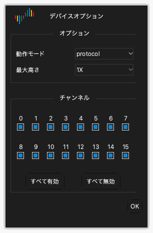

# デバイスオプション

## デバイスオプションを開く

1. ツールバーの **オプション** › **デバイスオプション...** をクリックします。`O` を押すこともできます。
2. **デバイスオプション** ウィンドウで設定を変更します。
3. **OK** をクリックします。

ウィンドウの設定は、デバイスのモデルごとに異なります。この章では DSLogic Plus の設定を示します。

> [!NOTE]
> キャプチャ中はデバイスオプションを変更できません。

## 動作モード

**動作モード** の設定で、デバイスがコンピュータにデータを送る方法を選択します。

**バッファモード。** キャプチャ中、デバイスはサンプルを内部メモリに保持します。キャプチャの後、デバイスは USB でデータをコンピュータに送ります。メモリは USB より高速です。したがって、バッファモードで最も高いサンプルレートが使えます。メモリの容量でキャプチャの長さが制限されます。高速の信号と短いキャプチャにはバッファモードを使います。

**ストリームモード。** キャプチャ中、デバイスはサンプルをコンピュータに送ります。コンピュータのメモリでキャプチャの長さが制限されます。キャプチャ中にデータを見ることができます。USB 接続の速度でサンプルレートが制限されます。低速の信号と長いキャプチャにはストリームモードを使います。

**内部テスト。** このモードはデバイスのテスト専用です。測定には使わないでください。

## 停止オプション

**停止オプション** の設定は、バッファモードにだけ適用されます。キャプチャが終わる前に停止したときの、アプリの動作を設定します。

- **すぐに停止**：アプリはデバイスからデータを取得しません。アプリはデータを表示しません。
- **キャプチャ済みデータをアップロード**：アプリは、停止の前にデバイスが記録したデータを取得します。アプリはこのデータを表示します。

## しきい値レベル

**しきい値レベル** の設定は、ローレベルとハイレベルを分ける電圧です。しきい値より高い信号はハイレベルです。しきい値より低い信号はローレベルです。

0.0 V から 5.0 V の値を、0.1 V 刻みで設定できます。しきい値は、回路のロジック電圧の約 50% に設定します。3.3 V の回路では、約 1.6 V に設定します。

## フィルタ対象

**フィルタ対象** の設定で、データから短いパルスを取り除きます。

- **なし**：アプリはすべてのサンプルを表示します。
- **1 サンプルクロック**：アプリは、1 サンプル周期より短いパルスをすべて取り除きます。

## 最大高さ

**最大高さ** の設定で、波形エリアの各チャンネル行の最大の高さを設定します。**1X** は高さ 1 単位です。少数のチャンネルだけを表示するときは、大きい値を使います。

## RLE 圧縮を有効化

**RLE 圧縮を有効化** を選択すると、デバイスはメモリ内のデータを圧縮します（ランレングス符号化）。この設定はバッファモードにだけ適用されます。信号のエッジが少ない場合、デバイスはより長いキャプチャをメモリに保持できます。信号のエッジが多い場合、圧縮しても長さは増えません。

## 外部クロックを使用

**外部クロックを使用** を選択すると、デバイスは CK 線の各クロックエッジでチャンネルをサンプリングします。デバイスは内部クロックを使いません。クロック信号があるバスを記録するときに、この設定を使います。

## クロックの立ち下がりエッジを使用

この設定は、**外部クロックを使用** を選択したときにだけ適用されます。通常、デバイスはクロックの立ち上がりエッジでチャンネルをサンプリングします。**クロックの立ち下がりエッジを使用** を選択すると、デバイスはクロックの立ち下がりエッジでチャンネルをサンプリングします。

## チャンネルモード

チャンネルモードで、デバイスが使えるチャンネル数を設定します。最大サンプルレートも設定されます。チャンネル数が少ないほど、最大サンプルレートは高くなります。信号の数と周波数に合うチャンネルモードを選択します。

DSLogic Plus のチャンネルモードは次のとおりです。

| 動作モード | チャンネルモード | 最大サンプルレート |
| --- | --- | --- |
| バッファモード | チャンネル 0 から 15 | 100 MHz |
| バッファモード | チャンネル 0 から 7 | 200 MHz |
| バッファモード | チャンネル 0 から 3 | 400 MHz |
| ストリームモード | 16 チャンネル | 20 MHz |
| ストリームモード | 12 チャンネル | 25 MHz |
| ストリームモード | 6 チャンネル | 50 MHz |
| ストリームモード | 3 チャンネル | 100 MHz |

## チャンネルを有効または無効にする

チャンネルモードの下に、チャンネルごとのチェックボックスがあります。

1. 使う各チャンネルのチェックボックスを選択します。
2. 使わない各チャンネルのチェックボックスを外します。
3. すべてのチャンネルを選択するには、**すべて有効** をクリックします。すべてのチャンネルを外すには、**すべて無効** をクリックします。

ストリームモードでは、有効なチャンネルが少ないほど、高いサンプルレートを使えます。
