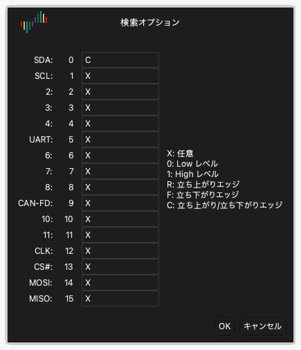

# 波形を調べる

キャプチャの後、波形エリアに各チャンネルのデータが波形として表示されます。

## 波形を左右に動かす

次のいずれかの方法を使います。

- **ドラッグ。** ポインタを波形に置きます。左マウスボタンを押したまま、マウスを左または右に動かします。
- **高速ドラッグ。** 波形をすばやくドラッグして、マウスボタンを放します。波形は動き続けます。その後、波形の動きは遅くなり、止まります。この機能をオンまたはオフにするには、表示オプションの **マウスドラッグで波形をスクロール** を使います。[アプリのインストールと起動](02-install.md)を参照してください。
- **スクロールバー。** ウィンドウ下部のスクロールバーをドラッグします。
- **キーボード。** `Page Up` または `Page Down` を押します。波形はウィンドウ幅 1 つ分動きます。

## ズームインとズームアウト

次のいずれかの方法を使います。

- **マウスホイール。** ポインタを波形に置き、マウスホイールを回します。ポインタの位置がズームの中心になります。
- **範囲ズーム。** 右マウスボタンを押したまま、波形の上をドラッグします。ボタンを放します。アプリは選択した範囲にズームインします。
- **全体表示。** 右マウスボタンで波形をダブルクリックします。アプリはすべてのデータを表示します。もう一度右マウスボタンでダブルクリックすると、前のズームに戻ります。
- **キーボード。** `←` を押すとズームインします。`→` を押すとズームアウトします。

## パターンを見つける

検索は、チャンネルのレベルとエッジのパターンを見つけます。

1. ツールバーの **検索** をクリックするか、`R` を押します。ウィンドウの下部に検索バーが開きます。
2. 検索フィールドをクリックします。**検索オプション** ウィンドウが開きます。
3. 各チャンネルに、文字 `X`、`0`、`1`、`R`、`F`、`C` のいずれかを入力します。各文字の機能は[トリガ](07-trigger.md)にあります。
4. **OK** をクリックします。
5. 検索バーの矢印ボタンをクリックして、前または次の結果に移動します。

たとえば、チャンネル 0 に `C`、他のすべてのチャンネルに `X` を入力します。すると、検索はチャンネル 0 の各エッジを見つけます。

## チャンネルを変更する

各チャンネルには、波形エリアの左にラベルがあります。ラベルには、チャンネルの色、名前、番号が表示されます。

### 色を変更する

1. チャンネルラベルの色の部分をクリックします。
2. 色を選択します。
3. **OK** をクリックします。

### 名前を変更する

1. チャンネルラベルの名前をクリックします。
2. 新しい名前を入力します。
3. `Return` を押します。

### チャンネルの順序を変更する

ポインタをチャンネルラベルに置くと、ポインタが矢印になります。次のいずれかの方法でチャンネルを動かします。

- ラベルの上で左マウスボタンを押したまま、チャンネルを上または下にドラッグします。新しい位置でボタンを放します。
- ラベルをクリックしてチャンネルを選択します。マウスを動かします。チャンネルはマウスと一緒に動きます。新しい位置でもう一度クリックして、チャンネルを放します。
- `Command` を押したまま、複数のラベルをクリックします。マウスを動かします。選択したチャンネルはマウスと一緒に動きます。もう一度クリックして、チャンネルを放します。
