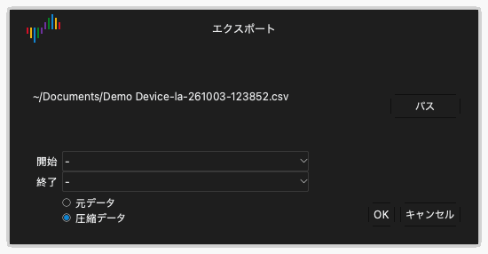

# ファイルとセッション

ツールバーの **ファイル** をクリックすると、ファイルメニューが開きます。メニューには次の項目があります。

- **設定**：セッションを読み込み、保存するためのメニュー。
- **開く...**：データファイルを開きます。
- **保存...**：キャプチャのデータを保存します。
- **エクスポート...**：データを別の形式にエクスポートします。
- **画面取込...**：ウィンドウの画像を保存します。

## セッション

セッションファイルには設定が入っています。キャプチャのデータは入っていません。セッションには、デバイスオプション、有効なチャンネル、チャンネルの名前と色、トリガの設定が含まれます。セッションファイルの拡張子は `.dsc` です。

### セッションを保存する

1. **ファイル** › **設定** › **セッション保存** をクリックします。
2. フォルダを選択し、ファイル名を入力します。
3. **保存** をクリックします。

### セッションを読み込む

1. **ファイル** › **設定** › **セッション読込** をクリックします。
2. セッションファイルを選択します。
3. **開く** をクリックします。

### 初期設定に戻す

**ファイル** › **設定** › **既定セッション読込** をクリックします。アプリは、デバイスのすべての設定を初期値に戻します。

終了時に、アプリは設定を自動で保存します。次に起動すると、アプリは前回のセッションの設定を読み込みます。

## データを保存する

1. **ファイル** › **保存...** をクリックします。
2. フォルダを選択し、ファイル名を入力します。
3. **保存** をクリックします。

アプリは、データと設定を拡張子 `.dsl` のファイルに保存します。このファイルは Logic Analyze で再び開けます。

> [!CAUTION]
> アプリはデータを自動で保存しません。新しいキャプチャを開始する前、またはアプリを終了する前に、データを保存してください。新しいキャプチャは、前のキャプチャのデータを置き換えます。

## データファイルを開く

1. **ファイル** › **開く...** をクリックします。
2. 拡張子 `.dsl` のファイルを選択します。
3. **開く** をクリックします。

アプリは、波形エリアにデータを表示します。デバイスの種類のラベルに **ファイル** が表示されます。

## データをエクスポートする

エクスポートすると、他のプログラムが読めるファイルができます。

1. **ファイル** › **エクスポート...** をクリックします。**エクスポート** ウィンドウが開きます。
2. **パス** をクリックします。
3. フォルダを選択し、ファイル名を入力し、形式を選択します。
4. **保存** をクリックします。
5. 形式が CSV の場合は、**元データ** または **圧縮データ** を選択します。圧縮データでは、値が変わるたびに 1 行だけ記録されます。
6. **OK** をクリックします。

ロジックアナライザモードでは、次の形式を使えます。

| 形式 | 拡張子 | 用途 |
| --- | --- | --- |
| CSV | `.csv` | 表計算プログラムとスクリプト。 |
| VCD | `.vcd` | 波形プログラム。例：GTKWave。 |
| Gnuplot | `.gnuplot` | Gnuplot プログラム。 |
| srzip | `.srzip` | sigrok のプログラム。例：PulseView。 |

オシロスコープモードとデータ収集モードでは、CSV だけを使えます。

## ウィンドウの画像を保存する

1. **ファイル** › **画面取込...** をクリックします。
2. フォルダを選択し、ファイル名を入力します。
3. PNG または JPEG を選択します。
4. **保存** をクリックします。
