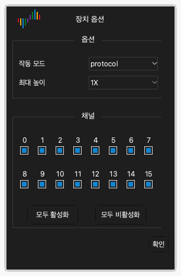

# 장치 옵션

## 장치 옵션 열기

1. 도구 막대에서 **옵션** › **장치 옵션...**을 클릭하십시오. `O`를 눌러도 됩니다.
2. **장치 옵션** 창에서 설정을 변경하십시오.
3. **확인**을 클릭하십시오.

창의 설정은 장치 모델마다 다릅니다. 이 장은 DSLogic Plus의 설정을 설명합니다.

> [!NOTE]
> 캡처 중에는 장치 옵션을 변경할 수 없습니다.

## 작동 모드

**작동 모드** 설정은 장치가 컴퓨터로 데이터를 보내는 방법을 선택합니다.

**버퍼 모드.** 캡처 중에 장치는 샘플을 내부 메모리에 저장합니다. 캡처 후에 장치는 USB를 통해 데이터를 컴퓨터로 보냅니다. 메모리는 USB보다 빠릅니다. 그래서 버퍼 모드는 가장 높은 샘플 레이트를 제공합니다. 메모리 용량이 캡처 길이를 제한합니다. 빠른 신호와 짧은 캡처에는 버퍼 모드를 사용하십시오.

**스트림 모드.** 캡처 중에 장치는 샘플을 컴퓨터로 보냅니다. 컴퓨터의 메모리가 캡처 길이를 제한합니다. 캡처 중에 데이터를 볼 수 있습니다. USB 연결 속도가 샘플 레이트를 제한합니다. 느린 신호와 긴 캡처에는 스트림 모드를 사용하십시오.

**내부 테스트.** 이 모드는 장치 테스트 전용입니다. 측정에 사용하지 마십시오.

## 정지 옵션

**정지 옵션** 설정은 버퍼 모드에만 적용됩니다. 캡처가 끝나기 전에 정지할 때 앱이 어떻게 작동하는지 정합니다.

- **즉시 정지**: 앱이 장치에서 데이터를 가져오지 않습니다. 앱은 데이터를 표시하지 않습니다.
- **캡처한 데이터 업로드**: 앱이 정지 전에 장치가 기록한 데이터를 가져옵니다. 앱은 이 데이터를 표시합니다.

## 임계 레벨

**임계 레벨** 설정은 로우 레벨과 하이 레벨을 나누는 전압입니다. 임계값보다 높은 신호는 하이 레벨입니다. 임계값보다 낮은 신호는 로우 레벨입니다.

0.0 V부터 5.0 V까지 0.1 V 단위로 값을 설정할 수 있습니다. 임계값을 회로 로직 전압의 약 50%로 설정하십시오. 3.3 V 회로에서는 약 1.6 V로 설정하십시오.

## 필터 대상

**필터 대상** 설정은 데이터에서 짧은 펄스를 제거합니다.

- **없음**: 앱이 모든 샘플을 표시합니다.
- **1 샘플 클록**: 앱이 샘플 주기 하나보다 짧은 펄스를 모두 제거합니다.

## 최대 높이

**최대 높이** 설정은 파형 영역에서 각 채널 행의 최대 높이를 정합니다. **1X**는 높이 한 단위입니다. 적은 수의 채널만 표시할 때는 더 큰 값을 사용하십시오.

## RLE 압축 활성화

**RLE 압축 활성화**를 선택하면 장치가 메모리의 데이터를 압축합니다(런 렝스 부호화). 이 설정은 버퍼 모드에만 적용됩니다. 신호의 에지 수가 적으면 장치가 메모리에 더 긴 캡처를 저장할 수 있습니다. 신호의 에지 수가 많으면 압축해도 길이가 늘지 않습니다.

## 외부 클록 사용

**외부 클록 사용**을 선택하면 장치는 CK 선의 각 클록 에지에서 채널을 샘플링합니다. 장치는 내부 클록을 사용하지 않습니다. 클록 신호가 있는 버스를 기록할 때 이 설정을 사용하십시오.

## 클록 하강 에지 사용

이 설정은 **외부 클록 사용**과 함께만 적용됩니다. 보통 장치는 클록의 상승 에지에서 채널을 샘플링합니다. **클록 하강 에지 사용**을 선택하면 장치는 클록의 하강 에지에서 채널을 샘플링합니다.

## 채널 모드

채널 모드는 장치가 사용할 수 있는 채널 수를 정합니다. 최대 샘플 레이트도 정합니다. 채널 수가 적을수록 최대 샘플 레이트가 높습니다. 신호의 수와 주파수에 맞는 채널 모드를 선택하십시오.

DSLogic Plus의 채널 모드는 다음과 같습니다.

| 작동 모드 | 채널 모드 | 최대 샘플 레이트 |
| --- | --- | --- |
| 버퍼 모드 | 채널 0~15 | 100 MHz |
| 버퍼 모드 | 채널 0~7 | 200 MHz |
| 버퍼 모드 | 채널 0~3 | 400 MHz |
| 스트림 모드 | 16채널 | 20 MHz |
| 스트림 모드 | 12채널 | 25 MHz |
| 스트림 모드 | 6채널 | 50 MHz |
| 스트림 모드 | 3채널 | 100 MHz |

## 채널 활성화 및 비활성화

창의 채널 모드 아래에 채널마다 체크 상자가 있습니다.

1. 사용하는 각 채널의 체크 상자를 선택하십시오.
2. 사용하지 않는 각 채널의 체크 상자를 해제하십시오.
3. 모든 채널을 선택하려면 **모두 활성화**를 클릭하십시오. 모든 채널을 해제하려면 **모두 비활성화**를 클릭하십시오.

스트림 모드에서는 활성화한 채널 수가 적을수록 더 높은 샘플 레이트를 사용할 수 있습니다.
