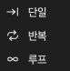

# 데이터 캡처

캡처를 시작하기 전에 다음 항목을 설정하십시오.

1. 장치 옵션. [장치 옵션](05-device-options.md)을 참조하십시오.
2. 샘플 레이트와 샘플 시간. [샘플 레이트와 샘플 시간](06-sample-rate.md)을 참조하십시오.
3. 필요하면 트리거. [트리거](07-trigger.md)를 참조하십시오.
4. 캡처 모드. [캡처 모드](#capture-modes)를 참조하십시오.

## 캡처 시작

캡처에는 두 가지 유형이 있습니다.

- **시작**은 표준 캡처를 시작합니다. 트리거를 설정했으면 장치가 트리거를 기다립니다.
- **즉시**는 캡처를 바로 시작합니다. 장치는 트리거 설정을 사용하지 않습니다.

표준 캡처를 시작하려면 **시작**을 클릭하거나 `S`를 누르십시오. 즉시 캡처를 시작하려면 **즉시**를 클릭하거나 `I`를 누르십시오. 캡처 중에는 버튼이 **정지**로 바뀝니다. 캡처를 멈추려면 **정지**를 클릭하십시오.

### 버퍼 모드의 표준 캡처 순서

1. **시작**을 클릭합니다.
2. 앱이 설정을 장치로 보냅니다.
3. 트리거가 없으면 장치가 바로 기록을 시작합니다. 트리거가 있으면 장치가 트리거를 기다립니다.
4. 장치는 샘플 시간이 끝나거나 메모리가 가득 찰 때까지 기록합니다.
5. 장치가 데이터를 컴퓨터로 보냅니다.
6. 앱이 파형 영역에 파형을 표시합니다.

### 스트림 모드의 표준 캡처 순서

1. **시작**을 클릭합니다.
2. 앱이 설정을 장치로 보냅니다.
3. 트리거가 있으면 장치가 트리거를 기다립니다. 루프 모드에서는 장치가 트리거를 사용하지 않습니다.
4. 캡처 중에 장치가 데이터를 컴퓨터로 보냅니다.
5. 캡처 중에 앱이 파형을 표시합니다.
6. 캡처는 샘플 시간이 끝나면 멈춥니다. 루프 모드에서는 **정지**를 클릭할 때까지 캡처가 계속됩니다.

## 즉시 캡처 사용

즉시 캡처는 표준 캡처와 같지만 트리거 설정을 사용하지 않습니다. 다음 경우에 사용하십시오.

- 트리거 조건이 발생하지 않아서 표준 캡처가 오래 기다립니다.
- 지금 이 시간의 신호를 보려고 합니다.
- 트리거를 변경하기 전에 신호를 검사하려고 합니다.

신호가 없으면 표준 캡처는 트리거 위치에서 기다립니다. 상태에 **트리거 대기 중!**이 표시됩니다. 즉시 캡처는 신호를 바로 기록합니다.

## 캡처 모드 {#capture-modes}

캡처 모드를 선택하려면 도구 막대에서 **모드**를 클릭하십시오. 그런 다음 다음 항목 중 하나를 선택하십시오.

| 캡처 모드 | 버퍼 모드 | 스트림 모드 |
| --- | --- | --- |
| **단일** | 예 | 예 |
| **반복** | 예 | 예 |
| **루프** | 아니요 | 예 |

### 단일

장치가 캡처를 한 번 합니다. 그런 다음 캡처가 멈춥니다.

버퍼 모드에서는 앱이 캡처 후에 파형을 표시합니다. 스트림 모드에서는 앱이 캡처 중에 파형을 표시합니다.

신호 조건 하나 또는 지금 이 시간의 파형을 캡처할 때 이 모드를 사용하십시오.

### 반복

장치가 캡처를 합니다. 그런 다음 다음 캡처를 자동으로 시작합니다. 이 동작은 **정지**를 클릭할 때까지 계속됩니다.

버퍼 모드에서는 앱이 캡처 사이의 간격을 설정하는 창을 표시합니다. 0.1 s부터 10 s까지의 값을 설정할 수 있습니다.

여러 번 발생하는 신호 조건을 볼 때 이 모드를 사용하십시오. 예를 들어 회로를 리셋할 때마다 또는 버튼을 누를 때마다 신호를 볼 때 사용하십시오. 트리거와 함께 사용하십시오.

### 루프

이 모드는 스트림 모드에서만 사용할 수 있습니다. 캡처는 **정지**를 클릭할 때까지 계속됩니다. 데이터가 샘플 시간보다 길어지면 처음 데이터가 창의 왼쪽으로 나갑니다. 가장 새로운 데이터가 오른쪽에서 들어옵니다. 앱은 밖으로 나간 데이터를 버립니다.

신호 조건이 언제 발생하는지 모를 때 이 모드를 사용하십시오. 캡처 중에 파형을 보십시오. 조건이 보이면 **정지**를 클릭하십시오.

> [!NOTE]
> 루프 모드에서는 장치가 트리거 설정을 사용하지 않습니다.

## 캡처 상태

캡처 중에 파형 영역에 상태가 표시됩니다.

- **트리거 대기 중!**: 장치가 트리거 조건을 기다립니다.
- **트리거됨!**: 트리거가 발생했습니다.
- **% 캡처됨**: 완료된 캡처의 백분율.

캡처 후에 파형 영역 아래쪽에 **트리거 시간**이 표시됩니다.
