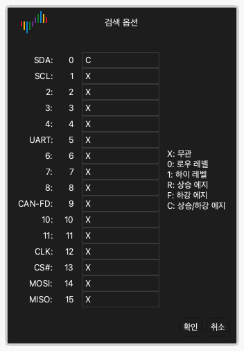

# 파형 검사

캡처 후에 파형 영역은 각 채널의 데이터를 파형으로 표시합니다.

## 파형을 왼쪽 또는 오른쪽으로 이동

다음 방법 중 하나를 사용하십시오.

- **드래그.** 파형에 포인터를 놓으십시오. 마우스 왼쪽 버튼을 누른 상태로 마우스를 왼쪽 또는 오른쪽으로 움직이십시오.
- **빠른 드래그.** 파형을 빠르게 드래그하고 마우스 버튼을 놓으십시오. 파형이 계속 움직입니다. 그런 다음 느려지고 멈춥니다. 이 기능을 켜거나 끄려면 표시 옵션의 **마우스 드래그로 파형 스크롤**을 사용하십시오. [앱 설치 및 시작](02-install.md)을 참조하십시오.
- **스크롤 막대.** 창 아래쪽의 스크롤 막대를 드래그하십시오.
- **키보드.** `Page Up` 또는 `Page Down`을 누르십시오. 파형이 창 너비 하나만큼 움직입니다.

## 확대 및 축소

다음 방법 중 하나를 사용하십시오.

- **마우스 휠.** 파형에 포인터를 놓고 마우스 휠을 돌리십시오. 포인터는 확대/축소의 가운데에 있습니다.
- **영역 확대.** 마우스 오른쪽 버튼을 누른 상태로 파형 위를 드래그하십시오. 버튼을 놓으십시오. 앱이 선택한 영역을 확대합니다.
- **전체 보기.** 마우스 오른쪽 버튼으로 파형을 더블클릭하십시오. 앱이 모든 데이터를 표시합니다. 이전 확대/축소로 돌아가려면 마우스 오른쪽 버튼으로 다시 더블클릭하십시오.
- **키보드.** 확대하려면 `←`를 누르십시오. 축소하려면 `→`를 누르십시오.

## 패턴 찾기

검색은 채널에서 레벨과 에지의 패턴을 찾습니다.

1. 도구 막대에서 **검색**을 클릭하거나 `R`을 누르십시오. 창 아래쪽에 검색 막대가 열립니다.
2. 검색 필드를 클릭하십시오. **검색 옵션** 창이 열립니다.
3. 채널마다 `X`, `0`, `1`, `R`, `F`, `C` 중 한 문자를 입력하십시오. [트리거](07-trigger.md)에 각 문자의 기능이 있습니다.
4. **확인**을 클릭하십시오.
5. 이전 결과나 다음 결과로 가려면 검색 막대의 화살표 버튼을 클릭하십시오.

예를 들어 채널 0에 `C`를 입력하고 다른 모든 채널에 `X`를 입력하십시오. 그러면 검색이 채널 0의 모든 에지를 찾습니다.

## 채널 변경

각 채널에는 파형 영역 왼쪽에 레이블이 있습니다. 레이블은 채널의 색, 이름, 번호를 표시합니다.

### 색 변경

1. 채널 레이블의 색 영역을 클릭하십시오.
2. 색을 선택하십시오.
3. **확인**을 클릭하십시오.

### 이름 변경

1. 채널 레이블의 이름을 클릭하십시오.
2. 새 이름을 입력하십시오.
3. `Return`을 누르십시오.

### 채널 순서 변경

채널 레이블에 포인터를 놓으면 포인터가 화살표로 바뀝니다. 다음 방법 중 하나로 채널을 이동하십시오.

- 레이블에서 마우스 왼쪽 버튼을 누른 상태로 채널을 위나 아래로 드래그하십시오. 새 위치에서 버튼을 놓으십시오.
- 레이블을 클릭하여 채널을 선택하십시오. 마우스를 움직이십시오. 채널이 마우스와 함께 움직입니다. 새 위치에서 다시 클릭하여 채널을 놓으십시오.
- `Command`를 누른 상태로 레이블을 둘 이상 클릭하십시오. 마우스를 움직이십시오. 선택한 채널이 마우스와 함께 움직입니다. 다시 클릭하여 채널을 놓으십시오.
