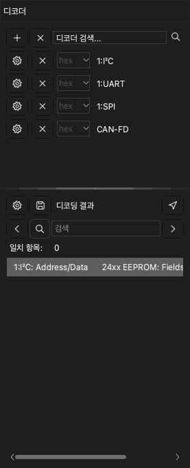

# 프로토콜 디코더

프로토콜 디코더는 캡처 데이터를 읽고 프로토콜의 프레임을 찾습니다. 예: UART, I2C, SPI. 앱은 결과를 채널 위의 새 행에 표시합니다. 앱에는 디코더가 100개 넘게 있습니다.

디코더 도크를 열려면 도구 막대에서 **디코드**를 클릭하거나 `D`를 누르십시오. 도크는 두 부분으로 되어 있습니다.

- 디코더 목록. 위쪽에 **디코더 검색...** 필드가 있습니다.
- **디코딩 결과** 목록. 이 목록은 디코더의 각 항목을 텍스트 한 행으로 표시합니다.

## 디코더 추가

> [!NOTE]
> 접두사가 `0:`인 디코더는 작은 버전입니다. 비트를 표시하지 않습니다. 그 위에 상위 프로토콜을 추가할 수 없습니다. 더 빠르게 디코드하고 메모리를 덜 사용합니다.

1. **디코더 검색...** 필드를 클릭하십시오. 디코더 목록이 열립니다.
2. 프로토콜 이름의 일부를 입력하십시오. 예: `I2C`. 목록에 텍스트와 일치하는 디코더만 표시됩니다.
3. 디코더를 클릭하십시오. **디코더 옵션** 창이 열립니다.
4. 프로토콜의 채널을 설정하십시오. 예를 들어 I2C에서는 **SCL**과 **SDA**를 설정하십시오.
5. 프로토콜 옵션을 설정하십시오. 예: UART의 baud 레이트.
6. 앱이 표시할 결과 행을 선택하십시오.
7. 필요하면 디코드 영역을 설정하십시오. [캡처의 일부 디코드](#decode-region)를 참조하십시오.
8. **확인**을 클릭하십시오.

앱이 데이터를 디코드하고 파형 영역의 새 행에 결과를 표시합니다.

디코더를 더 추가하려면 디코더마다 이 절차를 다시 수행하십시오.

디코더의 설정을 변경하려면 도크에서 그 디코더의 설정 버튼을 클릭하십시오.

## 스택 디코더 추가

일부 프로토콜은 하위 프로토콜을 사용합니다. 예를 들어 24xx EEPROM 프로토콜은 I2C를 사용합니다. 상위 프로토콜을 추가하면 앱이 하위 프로토콜도 추가합니다.

1. **디코더 검색...** 필드에 상위 프로토콜의 이름을 입력하십시오. 예: `24xx`.
2. 디코더를 클릭하십시오.
3. **디코더 옵션** 창에서 각 프로토콜 계층의 옵션을 설정하십시오.
4. **확인**을 클릭하십시오.

결과에는 하위 프로토콜의 프레임과 상위 프로토콜의 명령과 데이터가 표시됩니다.

## 캡처의 일부 디코드 {#decode-region}

보통 앱은 모든 데이터를 디코드합니다. 일부만 디코드하려면 시작 커서와 끝 커서를 설정하십시오. 예를 들어 회로 리셋 때의 노이즈를 무시할 수 있습니다. 영역이 짧으면 디코드 시간도 줄어듭니다.

1. 영역의 시작과 끝에 커서를 두 개 추가하십시오. [측정](10-measure.md)을 참조하십시오.
2. 디코더의 **디코더 옵션** 창을 여십시오.
3. **시작** 목록에서 시작 커서를 선택하십시오.
4. **끝** 목록에서 끝 커서를 선택하십시오.
5. **확인**을 클릭하십시오.

## 결과 목록 읽기

**디코딩 결과** 목록은 디코더의 항목을 시간 순서로 표시합니다. 행을 클릭하면 파형이 그 항목으로 이동합니다.

목록이 표시하는 열을 변경하려면 목록 위쪽의 설정 버튼을 클릭하십시오.

## 결과에서 텍스트 찾기

1. **디코딩 결과** 목록의 검색 필드에 텍스트를 입력하십시오.
2. 텍스트가 있는 다음 행으로 가려면 오른쪽 화살표를 클릭하십시오. 이전 행으로 가려면 왼쪽 화살표를 클릭하십시오.

검색이 찾은 행마다 파형이 그 항목으로 이동합니다. 먼저 행을 클릭하면 검색이 그 행에서 시작합니다.

바이트 순서를 찾으려면 바이트 사이에 `-` 기호를 넣으십시오. 예를 들어 `70-70-70`은 값이 70인 바이트 세 개가 이어진 곳을 찾습니다.

> [!NOTE]
> 바이트 순서 검색은 UART, I2C, SPI 디코더에서만 작동합니다.

## 결과 내보내기

1. **디코딩 결과** 목록 위쪽의 저장 버튼을 클릭하십시오. **프로토콜 내보내기** 창이 열립니다.
2. **내보내기 형식**에서 CSV 또는 TXT를 선택하십시오.
3. 내보낼 열을 각각 선택하십시오. 앱은 모든 열을 시간 순서로 파일 하나에 넣습니다.
4. **확인**을 클릭하십시오.
5. 폴더를 선택하고 파일 이름을 입력하십시오.
6. **저장**을 클릭하십시오.

## 디코더 삭제

- 디코더 하나를 삭제하려면 그 디코더 행의 **×** 버튼을 클릭하십시오.
- 모든 디코더를 삭제하려면 도크 위쪽의 **+** 버튼 옆에 있는 **×** 버튼을 클릭하십시오.
