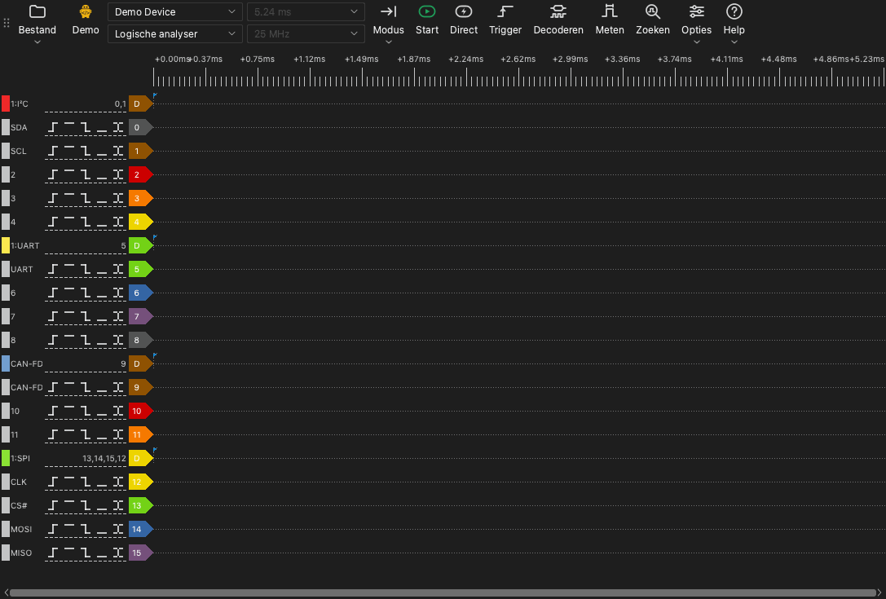

# Het hoofdvenster

## Onderdelen van het hoofdvenster

Het hoofdvenster heeft deze onderdelen:

- **Werkbalk.** De werkbalk heeft de bedieningselementen voor het apparaat, de opname en de hulpmiddelen.
- **Golfvormgebied.** Het golfvormgebied toont één rij voor elk kanaal. Boven de rijen staat een tijdliniaal.
- **Kanaallabels.** Een label links van elke rij toont het kanaalnummer, de naam en de triggerknoppen.
- **Docks.** Een dock is een paneel aan de zijkant van het golfvormgebied. De hulpmiddelen voor de trigger, de decoders, de metingen en het zoeken openen in docks.

## De werkbalk

De werkbalk heeft deze items, van het begin tot het einde:

| Item | Functie |
| --- | --- |
| **Bestand** | Een menu om gegevens te openen, op te slaan en te exporteren en om sessies op te slaan. Zie [Bestanden en sessies](12-files.md). |
| Apparaattype | Een label dat de verbinding toont: **USB 2.0**, **USB 3.0**, **Demo** of **Bestand**. |
| Apparatenlijst | Het apparaat dat de app gebruikt. Selecteer hier een ander apparaat of een demo-apparaat. |
| Apparaatmodus | **Logische analyser**, **Oscilloscoop** of **Data-acquisitie**. De lijst toont alleen de modi die voor het apparaat beschikbaar zijn. |
| Sampleduur | De tijdsduur van een opname. |
| Samplefrequentie | Het aantal samples per seconde voor elk kanaal. |
| **Modus** | De opnamemodus: **Enkel**, **Herhalend** of **Lus**. |
| **Start** | Start een opname. Tijdens een opname verandert deze knop in **Stop**. |
| **Direct** | Start een opname die niet op de trigger wacht. |
| **Trigger** | Opent het triggerdock. |
| **Decoderen** | Opent het decoderdock. |
| **Meten** | Opent het meetdock. |
| **Zoeken** | Opent de zoekbalk. |
| **Opties** | Een menu met **Apparaatopties...** en het menu **Weergave**. |
| **Help** | Een menu met de taal, deze handleiding, de updatepagina, de logopties en de pagina voor foutmeldingen. |

Het label van het apparaattype toont deze waarden:

- **USB 3.0**: Het apparaat gebruikt een USB 3.0-verbinding.
- **USB 2.0**: Het apparaat gebruikt een USB 2.0-verbinding. Als het apparaat een USB 3.0-verbinding heeft, sluit het dan aan op een USB 3.0-poort. Een USB 2.0-verbinding verlaagt de maximale samplefrequentie in de streammodus.
- **Demo**: Het apparaat is een demo-apparaat. Het demo-apparaat maakt testsignalen. Gebruik het om de functies van de app te proberen.
- **Bestand**: De app toont gegevens uit een bestand. Er is geen apparaat.

## Sneltoetsen

| Toets | Functie |
| --- | --- |
| `S` | Een opname starten of stoppen. |
| `I` | Een directe opname starten of stoppen. In de oscilloscoopmodus één opname uitvoeren en stoppen. |
| `T` | Het triggerdock openen of sluiten. |
| `D` | Het decoderdock openen of sluiten. |
| `M` | Het meetdock openen of sluiten. |
| `R` | De zoekbalk openen of sluiten. |
| `O` | Het venster **Apparaatopties** openen. |
| `Page Up` | De golfvorm één vensterbreedte naar links bewegen. |
| `Page Down` | De golfvorm één vensterbreedte naar rechts bewegen. |
| `←` | Inzoomen. |
| `→` | Uitzoomen. |
| `0`, `1` | In de oscilloscoopmodus de schaalregelaar van kanaal 0 of kanaal 1 selecteren of loslaten. |
| `↑`, `↓` | In de oscilloscoopmodus de verticale schaal van het geselecteerde kanaal wijzigen. |

De sneltoetsen werken als het golfvormgebied de toetsenbordfocus heeft.
