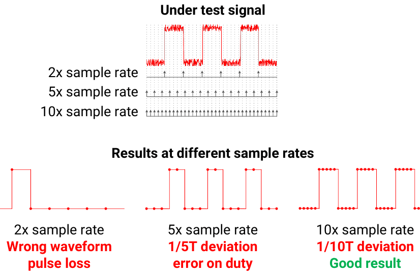

# Samplefrequentie en sampleduur

De werkbalk heeft twee lijsten voor de lengte van de opname. De bovenste lijst is de sampleduur. De onderste lijst is de samplefrequentie.

- De **sampleduur** is de tijdsduur van de opname.
- De **samplefrequentie** is het aantal samples per seconde voor elk kanaal.

De beschikbare waarden veranderen met het apparaat, de USB-verbinding, de bedrijfsmodus en de kanaalmodus.

## Maximale sampleduur

**Buffermodus.** Het geheugen van het apparaat begrenst de sampleduur. Gebruik deze formule:

```text
maximum duration = memory size / (sample rate × number of enabled channels)
```

De DSLogic Plus heeft 256 Mbit geheugen. Dit zijn twee voorbeelden:

- Bij 100 MHz met 16 kanalen is de maximale sampleduur ongeveer 167,77 ms.
- Bij 400 MHz met 1 kanaal is de maximale sampleduur ongeveer 671,09 ms.

**Streammodus.** Het geheugen van de computer begrenst de sampleduur. De app kan 16 G samples voor elk kanaal bewaren. Dit zijn twee voorbeelden:

- Bij 1 MHz is de maximale sampleduur ongeveer 4,77 uur.
- Bij 100 MHz is de maximale sampleduur ongeveer 2,86 minuten.

## De samplefrequentie selecteren

Stel de samplefrequentie in op 4 tot 10 keer de hoogste frequentie in het signaal.

Bij 4 keer de signaalfrequentie neemt de app elke flank op. Maar de tijd van elke flank heeft een fout van maximaal 25% van de signaalperiode. Bij 10 keer de signaalfrequentie daalt de fout naar 10%.

De tijdfout van een flank is gelijk aan één sampleperiode of kleiner. Bijvoorbeeld: bij 100 MHz is de sampleperiode 10 ns. Daarom is de fout van elke flank ±10 ns of kleiner.



Dit zijn typische waarden:

| Signaal | Typische samplefrequentie |
| --- | --- |
| UART bij 115200 baud | 2 MHz |
| I2C bij 400 kHz | 4 MHz tot 10 MHz |
| SPI bij 40 MHz | 400 MHz |

## Gebruik geen te hoge samplefrequentie

Een hogere samplefrequentie geeft een nauwkeurigere golfvorm. Maar een hoge samplefrequentie heeft ook deze problemen:

1. De app neemt meer gegevens per seconde op. Daarom wordt de maximale sampleduur kleiner. De app heeft ook meer tijd nodig om de gegevens te tonen en te decoderen.
2. Een langzaam signaal kan langzame flanken hebben. Bij een hoge samplefrequentie kan de app tijdens elke langzame flank kleine pulsen bij de drempel opnemen. Deze pulsen kunnen fouten in de decoders veroorzaken.

Als u ongewenste korte pulsen op langzame signalen ziet, verlaag dan de samplefrequentie. U kunt ook **Filterdoelen** instellen op **1 sampleklok**. Zie [Apparaatopties](05-device-options.md).

## De samplefrequentie en de duur instellen

1. Stel de bedrijfsmodus en de kanaalmodus in. Zie [Apparaatopties](05-device-options.md).
2. Selecteer in de onderste lijst op de werkbalk de samplefrequentie.
3. Selecteer in de bovenste lijst op de werkbalk de sampleduur.

> [!NOTE]
> Als u de kanaalmodus wijzigt, kan de app de samplefrequentie wijzigen. Controleer de samplefrequentie opnieuw na elke wijziging van de apparaatopties.
