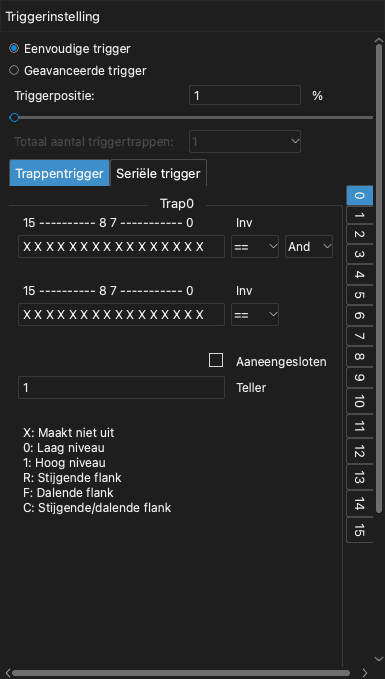
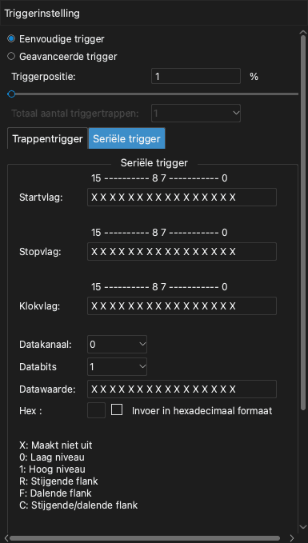

# Triggers

Een trigger is een voorwaarde in de signalen. Als de voorwaarde optreedt, markeert het apparaat die tijd als het triggerpunt. Met de trigger neemt u het deel van het signaal op dat u wilt onderzoeken.

De app heeft twee soorten trigger:

- **Eenvoudige trigger**: Een flank of een niveau op een of meer kanalen.
- **Geavanceerde trigger**: Een reeks voorwaarden of een waarde op een seriële bus.

Om het triggerdock te openen, klikt u op de werkbalk op **Trigger** of drukt u op `T`.

> [!NOTE]
> Als het signaal niet overeenkomt met de triggervoorwaarde, blijft de opname wachten. Om het signaal zonder de trigger te zien, klikt u op **Direct**. Om het wachten te stoppen, klikt u op **Stop**.

## Triggerpositie

De instelling **Triggerpositie** bepaalt waar het triggerpunt in de opname ligt. De waarde is een percentage van de sampleduur.

- Een kleine waarde, bijvoorbeeld 10%, toont meer van het signaal na de trigger.
- Een grote waarde, bijvoorbeeld 90%, toont meer van het signaal vóór de trigger.

De triggerpositie gebruikt het geheugen van het apparaat. Daarom kunt u deze alleen in de buffermodus instellen. In de streammodus is de triggerpositie altijd ongeveer 1%.

<!-- TODO: new screenshot -->

## Eenvoudige trigger

Elk kanaallabel in het golfvormgebied heeft vijf triggerknoppen. Van links naar rechts zijn de knoppen:

1. Stijgende flank
2. Hoog niveau
3. Dalende flank
4. Laag niveau
5. Stijgende of dalende flank

Voer deze stappen uit om een eenvoudige trigger in te stellen:

1. Open het triggerdock.
2. Selecteer **Eenvoudige trigger**.
3. Klik op het label van een kanaal op de triggerknop die u wilt. De knop krijgt een andere kleur.
4. Om de trigger van een kanaal te verwijderen, klikt u nog een keer op dezelfde knop.
5. Stel de **Triggerpositie** in.

Als u een trigger op meer dan één kanaal instelt, moeten alle voorwaarden bij dezelfde sample optreden (logische EN).

## Geavanceerde trigger

> [!NOTE]
> De geavanceerde trigger is alleen beschikbaar in de buffermodus. Stel daarvoor **Bedrijfsmodus** in op **Buffermodus**. Zie [Apparaatopties](05-device-options.md).

Om de geavanceerde trigger te gebruiken, selecteert u in het triggerdock **Geavanceerde trigger**. Selecteer daarna het tabblad **Trappentrigger** of het tabblad **Seriële trigger**.

### Waarden voor elk kanaal

De trappentrigger en de seriële trigger gebruiken een rij van 16 tekens. Elk teken is de voorwaarde voor één kanaal. Het teken rechts is kanaal 0. Het teken links is kanaal 15.

| Teken | Voorwaarde |
| --- | --- |
| `X` | Alle waarden (het kanaal heeft geen effect). |
| `0` | Laag niveau. |
| `1` | Hoog niveau. |
| `R` | Stijgende flank. |
| `F` | Dalende flank. |
| `C` | Stijgende of dalende flank. |

### Trappentrigger

Een trappentrigger is een reeks voorwaarden. Elke voorwaarde is een trap. Het apparaat onderzoekt eerst trap 0. Als de voorwaarde van een trap optreedt, gaat het apparaat naar de volgende trap. De trigger treedt op als de laatste trap voltooid is. U kunt maximaal 16 trappen gebruiken.

Elke trap heeft deze instellingen:

- Twee rijen met kanaalvoorwaarden.
- Voor elke rij `==` of `!=`. Met `==` treedt de voorwaarde op als de kanalen overeenkomen met de rij. Met `!=` treedt de voorwaarde op als de kanalen niet overeenkomen met de rij.
- **En** of **Of**. Deze instelling verbindt de twee rijen.
- **Teller**: Het aantal keren dat de voorwaarde moet optreden voordat de trap voltooid is.
- **Aaneengesloten**: Als u dit selectievakje selecteert, moet de voorwaarde optreden in samples die zonder onderbreking op elkaar volgen.

Voer deze stappen uit om een trappentrigger in te stellen:

1. Selecteer in **Totaal aantal triggertrappen** het aantal trappen.
2. Klik in de lijst van trappen rechts op trap 0.
3. Typ de kanaalvoorwaarden in de eerste rij.
4. Typ indien nodig de kanaalvoorwaarden in de tweede rij en selecteer **En** of **Of**.
5. Typ een waarde in **Teller**.
6. Voer de stappen 2 tot 5 opnieuw uit voor elke andere trap.

Dit zijn drie voorbeelden.

**Voorbeeld 1.** Trigger als kanaal 0 langer dan 1000 samples hoog blijft:

1. Stel **Totaal aantal triggertrappen** in op 1.
2. Typ in trap 0 in de eerste rij `1` voor kanaal 0.
3. Selecteer **Aaneengesloten**.
4. Stel **Teller** in op 1000.

**Voorbeeld 2.** Trigger op een stijgende flank op kanaal 0 of een dalende flank op kanaal 1:

1. Stel **Totaal aantal triggertrappen** in op 1.
2. Typ in trap 0 in de eerste rij `R` voor kanaal 0.
3. Typ in de tweede rij `F` voor kanaal 1.
4. Selecteer **Of**.

**Voorbeeld 3.** Trigger op een stijgende flank op kanaal 0, daarna 100 dalende flanken op kanaal 1, daarna een hoog niveau op kanaal 2:

1. Stel **Totaal aantal triggertrappen** in op 3.
2. Typ in trap 0 `R` voor kanaal 0.
3. Typ in trap 1 `F` voor kanaal 1. Stel **Teller** in op 100.
4. Typ in trap 2 `1` voor kanaal 2.

### Seriële trigger

Een seriële trigger vindt een gegevenswaarde op een seriële bus. Hij werkt als een schuifregister. Dit zijn de instellingen:

- **Startvlag**: De voorwaarde die de seriële trigger start.
- **Stopvlag**: De voorwaarde die het schuifregister wist.
- **Klokvlag**: De voorwaarde die één bit aan het schuifregister toevoegt.
- **Datakanaal**: Het kanaal dat de gegevens overdraagt.
- **Databits**: Het aantal bits in de waarde.
- **Datawaarde**: De waarde die de trigger veroorzaakt.

Na de startvlag leest het apparaat het datakanaal bij elke klokvlag. Het apparaat schuift deze bit in het schuifregister. Als de laatste bits van het schuifregister gelijk zijn aan **Datawaarde**, treedt de trigger op. Als de stopvlag optreedt, wist het apparaat het schuifregister.

**Voorbeeld 4.** Trigger als de waarde `010000100` optreedt op een I2C-bus. Kanaal 0 is SCL en kanaal 1 is SDA.

1. Stel **Startvlag** in op een dalende flank op SDA terwijl SCL hoog is: `F1` in de twee tekens rechts.
2. Stel **Stopvlag** in op een stijgende flank op SDA terwijl SCL hoog is: `R1`.
3. Stel **Klokvlag** in op een stijgende flank op SCL: `R` voor kanaal 0.
4. Stel **Datakanaal** in op 1.
5. Stel **Databits** in op 9.
6. Typ `010000100` in **Datawaarde**.

**Voorbeeld 5.** Trigger als de waarde `0x1234` optreedt op MOSI van een SPI-bus. Kanaal 0 is CS#, kanaal 1 is CLK, kanaal 2 is MISO en kanaal 3 is MOSI.

1. Stel **Startvlag** in op een dalende flank op CS#: `F` voor kanaal 0.
2. Stel **Stopvlag** in op een stijgende flank op CS#: `R` voor kanaal 0.
3. Stel **Klokvlag** in op een stijgende flank op CLK: `R` voor kanaal 1.
4. Stel **Datakanaal** in op 3.
5. Stel **Databits** in op 16.
6. Typ `0001001000110100` in **Datawaarde**.

Om de waarde hexadecimaal te typen, selecteert u **Invoer in hexadecimaal formaat**. Typ daarna de waarde in het veld **Hex**.
