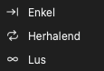

# Gegevens opnemen

Stel deze items in voordat u een opname start:

1. De apparaatopties. Zie [Apparaatopties](05-device-options.md).
2. De samplefrequentie en de sampleduur. Zie [Samplefrequentie en sampleduur](06-sample-rate.md).
3. De trigger, indien nodig. Zie [Triggers](07-trigger.md).
4. De opnamemodus. Zie [Opnamemodi](#capture-modes).

## Een opname starten

Er zijn twee soorten opname:

- **Start** start een standaardopname. Het apparaat wacht op de trigger als u een trigger instelt.
- **Direct** start meteen een opname. Het apparaat gebruikt de triggerinstellingen niet.

Om een standaardopname te starten, klikt u op **Start** of drukt u op `S`. Om een directe opname te starten, klikt u op **Direct** of drukt u op `I`. Tijdens een opname verandert de knop in **Stop**. Klik op **Stop** om de opname te stoppen.

### Verloop van een standaardopname in de buffermodus

1. U klikt op **Start**.
2. De app stuurt de instellingen naar het apparaat.
3. Als er geen trigger is, begint het apparaat meteen met opnemen. Als er een trigger is, wacht het apparaat op de trigger.
4. Het apparaat neemt op tot het einde van de sampleduur of tot het geheugen vol is.
5. Het apparaat stuurt de gegevens naar de computer.
6. De app toont de golfvorm in het golfvormgebied.

### Verloop van een standaardopname in de streammodus

1. U klikt op **Start**.
2. De app stuurt de instellingen naar het apparaat.
3. Als er een trigger is, wacht het apparaat op de trigger. In de lusmodus gebruikt het apparaat de trigger niet.
4. Het apparaat stuurt de gegevens tijdens de opname naar de computer.
5. De app toont de golfvorm tijdens de opname.
6. De opname stopt aan het einde van de sampleduur. In de lusmodus gaat de opname door tot u op **Stop** klikt.

## De directe opname gebruiken

De directe opname is gelijk aan de standaardopname, maar zij gebruikt de triggerinstellingen niet. Gebruik haar in deze situaties:

- De standaardopname wacht lang, omdat de triggervoorwaarde niet optreedt.
- U wilt de signalen op dit moment zien.
- U wilt de signalen onderzoeken voordat u de trigger wijzigt.

Als er geen signaal is, wacht een standaardopname bij de triggerpositie. De status toont **Wachten op trigger!**. Een directe opname neemt de signalen meteen op.

## Opnamemodi {#capture-modes}

Om de opnamemodus te selecteren, klikt u op de werkbalk op **Modus**. Selecteer daarna een van deze items:

| Opnamemodus | Buffermodus | Streammodus |
| --- | --- | --- |
| **Enkel** | Ja | Ja |
| **Herhalend** | Ja | Ja |
| **Lus** | Nee | Ja |

### Enkel

Het apparaat voert één opname uit. Daarna stopt de opname.

In de buffermodus toont de app de golfvorm na de opname. In de streammodus toont de app de golfvorm tijdens de opname.

Gebruik deze modus om één signaalvoorwaarde of de golfvorm van dit moment op te nemen.

### Herhalend

Het apparaat voert een opname uit. Daarna start het automatisch de volgende opname. Dit gaat door tot u op **Stop** klikt.

In de buffermodus toont de app een venster voor het interval tussen de opnamen. U kunt een waarde van 0,1 s tot 10 s instellen.

Gebruik deze modus om een signaalvoorwaarde te zien die vaak optreedt. Gebruik hem bijvoorbeeld om de signalen na elke reset van de schakeling of na elke druk op een knop te zien. Gebruik hem samen met een trigger.

### Lus

Deze modus is alleen beschikbaar in de streammodus. De opname gaat door tot u op **Stop** klikt. Als de gegevens langer zijn dan de sampleduur, bewegen de eerste gegevens links uit het venster. De nieuwste gegevens komen rechts binnen. De app verwijdert de gegevens die uit het venster bewegen.

Gebruik deze modus als u het moment van de signaalvoorwaarde niet weet. Bekijk de golfvorm tijdens de opname. Als u de voorwaarde ziet, klikt u op **Stop**.

> [!NOTE]
> In de lusmodus gebruikt het apparaat de triggerinstellingen niet.

## Opnamestatus

Tijdens een opname toont het golfvormgebied de status:

- **Wachten op trigger!**: Het apparaat wacht op de triggervoorwaarde.
- **Getriggerd!**: De trigger is opgetreden.
- **% vastgelegd**: Het percentage van de opname dat voltooid is.

Na een opname toont de onderkant van het golfvormgebied de **Triggertijd**.
