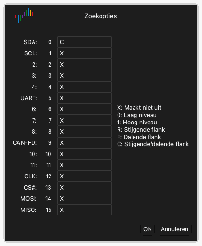

# De golfvorm onderzoeken

Na een opname toont het golfvormgebied de gegevens van elk kanaal als een golfvorm.

## De golfvorm naar links of naar rechts bewegen

Gebruik een van deze methoden:

- **Slepen.** Zet de aanwijzer op de golfvorm. Houd de linkermuisknop ingedrukt en beweeg de muis naar links of naar rechts.
- **Snel slepen.** Sleep de golfvorm snel en laat de muisknop los. De golfvorm blijft bewegen. Daarna beweegt hij langzamer en stopt hij. Om deze functie in of uit te schakelen, gebruikt u **Golfvorm scrollen door slepen met muis** in de weergaveopties. Zie [De app installeren en starten](02-install.md).
- **Schuifbalk.** Sleep de schuifbalk onder in het venster.
- **Toetsenbord.** Druk op `Page Up` of `Page Down`. De golfvorm beweegt één vensterbreedte.

## Inzoomen en uitzoomen

Gebruik een van deze methoden:

- **Muiswiel.** Zet de aanwijzer op de golfvorm en draai het muiswiel. De aanwijzer blijft in het midden van de zoom.
- **Gebiedszoom.** Houd de rechtermuisknop ingedrukt en sleep over de golfvorm. Laat de knop los. De app zoomt in op het gebied dat u hebt geselecteerd.
- **Volledige weergave.** Dubbelklik met de rechtermuisknop op de golfvorm. De app toont alle gegevens. Dubbelklik nog een keer met de rechtermuisknop om terug te gaan naar de vorige zoom.
- **Toetsenbord.** Druk op `←` om in te zoomen. Druk op `→` om uit te zoomen.

## Een patroon vinden

De zoekfunctie vindt een patroon van niveaus en flanken op de kanalen.

1. Klik op de werkbalk op **Zoeken** of druk op `R`. De zoekbalk opent onder in het venster.
2. Klik op het zoekveld. Het venster **Zoekopties** opent.
3. Typ voor elk kanaal een van de tekens `X`, `0`, `1`, `R`, `F` of `C`. [Triggers](07-trigger.md) geeft de functie van elk teken.
4. Klik op **OK**.
5. Klik op de pijlknoppen in de zoekbalk om naar het vorige of het volgende resultaat te gaan.

Typ bijvoorbeeld `C` voor kanaal 0 en `X` voor alle andere kanalen. De zoekfunctie vindt dan elke flank op kanaal 0.

## Een kanaal wijzigen

Elk kanaal heeft een label links in het golfvormgebied. Het label toont de kleur, de naam en het nummer van het kanaal.

### De kleur wijzigen

1. Klik op het kleurgebied van het kanaallabel.
2. Selecteer een kleur.
3. Klik op **OK**.

### De naam wijzigen

1. Klik op de naam in het kanaallabel.
2. Typ een nieuwe naam.
3. Druk op `Return`.

### De volgorde van de kanalen wijzigen

Als u de aanwijzer op een kanaallabel zet, toont de aanwijzer een pijl. Gebruik een van deze methoden om het kanaal te verplaatsen:

- Houd de linkermuisknop op het label ingedrukt en sleep het kanaal omhoog of omlaag. Laat de knop los op de nieuwe positie.
- Klik op het label om het kanaal te selecteren. Beweeg de muis. Het kanaal beweegt met de muis mee. Klik nog een keer om het kanaal op de nieuwe positie los te laten.
- Houd `Command` ingedrukt en klik op meer dan één label. Beweeg de muis. De geselecteerde kanalen bewegen met de muis mee. Klik nog een keer om ze los te laten.
