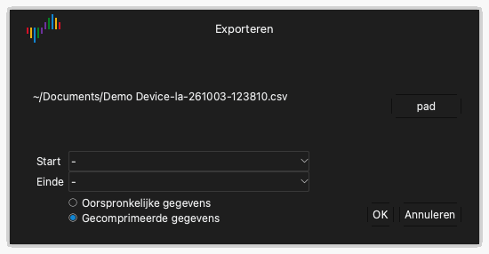

# Bestanden en sessies

Klik op de werkbalk op **Bestand** om het bestandsmenu te openen. Het menu heeft deze items:

- **Config**: een menu om sessies te laden en op te slaan.
- **Openen...**: een gegevensbestand openen.
- **Opslaan...**: de gegevens van de opname opslaan.
- **Exporteren...**: de gegevens naar een ander formaat exporteren.
- **Screenshot...**: een afbeelding van het venster opslaan.

## Sessies

Een sessiebestand bevat de instellingen, maar niet de gegevens van de opname. Een sessie bevat de apparaatopties, de ingeschakelde kanalen, de namen en kleuren van de kanalen en de triggerinstellingen. Een sessiebestand heeft de extensie `.dsc`.

### Een sessie opslaan

1. Klik op **Bestand** › **Config** › **Sessie opslaan**.
2. Selecteer de map en typ de bestandsnaam.
3. Klik op **Bewaar**.

### Een sessie laden

1. Klik op **Bestand** › **Config** › **Sessie laden**.
2. Selecteer het sessiebestand.
3. Klik op **Open**.

### Teruggaan naar de beginwaarden

Klik op **Bestand** › **Config** › **Standaardsessie laden**. De app zet alle instellingen van het apparaat op hun beginwaarden.

De app slaat de instellingen automatisch op als u de app stopt. Als u de app opnieuw start, laadt de app de instellingen van de laatste sessie.

## De gegevens opslaan

1. Klik op **Bestand** › **Opslaan...**.
2. Selecteer de map en typ de bestandsnaam.
3. Klik op **Bewaar**.

De app slaat de gegevens en de instellingen op in een bestand met de extensie `.dsl`. U kunt dit bestand opnieuw openen in Logic Analyze.

> [!CAUTION]
> De app slaat de gegevens niet automatisch op. Sla de gegevens op voordat u een nieuwe opname start of de app stopt. Een nieuwe opname vervangt de gegevens van de vorige opname.

## Een gegevensbestand openen

1. Klik op **Bestand** › **Openen...**.
2. Selecteer een bestand met de extensie `.dsl`.
3. Klik op **Open**.

De app toont de gegevens in het golfvormgebied. Het label van het apparaattype toont **Bestand**.

## De gegevens exporteren

De export maakt een bestand dat andere programma's kunnen lezen.

1. Klik op **Bestand** › **Exporteren...**. Het venster **Exporteren** opent.
2. Klik op **pad**.
3. Selecteer de map, typ de bestandsnaam en selecteer het formaat.
4. Klik op **Bewaar**.
5. Als het formaat CSV is, selecteert u **Oorspronkelijke gegevens** of **Gecomprimeerde gegevens**. Gecomprimeerde gegevens bevatten alleen een rij bij elke verandering van waarde.
6. Klik op **OK**.

In de modus logische analyser zijn deze formaten beschikbaar:

| Formaat | Extensie | Gebruik |
| --- | --- | --- |
| CSV | `.csv` | Spreadsheetprogramma's en scripts. |
| VCD | `.vcd` | Golfvormprogramma's, bijvoorbeeld GTKWave. |
| Gnuplot | `.gnuplot` | Het programma Gnuplot. |
| srzip | `.srzip` | sigrok-programma's, bijvoorbeeld PulseView. |

In de oscilloscoopmodus en in de modus data-acquisitie is alleen CSV beschikbaar.

## Een afbeelding van het venster opslaan

1. Klik op **Bestand** › **Screenshot...**.
2. Selecteer de map en typ de bestandsnaam.
3. Selecteer PNG of JPEG.
4. Klik op **Bewaar**.
