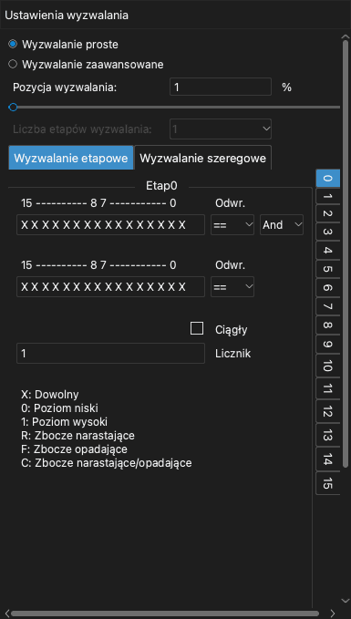
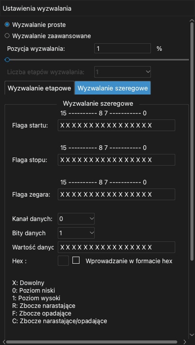

# Wyzwalanie

Wyzwalanie to warunek w sygnałach. Gdy warunek wystąpi, urządzenie oznacza ten czas jako punkt wyzwolenia. Wyzwalanie pozwala zarejestrować część sygnału, którą chcesz zbadać.

Aplikacja ma dwa rodzaje wyzwalania:

- **Wyzwalanie proste**: Zbocze lub poziom na jednym lub kilku kanałach.
- **Wyzwalanie zaawansowane**: Sekwencja warunków lub wartość na magistrali szeregowej.

Aby otworzyć panel boczny wyzwalania, kliknij **Wyzwalanie** na pasku narzędzi lub naciśnij `T`.

> [!NOTE]
> Jeśli sygnał nie spełnia warunku wyzwalania, rejestracja dalej czeka. Aby zobaczyć sygnał bez wyzwalania, kliknij **Teraz**. Aby przerwać czekanie, kliknij **Stop**.

## Pozycja wyzwalania

Ustawienie **Pozycja wyzwalania** ustala, gdzie w rejestracji leży punkt wyzwolenia. Wartość to procent czasu próbkowania.

- Mała wartość, na przykład 10%, pokazuje więcej sygnału po wyzwoleniu.
- Duża wartość, na przykład 90%, pokazuje więcej sygnału przed wyzwoleniem.

Pozycja wyzwalania używa pamięci urządzenia. Dlatego możesz ją ustawić tylko w trybie buforowym. W trybie strumieniowym pozycja wyzwalania wynosi zawsze około 1%.

<!-- TODO: new screenshot -->

## Wyzwalanie proste

Każda etykieta kanału w obszarze przebiegów ma pięć przycisków wyzwalania. Od lewej do prawej przyciski to:

1. Zbocze narastające
2. Poziom wysoki
3. Zbocze opadające
4. Poziom niski
5. Zbocze narastające lub opadające

Aby ustawić wyzwalanie proste, wykonaj te kroki:

1. Otwórz panel boczny wyzwalania.
2. Wybierz **Wyzwalanie proste**.
3. Na etykiecie kanału kliknij wybrany przycisk wyzwalania. Przycisk zmienia kolor.
4. Aby usunąć wyzwalanie z kanału, kliknij ponownie ten sam przycisk.
5. Ustaw **Pozycja wyzwalania**.

Jeśli ustawisz wyzwalanie na więcej niż jednym kanale, wszystkie warunki muszą wystąpić w tej samej próbce (logiczne I).

## Wyzwalanie zaawansowane

> [!NOTE]
> Wyzwalanie zaawansowane jest dostępne tylko w trybie buforowym. Aby go użyć, ustaw **Tryb pracy** na **Tryb buforowy**. Zobacz [Opcje urządzenia](05-device-options.md).

Aby użyć wyzwalania zaawansowanego, wybierz **Wyzwalanie zaawansowane** w panelu bocznym wyzwalania. Następnie wybierz kartę **Wyzwalanie etapowe** lub kartę **Wyzwalanie szeregowe**.

### Wartości dla każdego kanału

Wyzwalanie etapowe i wyzwalanie szeregowe używają wiersza z 16 znaków. Każdy znak to warunek dla jednego kanału. Znak po prawej stronie to kanał 0. Znak po lewej stronie to kanał 15.

| Znak | Warunek |
| --- | --- |
| `X` | Wszystkie wartości (kanał nie ma wpływu). |
| `0` | Poziom niski. |
| `1` | Poziom wysoki. |
| `R` | Zbocze narastające. |
| `F` | Zbocze opadające. |
| `C` | Zbocze narastające lub opadające. |

### Wyzwalanie etapowe

Wyzwalanie etapowe to sekwencja warunków. Każdy warunek to etap. Urządzenie najpierw sprawdza etap 0. Gdy warunek etapu wystąpi, urządzenie przechodzi do następnego etapu. Wyzwolenie następuje, gdy ostatni etap jest zakończony. Możesz użyć do 16 etapów.

Każdy etap ma te ustawienia:

- Dwa wiersze warunków kanałów.
- Dla każdego wiersza `==` lub `!=`. Z `==` warunek występuje, gdy kanały zgadzają się z wierszem. Z `!=` warunek występuje, gdy kanały nie zgadzają się z wierszem.
- **I** lub **Lub**. To ustawienie łączy dwa wiersze.
- **Licznik**: Liczba wystąpień warunku, zanim etap się zakończy.
- **Ciągły**: Gdy zaznaczysz to pole wyboru, warunek musi wystąpić w próbkach, które następują po sobie bez przerwy.

Aby ustawić wyzwalanie etapowe, wykonaj te kroki:

1. W polu **Liczba etapów wyzwalania** wybierz liczbę etapów.
2. Na liście etapów po prawej stronie kliknij etap 0.
3. Wpisz warunki kanałów w pierwszym wierszu.
4. Jeśli to potrzebne, wpisz warunki kanałów w drugim wierszu i wybierz **I** lub **Lub**.
5. Wpisz wartość w polu **Licznik**.
6. Wykonaj ponownie kroki od 2 do 5 dla każdego innego etapu.

Oto trzy przykłady.

**Przykład 1.** Wyzwolenie, gdy kanał 0 pozostaje w stanie wysokim dłużej niż 1000 próbek:

1. Ustaw **Liczba etapów wyzwalania** na 1.
2. W etapie 0 wpisz `1` dla kanału 0 w pierwszym wierszu.
3. Zaznacz **Ciągły**.
4. Ustaw **Licznik** na 1000.

**Przykład 2.** Wyzwolenie na zboczu narastającym na kanale 0 lub na zboczu opadającym na kanale 1:

1. Ustaw **Liczba etapów wyzwalania** na 1.
2. W etapie 0 wpisz `R` dla kanału 0 w pierwszym wierszu.
3. Wpisz `F` dla kanału 1 w drugim wierszu.
4. Wybierz **Lub**.

**Przykład 3.** Wyzwolenie na zboczu narastającym na kanale 0, potem po 100 zboczach opadających na kanale 1, potem na poziomie wysokim na kanale 2:

1. Ustaw **Liczba etapów wyzwalania** na 3.
2. W etapie 0 wpisz `R` dla kanału 0.
3. W etapie 1 wpisz `F` dla kanału 1. Ustaw **Licznik** na 100.
4. W etapie 2 wpisz `1` dla kanału 2.

### Wyzwalanie szeregowe

Wyzwalanie szeregowe znajduje wartość danych na magistrali szeregowej. Działa jak rejestr przesuwny. Oto ustawienia:

- **Flaga startu**: Warunek, który uruchamia wyzwalanie szeregowe.
- **Flaga stopu**: Warunek, który czyści rejestr przesuwny.
- **Flaga zegara**: Warunek, który dodaje jeden bit do rejestru przesuwnego.
- **Kanał danych**: Kanał, który przesyła dane.
- **Bity danych**: Liczba bitów w wartości.
- **Wartość danych**: Wartość, która powoduje wyzwolenie.

Po fladze startu urządzenie odczytuje kanał danych przy każdej fladze zegara. Urządzenie przesuwa ten bit do rejestru przesuwnego. Gdy ostatnie bity rejestru przesuwnego są równe wartości z pola **Wartość danych**, następuje wyzwolenie. Gdy wystąpi flaga stopu, urządzenie czyści rejestr przesuwny.

**Przykład 4.** Wyzwolenie, gdy na magistrali I2C wystąpi wartość `010000100`. Kanał 0 to SCL, a kanał 1 to SDA.

1. Ustaw **Flaga startu** na zbocze opadające na SDA, gdy SCL ma stan wysoki: `F1` w dwóch znakach po prawej stronie.
2. Ustaw **Flaga stopu** na zbocze narastające na SDA, gdy SCL ma stan wysoki: `R1`.
3. Ustaw **Flaga zegara** na zbocze narastające na SCL: `R` dla kanału 0.
4. Ustaw **Kanał danych** na 1.
5. Ustaw **Bity danych** na 9.
6. Wpisz `010000100` w polu **Wartość danych**.

**Przykład 5.** Wyzwolenie, gdy na linii MOSI magistrali SPI wystąpi wartość `0x1234`. Kanał 0 to CS#, kanał 1 to CLK, kanał 2 to MISO, a kanał 3 to MOSI.

1. Ustaw **Flaga startu** na zbocze opadające na CS#: `F` dla kanału 0.
2. Ustaw **Flaga stopu** na zbocze narastające na CS#: `R` dla kanału 0.
3. Ustaw **Flaga zegara** na zbocze narastające na CLK: `R` dla kanału 1.
4. Ustaw **Kanał danych** na 3.
5. Ustaw **Bity danych** na 16.
6. Wpisz `0001001000110100` w polu **Wartość danych**.

Aby wpisać wartość szesnastkowo, zaznacz **Wprowadzanie w formacie hex**. Następnie wpisz wartość w polu **Hex**.
