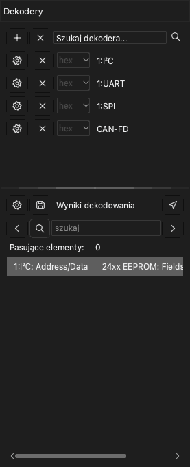

# Dekodery protokołów

Dekoder protokołu odczytuje dane rejestracji i znajduje ramki protokołu, na przykład UART, I2C lub SPI. Aplikacja pokazuje wynik jako nowy wiersz nad kanałami. Aplikacja ma ponad 100 dekoderów.

Aby otworzyć panel boczny dekoderów, kliknij **Dekoduj** na pasku narzędzi lub naciśnij `D`. Panel boczny ma dwie części:

- Listę dekoderów z polem **Szukaj dekodera...** u góry.
- Listę **Wyniki dekodowania**. Ta lista pokazuje każdy element z dekodera jako wiersz tekstu.

## Dodawanie dekodera

> [!NOTE]
> Dekoder z przedrostkiem `0:` to mniejsza wersja. Nie pokazuje bitów. Nie możesz dodać na nim wyższego protokołu. Dekoduje szybciej i używa mniej pamięci.

1. Kliknij pole **Szukaj dekodera...**. Otwiera się lista dekoderów.
2. Wpisz część nazwy protokołu, na przykład `I2C`. Lista pokazuje tylko dekodery zgodne z tekstem.
3. Kliknij dekoder. Otwiera się okno **Opcje dekodera**.
4. Ustaw kanały protokołu. Na przykład ustaw **SCL** i **SDA** dla I2C.
5. Ustaw opcje protokołu, na przykład prędkość transmisji UART.
6. Wybierz wiersze wyników, które pokazuje aplikacja.
7. Jeśli to potrzebne, ustaw obszar dekodowania. Zobacz [Dekodowanie części rejestracji](#decode-region).
8. Kliknij **OK**.

Aplikacja dekoduje dane i pokazuje wyniki w nowym wierszu w obszarze przebiegów.

Aby dodać więcej dekoderów, wykonaj procedurę ponownie dla każdego dekodera.

Aby zmienić ustawienia dekodera, kliknij przycisk ustawień tego dekodera w panelu bocznym.

## Dodawanie dekodera warstwowego

Niektóre protokoły używają niższego protokołu. Na przykład protokół 24xx EEPROM używa I2C. Gdy dodasz wyższy protokół, aplikacja dodaje też niższe protokoły.

1. W polu **Szukaj dekodera...** wpisz nazwę wyższego protokołu, na przykład `24xx`.
2. Kliknij dekoder.
3. W oknie **Opcje dekodera** ustaw opcje dla każdej warstwy protokołu.
4. Kliknij **OK**.

Wyniki pokazują ramki niższego protokołu oraz polecenia i dane wyższego protokołu.

## Dekodowanie części rejestracji {#decode-region}

Zwykle aplikacja dekoduje wszystkie dane. Aby zdekodować tylko część, ustaw kursor początkowy i kursor końcowy. Na przykład możesz pominąć szum podczas resetu obwodu. Krótszy obszar skraca też czas dekodowania.

1. Dodaj dwa kursory na początku i na końcu obszaru. Zobacz [Pomiary](10-measure.md).
2. Otwórz okno **Opcje dekodera** dekodera.
3. Na liście **Początek** wybierz kursor początkowy.
4. Na liście **Koniec** wybierz kursor końcowy.
5. Kliknij **OK**.

## Czytanie listy wyników

Lista **Wyniki dekodowania** pokazuje elementy z dekodera w kolejności czasowej. Kliknij wiersz, aby przesunąć przebieg do tego elementu.

Aby zmienić kolumny, które pokazuje lista, kliknij przycisk ustawień u góry listy.

## Wyszukiwanie tekstu w wynikach

1. Wpisz tekst w polu wyszukiwania listy **Wyniki dekodowania**.
2. Kliknij prawą strzałkę, aby przejść do następnego wiersza z tym tekstem. Kliknij lewą strzałkę, aby przejść do poprzedniego wiersza.

Przebieg przesuwa się do elementu każdego wiersza, który znajduje wyszukiwanie. Jeśli najpierw klikniesz wiersz, wyszukiwanie zaczyna się od tego wiersza.

Aby znaleźć sekwencję bajtów, wstaw znak `-` między bajty. Na przykład `70-70-70` znajduje trzy kolejne bajty o wartości 70.

> [!NOTE]
> Wyszukiwanie sekwencji bajtów działa tylko z dekoderami UART, I2C i SPI.

## Eksportowanie wyników

1. Kliknij przycisk zapisu u góry listy **Wyniki dekodowania**. Otwiera się okno **Eksport protokołu**.
2. W polu **Format eksportu** wybierz CSV lub TXT.
3. Zaznacz każdą kolumnę, którą chcesz eksportować. Aplikacja zapisuje wszystkie kolumny w jednym pliku, w kolejności czasowej.
4. Kliknij **OK**.
5. Wybierz folder i wpisz nazwę pliku.
6. Kliknij **Zachowaj**.

## Usuwanie dekodera

- Aby usunąć jeden dekoder, kliknij przycisk **×** w wierszu tego dekodera.
- Aby usunąć wszystkie dekodery, kliknij przycisk **×** u góry panelu bocznego, obok przycisku **+**.
