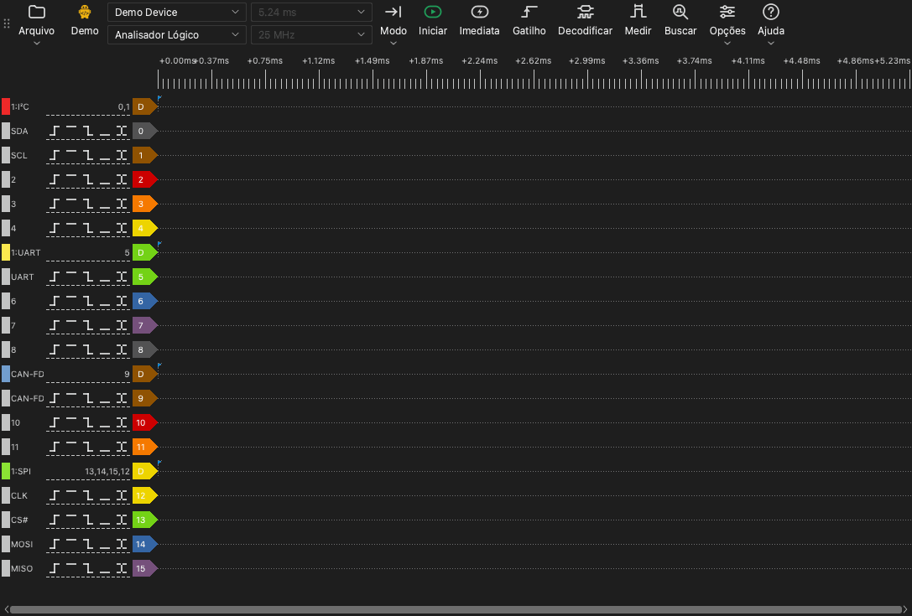

# A janela principal

## Partes da janela principal

A janela principal tem estas partes:

- **Barra de ferramentas.** A barra de ferramentas tem os controles do dispositivo, da captura e das ferramentas.
- **Área da forma de onda.** A área da forma de onda mostra uma linha para cada canal. Uma régua de tempo fica acima das linhas.
- **Rótulos de canal.** Um rótulo à esquerda de cada linha mostra o número do canal, o nome e os botões de gatilho.
- **Painéis.** Um painel fica ao lado da área da forma de onda. As ferramentas do gatilho, dos decodificadores, das medições e da busca abrem em painéis.

## A barra de ferramentas

A barra de ferramentas tem estes itens, do início ao fim:

| Item | Função |
| --- | --- |
| **Arquivo** | Um menu para abrir, salvar e exportar dados e para salvar sessões. Consulte [Arquivos e sessões](12-files.md). |
| Tipo de dispositivo | Um rótulo que mostra a conexão: **USB 2.0**, **USB 3.0**, **Demo** ou **Arquivo**. |
| Lista de dispositivos | O dispositivo que o aplicativo usa. Selecione aqui um outro dispositivo ou um dispositivo de demonstração. |
| Modo do dispositivo | **Analisador Lógico**, **Osciloscópio** ou **Aquisição de Dados**. A lista mostra somente os modos disponíveis para o dispositivo. |
| Duração da amostragem | O tempo de uma captura. |
| Taxa de amostragem | O número de amostras em cada segundo, para cada canal. |
| **Modo** | O modo de captura: **Única**, **Repetitiva** ou **Cíclica**. |
| **Iniciar** | Inicia uma captura. Durante uma captura, este botão muda para **Parar**. |
| **Imediata** | Inicia uma captura que não espera o gatilho. |
| **Gatilho** | Abre o painel do gatilho. |
| **Decodificar** | Abre o painel do decodificador. |
| **Medir** | Abre o painel de medição. |
| **Buscar** | Abre a barra de busca. |
| **Opções** | Um menu com **Opções do dispositivo...** e o menu **Exibir**. |
| **Ajuda** | Um menu com o idioma, este manual, a página de atualização, as opções de log e a página de relatório de problemas. |

O rótulo do tipo de dispositivo mostra estes valores:

- **USB 3.0**: O dispositivo usa uma conexão USB 3.0.
- **USB 2.0**: O dispositivo usa uma conexão USB 2.0. Se o dispositivo tiver uma conexão USB 3.0, conecte-o a uma porta USB 3.0. Uma conexão USB 2.0 diminui a taxa de amostragem máxima no modo stream.
- **Demo**: O dispositivo é um dispositivo de demonstração. O dispositivo de demonstração gera sinais de teste. Use-o para experimentar as funções do aplicativo.
- **Arquivo**: O aplicativo mostra dados de um arquivo. Não há dispositivo.

## Atalhos de teclado

| Tecla | Função |
| --- | --- |
| `S` | Iniciar ou parar uma captura. |
| `I` | Iniciar ou parar uma captura imediata. No modo osciloscópio, fazer uma captura e parar. |
| `T` | Abrir ou fechar o painel do gatilho. |
| `D` | Abrir ou fechar o painel do decodificador. |
| `M` | Abrir ou fechar o painel de medição. |
| `R` | Abrir ou fechar a barra de busca. |
| `O` | Abrir a janela **Opções do dispositivo**. |
| `Page Up` | Mover a forma de onda uma largura de janela para a esquerda. |
| `Page Down` | Mover a forma de onda uma largura de janela para a direita. |
| `←` | Ampliar. |
| `→` | Reduzir. |
| `0`, `1` | No modo osciloscópio, selecionar ou soltar o controle de escala do canal 0 ou do canal 1. |
| `↑`, `↓` | No modo osciloscópio, mudar a escala vertical do canal selecionado. |

Os atalhos funcionam quando a área da forma de onda tem o foco do teclado.
