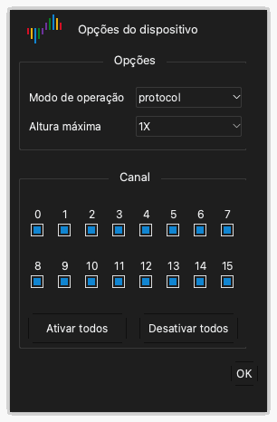

# Opções do dispositivo

## Abrir as opções do dispositivo

1. Clique em **Opções** › **Opções do dispositivo...** na barra de ferramentas. Você também pode pressionar `O`.
2. Mude as configurações na janela **Opções do dispositivo**.
3. Clique em **OK**.

As configurações da janela são diferentes para cada modelo de dispositivo. Este capítulo dá as configurações do DSLogic Plus.

> [!NOTE]
> Você não pode mudar as opções do dispositivo durante uma captura.

## Modo de operação

A configuração **Modo de operação** seleciona como o dispositivo envia os dados ao computador.

**Modo buffer.** O dispositivo guarda as amostras na sua memória interna durante a captura. Depois da captura, o dispositivo envia os dados ao computador pelo USB. A memória é mais rápida que o USB. Por isso, o modo buffer dá as taxas de amostragem mais altas. A capacidade da memória limita o tamanho da captura. Use o modo buffer para sinais rápidos e capturas curtas.

**Modo stream.** O dispositivo envia as amostras ao computador durante a captura. A memória do computador limita o tamanho da captura. Você pode ver os dados durante a captura. A velocidade da conexão USB limita a taxa de amostragem. Use o modo stream para sinais lentos e capturas longas.

**Teste interno.** Este modo serve somente para testes do dispositivo. Não o use para medições.

## Opções de parada

A configuração **Opções de parada** se aplica somente ao modo buffer. Ela define como o aplicativo opera quando você para uma captura antes do fim.

- **Parar imediatamente**: O aplicativo não recebe os dados do dispositivo. O aplicativo não mostra dados.
- **Enviar os dados capturados**: O aplicativo recebe os dados que o dispositivo registrou antes da parada. O aplicativo mostra esses dados.

## Nível de limiar

A configuração **Nível de limiar** é a tensão que separa um nível baixo de um nível alto. Um sinal acima do limiar é um nível alto. Um sinal abaixo do limiar é um nível baixo.

Você pode definir um valor de 0,0 V a 5,0 V em passos de 0,1 V. Defina o limiar em cerca de 50% da tensão lógica do circuito. Para um circuito de 3,3 V, defina cerca de 1,6 V.

## Alvos do filtro

A configuração **Alvos do filtro** remove pulsos curtos dos dados.

- **Nenhum**: O aplicativo mostra todas as amostras.
- **1 ciclo de amostragem**: O aplicativo remove cada pulso mais curto que um período de amostragem.

## Altura máxima

A configuração **Altura máxima** define a altura máxima de cada linha de canal na área da forma de onda. **1X** é uma unidade de altura. Use um valor maior quando você mostra somente um pequeno número de canais.

## Ativar compressão RLE

Quando você seleciona **Ativar compressão RLE**, o dispositivo comprime os dados na sua memória (codificação run-length). Esta configuração se aplica somente ao modo buffer. Se os sinais têm um pequeno número de bordas, o dispositivo pode guardar uma captura mais longa na sua memória. Se os sinais têm muitas bordas, a compressão não aumenta o tamanho da captura.

## Usar clock externo

Quando você seleciona **Usar clock externo**, o dispositivo amostra os canais em cada borda de clock no fio CK. O dispositivo não usa o seu clock interno. Use esta configuração para registrar um barramento que tem um sinal de clock.

## Usar borda de descida do clock

Esta configuração se aplica somente com **Usar clock externo**. Normalmente, o dispositivo amostra os canais na borda de subida do clock. Quando você seleciona **Usar borda de descida do clock**, o dispositivo amostra os canais na borda de descida do clock.

## Modo de canais

O modo de canais define o número de canais que o dispositivo pode usar. Ele também define a taxa de amostragem máxima. Um número menor de canais dá uma taxa de amostragem máxima mais alta. Selecione o modo de canais que corresponde ao número e à frequência dos seus sinais.

Para o DSLogic Plus, os modos de canais são:

| Modo de operação | Modo de canais | Taxa de amostragem máxima |
| --- | --- | --- |
| Modo buffer | Canais 0 a 15 | 100 MHz |
| Modo buffer | Canais 0 a 7 | 200 MHz |
| Modo buffer | Canais 0 a 3 | 400 MHz |
| Modo stream | 16 canais | 20 MHz |
| Modo stream | 12 canais | 25 MHz |
| Modo stream | 6 canais | 50 MHz |
| Modo stream | 3 canais | 100 MHz |

## Ativar e desativar canais

Abaixo dos modos de canais, a janela mostra uma caixa de seleção para cada canal.

1. Selecione a caixa de seleção de cada canal que você usa.
2. Desmarque a caixa de seleção de cada canal que você não usa.
3. Para selecionar todos os canais, clique em **Ativar todos**. Para desmarcar todos os canais, clique em **Desativar todos**.

No modo stream, um número menor de canais ativados pode permitir uma taxa de amostragem mais alta.
