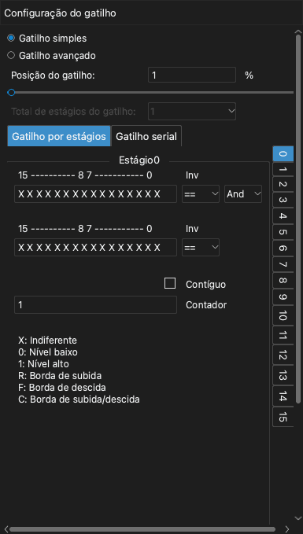
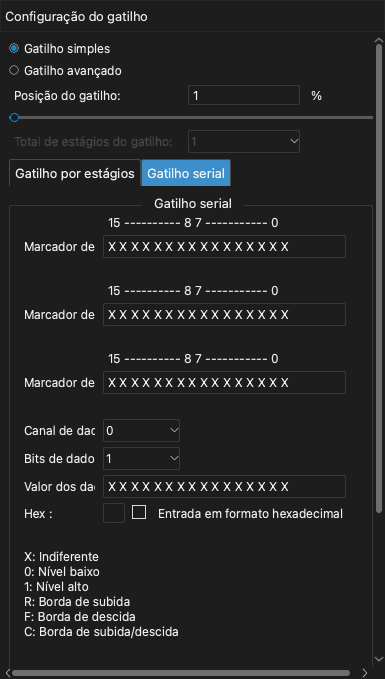

# Gatilhos

Um gatilho é uma condição nos sinais. Quando a condição ocorre, o dispositivo marca esse tempo como o ponto do gatilho. O gatilho permite capturar a parte do sinal que você quer examinar.

O aplicativo tem dois tipos de gatilho:

- **Gatilho simples**: Uma borda ou um nível em um ou mais canais.
- **Gatilho avançado**: Uma sequência de condições ou um valor em um barramento serial.

Para abrir o painel do gatilho, clique em **Gatilho** na barra de ferramentas ou pressione `T`.

> [!NOTE]
> Se o sinal não corresponde à condição do gatilho, a captura continua a esperar. Para ver o sinal sem o gatilho, clique em **Imediata**. Para parar a espera, clique em **Parar**.

## Posição do gatilho

A configuração **Posição do gatilho** define onde fica o ponto do gatilho na captura. O valor é uma porcentagem da duração da amostragem.

- Um valor pequeno, por exemplo 10%, mostra mais do sinal depois do gatilho.
- Um valor grande, por exemplo 90%, mostra mais do sinal antes do gatilho.

A posição do gatilho usa a memória do dispositivo. Por isso, você pode defini-la somente no modo buffer. No modo stream, a posição do gatilho é sempre de cerca de 1%.

<!-- TODO: new screenshot -->

## Gatilho simples

Cada rótulo de canal na área da forma de onda tem cinco botões de gatilho. Da esquerda para a direita, os botões são:

1. Borda de subida
2. Nível alto
3. Borda de descida
4. Nível baixo
5. Borda de subida ou borda de descida

Para definir um gatilho simples, faça estes passos:

1. Abra o painel do gatilho.
2. Selecione **Gatilho simples**.
3. No rótulo de um canal, clique no botão de gatilho que você quer. O botão muda de cor.
4. Para remover o gatilho de um canal, clique no mesmo botão de novo.
5. Defina a **Posição do gatilho**.

Se você define um gatilho em mais de um canal, todas as condições devem ocorrer na mesma amostra (E lógico).

## Gatilho avançado

> [!NOTE]
> O gatilho avançado está disponível somente no modo buffer. Para usá-lo, defina **Modo de operação** como **Modo buffer**. Consulte [Opções do dispositivo](05-device-options.md).

Para usar o gatilho avançado, selecione **Gatilho avançado** no painel do gatilho. Depois, selecione a guia **Gatilho por estágios** ou a guia **Gatilho serial**.

### Valores para cada canal

O gatilho por estágios e o gatilho serial usam uma linha de 16 caracteres. Cada caractere é a condição de um canal. O caractere da direita é o canal 0. O caractere da esquerda é o canal 15.

| Caractere | Condição |
| --- | --- |
| `X` | Todos os valores (o canal não tem efeito). |
| `0` | Nível baixo. |
| `1` | Nível alto. |
| `R` | Borda de subida. |
| `F` | Borda de descida. |
| `C` | Borda de subida ou borda de descida. |

### Gatilho por estágios

Um gatilho por estágios é uma sequência de condições. Cada condição é um estágio. O dispositivo examina primeiro o estágio 0. Quando a condição de um estágio ocorre, o dispositivo vai para o estágio seguinte. O gatilho ocorre quando o último estágio está completo. Você pode usar até 16 estágios.

Cada estágio tem estas configurações:

- Duas linhas de condições de canal.
- Para cada linha, `==` ou `!=`. Com `==`, a condição ocorre quando os canais correspondem à linha. Com `!=`, a condição ocorre quando os canais não correspondem à linha.
- **E** ou **Ou**. Esta configuração liga as duas linhas.
- **Contador**: O número de vezes que a condição deve ocorrer antes de o estágio estar completo.
- **Contíguo**: Quando você seleciona esta caixa de seleção, a condição deve ocorrer em amostras seguidas, sem interrupção.

Para definir um gatilho por estágios, faça estes passos:

1. Em **Total de estágios do gatilho**, selecione o número de estágios.
2. Na lista de estágios à direita, clique no estágio 0.
3. Digite as condições de canal na primeira linha.
4. Se necessário, digite as condições de canal na segunda linha e selecione **E** ou **Ou**.
5. Digite um valor em **Contador**.
6. Faça os passos 2 a 5 de novo para cada um dos outros estágios.

Estes são três exemplos.

**Exemplo 1.** Gatilho quando o canal 0 fica em nível alto por mais de 1000 amostras:

1. Defina **Total de estágios do gatilho** como 1.
2. No estágio 0, digite `1` para o canal 0 na primeira linha.
3. Selecione **Contíguo**.
4. Defina **Contador** como 1000.

**Exemplo 2.** Gatilho em uma borda de subida no canal 0 ou em uma borda de descida no canal 1:

1. Defina **Total de estágios do gatilho** como 1.
2. No estágio 0, digite `R` para o canal 0 na primeira linha.
3. Digite `F` para o canal 1 na segunda linha.
4. Selecione **Ou**.

**Exemplo 3.** Gatilho em uma borda de subida no canal 0, depois em 100 bordas de descida no canal 1 e depois em um nível alto no canal 2:

1. Defina **Total de estágios do gatilho** como 3.
2. No estágio 0, digite `R` para o canal 0.
3. No estágio 1, digite `F` para o canal 1. Defina **Contador** como 100.
4. No estágio 2, digite `1` para o canal 2.

### Gatilho serial

Um gatilho serial encontra um valor de dados em um barramento serial. Ele funciona como um registrador de deslocamento. Estas são as configurações:

- **Marcador de início**: A condição que inicia o gatilho serial.
- **Marcador de parada**: A condição que limpa o registrador de deslocamento.
- **Marcador de clock**: A condição que adiciona um bit ao registrador de deslocamento.
- **Canal de dados**: O canal que transmite os dados.
- **Bits de dados**: O número de bits do valor.
- **Valor dos dados**: O valor que causa o gatilho.

Depois que o marcador de início ocorre, o dispositivo lê o canal de dados em cada marcador de clock. O dispositivo move esse bit para o registrador de deslocamento. Quando os últimos bits do registrador de deslocamento são iguais ao **Valor dos dados**, o gatilho ocorre. Quando o marcador de parada ocorre, o dispositivo limpa o registrador de deslocamento.

**Exemplo 4.** Gatilho quando o valor `010000100` ocorre em um barramento I2C. O canal 0 é SCL e o canal 1 é SDA.

1. Defina **Marcador de início** como uma borda de descida em SDA enquanto SCL está em nível alto: `F1` nos dois caracteres da direita.
2. Defina **Marcador de parada** como uma borda de subida em SDA enquanto SCL está em nível alto: `R1`.
3. Defina **Marcador de clock** como uma borda de subida em SCL: `R` para o canal 0.
4. Defina **Canal de dados** como 1.
5. Defina **Bits de dados** como 9.
6. Digite `010000100` em **Valor dos dados**.

**Exemplo 5.** Gatilho quando o valor `0x1234` ocorre em MOSI de um barramento SPI. O canal 0 é CS#, o canal 1 é CLK, o canal 2 é MISO e o canal 3 é MOSI.

1. Defina **Marcador de início** como uma borda de descida em CS#: `F` para o canal 0.
2. Defina **Marcador de parada** como uma borda de subida em CS#: `R` para o canal 0.
3. Defina **Marcador de clock** como uma borda de subida em CLK: `R` para o canal 1.
4. Defina **Canal de dados** como 3.
5. Defina **Bits de dados** como 16.
6. Digite `0001001000110100` em **Valor dos dados**.

Para digitar o valor em hexadecimal, selecione **Entrada em formato hexadecimal**. Depois, digite o valor no campo **Hex**.
