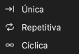

# Capturar dados

Antes de iniciar uma captura, defina estes itens:

1. As opções do dispositivo. Consulte [Opções do dispositivo](05-device-options.md).
2. A taxa de amostragem e a duração da amostragem. Consulte [Taxa de amostragem e duração da amostragem](06-sample-rate.md).
3. O gatilho, se necessário. Consulte [Gatilhos](07-trigger.md).
4. O modo de captura. Consulte [Modos de captura](#capture-modes).

## Iniciar uma captura

Há dois tipos de captura:

- **Iniciar** inicia uma captura padrão. O dispositivo espera o gatilho se você definiu um gatilho.
- **Imediata** inicia uma captura imediatamente. O dispositivo não usa as configurações do gatilho.

Para iniciar uma captura padrão, clique em **Iniciar** ou pressione `S`. Para iniciar uma captura imediata, clique em **Imediata** ou pressione `I`. Durante uma captura, o botão muda para **Parar**. Clique em **Parar** para parar a captura.

### Sequência de uma captura padrão no modo buffer

1. Você clica em **Iniciar**.
2. O aplicativo envia as configurações ao dispositivo.
3. Se não há gatilho, o dispositivo começa a registrar imediatamente. Se há um gatilho, o dispositivo espera o gatilho.
4. O dispositivo registra até o fim da duração da amostragem ou até a sua memória ficar cheia.
5. O dispositivo envia os dados ao computador.
6. O aplicativo mostra a forma de onda na área da forma de onda.

### Sequência de uma captura padrão no modo stream

1. Você clica em **Iniciar**.
2. O aplicativo envia as configurações ao dispositivo.
3. Se há um gatilho, o dispositivo espera o gatilho. No modo cíclico, o dispositivo não usa o gatilho.
4. O dispositivo envia os dados ao computador durante a captura.
5. O aplicativo mostra a forma de onda durante a captura.
6. A captura para no fim da duração da amostragem. No modo cíclico, a captura continua até você clicar em **Parar**.

## Usar a captura imediata

A captura imediata é igual à captura padrão, mas ela não usa as configurações do gatilho. Use-a nestas condições:

- A captura padrão espera por muito tempo porque a condição do gatilho não ocorre.
- Você quer ver os sinais neste momento.
- Você quer examinar os sinais antes de mudar o gatilho.

Se não há sinal, uma captura padrão espera na posição do gatilho. O status mostra **Aguardando gatilho!**. Uma captura imediata registra os sinais imediatamente.

## Modos de captura {#capture-modes}

Para selecionar o modo de captura, clique em **Modo** na barra de ferramentas. Depois, selecione um destes itens:

| Modo de captura | Modo buffer | Modo stream |
| --- | --- | --- |
| **Única** | Sim | Sim |
| **Repetitiva** | Sim | Sim |
| **Cíclica** | Não | Sim |

### Única

O dispositivo faz uma captura. Depois, a captura para.

No modo buffer, o aplicativo mostra a forma de onda depois da captura. No modo stream, o aplicativo mostra a forma de onda durante a captura.

Use este modo para capturar uma condição de sinal ou a forma de onda neste momento.

### Repetitiva

O dispositivo faz uma captura. Depois, ele inicia a captura seguinte automaticamente. Isso continua até você clicar em **Parar**.

No modo buffer, o aplicativo mostra uma janela para o intervalo entre as capturas. Você pode definir um valor de 0,1 s a 10 s.

Use este modo para ver uma condição de sinal que ocorre muitas vezes. Por exemplo, use-o para ver os sinais depois de cada reset do circuito ou depois de cada pressão em um botão. Use-o junto com um gatilho.

### Cíclica

Este modo está disponível somente no modo stream. A captura continua até você clicar em **Parar**. Quando os dados são mais longos que a duração da amostragem, os primeiros dados saem da janela pela esquerda. Os dados mais novos entram pela direita. O aplicativo descarta os dados que saem.

Use este modo quando você não sabe o momento da condição de sinal. Olhe a forma de onda durante a captura. Quando você vir a condição, clique em **Parar**.

> [!NOTE]
> No modo cíclico, o dispositivo não usa as configurações do gatilho.

## Status da captura

Durante uma captura, a área da forma de onda mostra o status:

- **Aguardando gatilho!**: O dispositivo espera a condição do gatilho.
- **Disparado!**: O gatilho ocorreu.
- **% capturado**: A porcentagem da captura que está completa.

Depois de uma captura, a parte de baixo da área da forma de onda mostra a **Hora do gatilho**.
