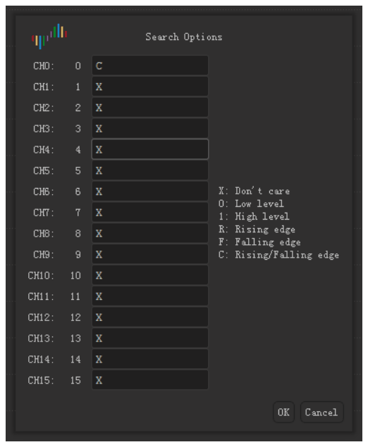
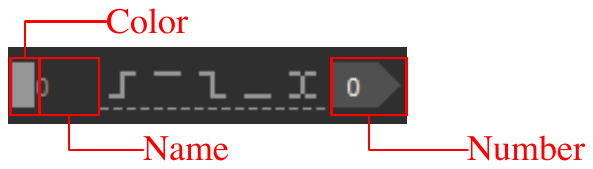

# Examinar a forma de onda

Depois de uma captura, a área da forma de onda mostra os dados de cada canal como uma forma de onda.

## Mover a forma de onda para a esquerda ou para a direita

Use um destes métodos:

- **Arrastar.** Coloque o ponteiro na forma de onda. Mantenha o botão esquerdo do mouse pressionado e mova o mouse para a esquerda ou para a direita.
- **Arrastar rápido.** Arraste a forma de onda rápido e solte o botão do mouse. A forma de onda continua a se mover. Depois, ela se move mais devagar e para. Para ligar ou desligar esta função, use **Rolar a forma de onda arrastando o mouse** nas opções de exibição. Consulte [Instalar e iniciar o aplicativo](02-install.md).
- **Barra de rolagem.** Arraste a barra de rolagem na parte de baixo da janela.
- **Teclado.** Pressione `Page Up` ou `Page Down`. A forma de onda se move uma largura de janela.

## Ampliar e reduzir

Use um destes métodos:

- **Roda do mouse.** Coloque o ponteiro na forma de onda e gire a roda do mouse. O ponteiro fica no meio do zoom.
- **Zoom de área.** Mantenha o botão direito do mouse pressionado e arraste sobre a forma de onda. Solte o botão. O aplicativo amplia a área que você selecionou.
- **Visão completa.** Dê um clique duplo na forma de onda com o botão direito do mouse. O aplicativo mostra todos os dados. Dê o clique duplo com o botão direito do mouse de novo para voltar ao zoom anterior.
- **Teclado.** Pressione `←` para ampliar. Pressione `→` para reduzir.

## Encontrar um padrão

A busca encontra um padrão de níveis e bordas nos canais.

1. Clique em **Buscar** na barra de ferramentas ou pressione `R`. A barra de busca abre na parte de baixo da janela.
2. Clique no campo de busca. A janela **Opções de busca** abre.
3. Para cada canal, digite um dos caracteres `X`, `0`, `1`, `R`, `F` ou `C`. [Gatilhos](07-trigger.md) dá a função de cada caractere.
4. Clique em **OK**.
5. Clique nos botões de seta na barra de busca para ir para o resultado anterior ou para o resultado seguinte.

<!-- TODO: new screenshot -->

Por exemplo, digite `C` para o canal 0 e `X` para todos os outros canais. A busca então encontra cada borda no canal 0.

## Mudar um canal

Cada canal tem um rótulo à esquerda da área da forma de onda. O rótulo mostra a cor, o nome e o número do canal.

### Mudar a cor

1. Clique na área da cor no rótulo do canal.
2. Selecione uma cor.
3. Clique em **OK**.

### Mudar o nome

1. Clique no nome no rótulo do canal.
2. Digite um nome novo.
3. Pressione `Return`.

### Mudar a sequência dos canais

Quando você coloca o ponteiro em um rótulo de canal, o ponteiro mostra uma seta. Use um destes métodos para mover o canal:

- Mantenha o botão esquerdo do mouse pressionado no rótulo e arraste o canal para cima ou para baixo. Solte o botão na posição nova.
- Clique no rótulo para selecionar o canal. Mova o mouse. O canal se move com o mouse. Clique de novo para soltar o canal na posição nova.
- Mantenha `Command` pressionado e clique em mais de um rótulo. Mova o mouse. Os canais selecionados se movem com o mouse. Clique de novo para soltá-los.
