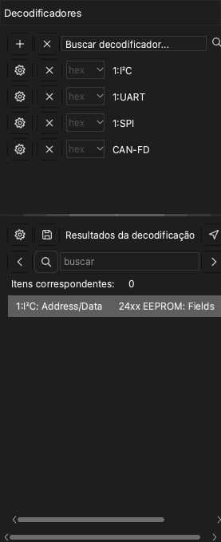

# Decodificadores de protocolo

Um decodificador de protocolo lê os dados de uma captura e encontra os quadros de um protocolo, por exemplo UART, I2C ou SPI. O aplicativo mostra o resultado como uma linha nova acima dos canais. O aplicativo tem mais de 100 decodificadores.

Para abrir o painel do decodificador, clique em **Decodificar** na barra de ferramentas ou pressione `D`. O painel tem duas partes:

- A lista de decodificadores, com o campo **Buscar decodificador...** em cima.
- A lista **Resultados da decodificação**. Esta lista mostra cada item do decodificador como uma linha de texto.

## Adicionar um decodificador

> [!NOTE]
> Um decodificador com o prefixo `0:` é uma versão menor. Ele não mostra os bits. Você não pode adicionar um protocolo superior sobre ele. Ele decodifica mais rápido e usa menos memória.

1. Clique no campo **Buscar decodificador...**. A lista de decodificadores abre.
2. Digite uma parte do nome do protocolo, por exemplo `I2C`. A lista mostra somente os decodificadores que correspondem ao texto.
3. Clique no decodificador. A janela **Opções do decodificador** abre.
4. Defina os canais do protocolo. Por exemplo, defina **SCL** e **SDA** para I2C.
5. Defina as opções do protocolo, por exemplo a taxa de baud de uma UART.
6. Selecione as linhas de resultados que o aplicativo mostra.
7. Se necessário, defina a região de decodificação. Consulte [Decodificar uma parte da captura](#decode-region).
8. Clique em **OK**.

O aplicativo decodifica os dados e mostra os resultados em uma linha nova na área da forma de onda.

Para adicionar mais decodificadores, faça o procedimento de novo para cada decodificador.

Para mudar as configurações de um decodificador, clique no botão de configurações desse decodificador no painel.

## Adicionar um decodificador empilhado

Alguns protocolos usam um protocolo inferior. Por exemplo, o protocolo 24xx EEPROM usa I2C. Quando você adiciona o protocolo superior, o aplicativo também adiciona os protocolos inferiores.

1. No campo **Buscar decodificador...**, digite o nome do protocolo superior, por exemplo `24xx`.
2. Clique no decodificador.
3. Na janela **Opções do decodificador**, defina as opções de cada camada de protocolo.
4. Clique em **OK**.

Os resultados mostram os quadros do protocolo inferior e os comandos e dados do protocolo superior.

## Decodificar uma parte da captura {#decode-region}

Normalmente, o aplicativo decodifica todos os dados. Para decodificar somente uma parte, defina um cursor de início e um cursor de fim. Por exemplo, você pode ignorar o ruído em um reset do circuito. Uma área menor também diminui o tempo de decodificação.

1. Adicione dois cursores no início e no fim da área. Consulte [Medições](10-measure.md).
2. Abra a janela **Opções do decodificador** do decodificador.
3. Na lista **Início**, selecione o cursor de início.
4. Na lista **Fim**, selecione o cursor de fim.
5. Clique em **OK**.

## Ler a lista de resultados

A lista **Resultados da decodificação** mostra os itens do decodificador em sequência de tempo. Clique em uma linha para mover a forma de onda até esse item.

Para mudar as colunas que a lista mostra, clique no botão de configurações em cima da lista.

## Encontrar um texto nos resultados

1. Digite um texto no campo de busca da lista **Resultados da decodificação**.
2. Clique na seta da direita para ir para a linha seguinte que contém o texto. Clique na seta da esquerda para ir para a linha anterior.

A forma de onda vai para o item de cada linha que a busca encontra. Se você clicar antes em uma linha, a busca começa nessa linha.

Para encontrar uma sequência de bytes, coloque o sinal `-` entre os bytes. Por exemplo, `70-70-70` encontra três bytes seguidos com o valor 70.

> [!NOTE]
> A busca de uma sequência de bytes funciona somente com os decodificadores UART, I2C e SPI.

## Exportar os resultados

1. Clique no botão de salvar em cima da lista **Resultados da decodificação**. A janela **Exportar protocolo** abre.
2. Em **Formato de exportação**, selecione CSV ou TXT.
3. Selecione cada coluna que você quer exportar. O aplicativo coloca todas as colunas em um arquivo, em sequência de tempo.
4. Clique em **OK**.
5. Selecione a pasta e digite o nome do arquivo.
6. Clique em **Salvar**.

## Excluir um decodificador

- Para excluir um decodificador, clique no botão **×** na linha desse decodificador.
- Para excluir todos os decodificadores, clique no botão **×** em cima do painel, ao lado do botão **+**.
