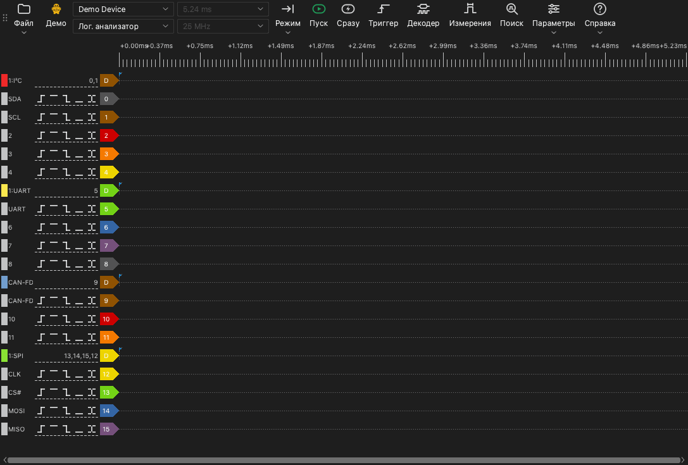

# Главное окно

## Части главного окна

Главное окно состоит из таких частей:

- **Панель инструментов.** На панели инструментов находятся элементы управления устройством, захватом и инструментами.
- **Область осциллограмм.** Область осциллограмм показывает одну строку для каждого канала. Над строками находится шкала времени.
- **Метки каналов.** Метка слева от каждой строки показывает номер канала, имя и кнопки триггера.
- **Боковые панели.** Боковая панель находится сбоку от области осциллограмм. Инструменты триггера, декодеров, измерений и поиска открываются на боковых панелях.

## Панель инструментов

На панели инструментов находятся такие элементы, от начала до конца:

| Элемент | Функция |
| --- | --- |
| **Файл** | Меню для открытия, сохранения и экспорта данных и для сохранения сеансов. См. [Файлы и сеансы](12-files.md). |
| Тип устройства | Метка, которая показывает подключение: **USB 2.0**, **USB 3.0**, **Демо** или **Файл**. |
| Список устройств | Устройство, которое использует приложение. Здесь можно выбрать другое устройство или демо-устройство. |
| Режим устройства | **Лог. анализатор**, **Осциллограф** или **Регистратор данных**. Список показывает только режимы, которые доступны для устройства. |
| Длительность захвата | Время одного захвата. |
| Частота дискретизации | Число выборок в секунду для каждого канала. |
| **Режим** | Режим захвата: **Однократно**, **Повторно** или **Цикл**. |
| **Пуск** | Запускает захват. Во время захвата эта кнопка меняется на **Стоп**. |
| **Сразу** | Запускает захват, который не ждет триггера. |
| **Триггер** | Открывает панель триггера. |
| **Декодер** | Открывает панель декодеров. |
| **Измерения** | Открывает панель измерений. |
| **Поиск** | Открывает строку поиска. |
| **Параметры** | Меню с пунктом **Параметры устройства...** и меню **Вид**. |
| **Справка** | Меню с выбором языка, этим руководством, страницей обновлений, параметрами журнала и страницей сообщений о проблемах. |

Метка типа устройства показывает такие значения:

- **USB 3.0**: Устройство использует подключение USB 3.0.
- **USB 2.0**: Устройство использует подключение USB 2.0. Если устройство поддерживает USB 3.0, подключите его к порту USB 3.0. Подключение USB 2.0 уменьшает максимальную частоту дискретизации в потоковом режиме.
- **Демо**: Устройство — это демо-устройство. Демо-устройство создает тестовые сигналы. Используйте его, чтобы попробовать функции приложения.
- **Файл**: Приложение показывает данные из файла. Устройства нет.

## Сочетания клавиш

| Клавиша | Функция |
| --- | --- |
| `S` | Запустить или остановить захват. |
| `I` | Запустить или остановить мгновенный захват. В режиме осциллографа выполнить один захват и остановиться. |
| `T` | Открыть или закрыть панель триггера. |
| `D` | Открыть или закрыть панель декодеров. |
| `M` | Открыть или закрыть панель измерений. |
| `R` | Открыть или закрыть строку поиска. |
| `O` | Открыть окно **Параметры устройства**. |
| `Page Up` | Сдвинуть осциллограмму на одну ширину окна влево. |
| `Page Down` | Сдвинуть осциллограмму на одну ширину окна вправо. |
| `←` | Увеличить масштаб. |
| `→` | Уменьшить масштаб. |
| `0`, `1` | В режиме осциллографа выбрать или отпустить регулятор масштаба канала 0 или канала 1. |
| `↑`, `↓` | В режиме осциллографа изменить вертикальный масштаб выбранного канала. |

Сочетания клавиш работают, когда область осциллограмм имеет фокус клавиатуры.
