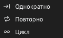

# Захват данных

Перед запуском захвата задайте такие параметры:

1. Параметры устройства. См. [Параметры устройства](05-device-options.md).
2. Частоту дискретизации и длительность захвата. См. [Частота дискретизации и длительность захвата](06-sample-rate.md).
3. Триггер, если нужно. См. [Триггеры](07-trigger.md).
4. Режим захвата. См. [Режимы захвата](#capture-modes).

## Запустите захват

Есть два типа захвата:

- **Пуск** запускает обычный захват. Если вы задали триггер, устройство ждет триггера.
- **Сразу** запускает захват немедленно. Устройство не использует настройки триггера.

Чтобы запустить обычный захват, щелкните **Пуск** или нажмите `S`. Чтобы запустить мгновенный захват, щелкните **Сразу** или нажмите `I`. Во время захвата кнопка меняется на **Стоп**. Щелкните **Стоп**, чтобы остановить захват.

### Последовательность обычного захвата в режиме буфера

1. Вы щелкаете **Пуск**.
2. Приложение передает настройки в устройство.
3. Если триггера нет, устройство сразу начинает запись. Если триггер есть, устройство ждет триггера.
4. Устройство записывает до конца длительности захвата или пока его память не заполнится.
5. Устройство передает данные в компьютер.
6. Приложение показывает осциллограмму в области осциллограмм.

### Последовательность обычного захвата в потоковом режиме

1. Вы щелкаете **Пуск**.
2. Приложение передает настройки в устройство.
3. Если триггер есть, устройство ждет триггера. В режиме цикла устройство не использует триггер.
4. Устройство передает данные в компьютер во время захвата.
5. Приложение показывает осциллограмму во время захвата.
6. Захват останавливается в конце длительности захвата. В режиме цикла захват продолжается, пока вы не щелкнете **Стоп**.

## Используйте мгновенный захват

Мгновенный захват такой же, как обычный захват, но он не использует настройки триггера. Используйте его в таких случаях:

- Обычный захват долго ждет, потому что условие триггера не выполняется.
- Вы хотите увидеть сигналы в текущий момент.
- Вы хотите изучить сигналы перед изменением триггера.

Если сигнала нет, обычный захват ждет в позиции триггера. Строка состояния показывает **Ожидание триггера!**. Мгновенный захват записывает сигналы сразу.

## Режимы захвата {#capture-modes}

Чтобы выбрать режим захвата, щелкните **Режим** на панели инструментов. Затем выберите один из этих пунктов:

| Режим захвата | Режим буфера | Потоковый режим |
| --- | --- | --- |
| **Однократно** | Да | Да |
| **Повторно** | Да | Да |
| **Цикл** | Нет | Да |

### Однократно

Устройство выполняет один захват. Затем захват останавливается.

В режиме буфера приложение показывает осциллограмму после захвата. В потоковом режиме приложение показывает осциллограмму во время захвата.

Используйте этот режим, чтобы захватить одно состояние сигнала или осциллограмму в текущий момент.

### Повторно

Устройство выполняет захват. Затем оно автоматически запускает следующий захват. Это продолжается, пока вы не щелкнете **Стоп**.

В режиме буфера приложение показывает окно для интервала между захватами. Можно задать значение от 0,1 s до 10 s.

Используйте этот режим, чтобы видеть состояние сигнала, которое повторяется много раз. Например, используйте его, чтобы видеть сигналы после каждого сброса цепи или после каждого нажатия кнопки. Используйте его вместе с триггером.

### Цикл

Этот режим доступен только в потоковом режиме. Захват продолжается, пока вы не щелкнете **Стоп**. Когда данные длиннее длительности захвата, первые данные уходят из окна влево. Самые новые данные появляются справа. Приложение удаляет данные, которые уходят из окна.

Используйте этот режим, если вы не знаете время состояния сигнала. Смотрите на осциллограмму во время захвата. Когда вы увидите это состояние, щелкните **Стоп**.

> [!NOTE]
> В режиме цикла устройство не использует настройки триггера.

## Состояние захвата

Во время захвата область осциллограмм показывает состояние:

- **Ожидание триггера!**: Устройство ждет выполнения условия триггера.
- **Сработал триггер!**: Триггер сработал.
- **% захвачено**: Процент захвата, который уже выполнен.

После захвата внизу области осциллограмм показано **Время триггера**.
