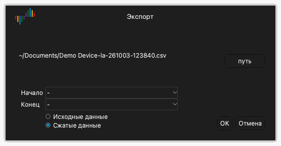

# Файлы и сеансы

Щелкните **Файл** на панели инструментов, чтобы открыть меню файла. Меню содержит такие пункты:

- **Сеанс**: меню для загрузки и сохранения сеансов.
- **Открыть...**: открыть файл данных.
- **Сохранить…**: сохранить данные захвата.
- **Экспорт...**: экспортировать данные в другой формат.
- **Скриншот...**: сохранить изображение окна.

## Сеансы

Файл сеанса содержит настройки, но не содержит данные захвата. Сеанс включает параметры устройства, включенные каналы, имена и цвета каналов и настройки триггера. Файл сеанса имеет расширение `.dsc`.

### Сохраните сеанс

1. Щелкните **Файл** › **Сеанс** › **Сохранить сеанс**.
2. Выберите папку и введите имя файла.
3. Щелкните **Сохранить**.

### Загрузите сеанс

1. Щелкните **Файл** › **Сеанс** › **Загрузить сеанс**.
2. Выберите файл сеанса.
3. Щелкните **Открыть**.

### Вернитесь к исходным настройкам

Щелкните **Файл** › **Сеанс** › **Сеанс по умолчанию**. Приложение возвращает все настройки устройства к исходным значениям.

Приложение автоматически сохраняет настройки, когда вы его закрываете. При следующем запуске приложение загружает настройки последнего сеанса.

## Сохраните данные

1. Щелкните **Файл** › **Сохранить…**.
2. Выберите папку и введите имя файла.
3. Щелкните **Сохранить**.

Приложение сохраняет данные и настройки в файл с расширением `.dsl`. Этот файл можно снова открыть в Logic Analyze.

> [!CAUTION]
> Приложение не сохраняет данные автоматически. Сохраните данные перед новым захватом или перед закрытием приложения. Новый захват заменяет данные предыдущего захвата.

## Откройте файл данных

1. Щелкните **Файл** › **Открыть...**.
2. Выберите файл с расширением `.dsl`.
3. Щелкните **Открыть**.

Приложение показывает данные в области осциллограмм. Метка типа устройства показывает **Файл**.

## Экспортируйте данные

Экспорт создает файл, который могут читать другие программы.

1. Щелкните **Файл** › **Экспорт...**. Открывается окно **Экспорт**.
2. Щелкните **путь**.
3. Выберите папку, введите имя файла и выберите формат.
4. Щелкните **Сохранить**.
5. Если формат CSV, выберите **Исходные данные** или **Сжатые данные**. Сжатые данные содержат строку только для каждого изменения значения.
6. Щелкните **OK**.

В режиме логического анализатора доступны такие форматы:

| Формат | Расширение | Назначение |
| --- | --- | --- |
| CSV | `.csv` | Программы электронных таблиц и скрипты. |
| VCD | `.vcd` | Программы для просмотра осциллограмм, например GTKWave. |
| Gnuplot | `.gnuplot` | Программа Gnuplot. |
| srzip | `.srzip` | Программы sigrok, например PulseView. |

В режиме осциллографа и в режиме регистратора данных доступен только CSV.

## Сохраните изображение окна

1. Щелкните **Файл** › **Скриншот...**.
2. Выберите папку и введите имя файла.
3. Выберите PNG или JPEG.
4. Щелкните **Сохранить**.
