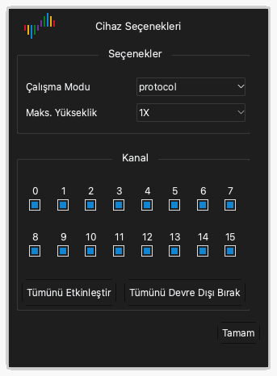

# Cihaz seçenekleri

## Cihaz seçeneklerini açma

1. Araç çubuğunda **Seçenekler** › **Cihaz Seçenekleri...** öğesine tıklayın. `O` tuşuna da basabilirsiniz.
2. **Cihaz Seçenekleri** penceresinde ayarları değiştirin.
3. **Tamam** düğmesine tıklayın.

Penceredeki ayarlar her cihaz modelinde farklıdır. Bu bölüm DSLogic Plus'ın ayarlarını verir.

> [!NOTE]
> Yakalama sırasında cihaz seçeneklerini değiştiremezsiniz.

## Çalışma modu

**Çalışma Modu** ayarı, cihazın verileri bilgisayara nasıl gönderdiğini seçer.

**Tampon Modu.** Yakalama sırasında cihaz örnekleri kendi iç belleğinde tutar. Yakalamadan sonra cihaz verileri USB üzerinden bilgisayara gönderir. Bellek USB'den hızlıdır. Bu nedenle tampon modu en yüksek örnekleme hızlarını verir. Bellek kapasitesi yakalama uzunluğunu sınırlar. Hızlı sinyaller ve kısa yakalamalar için tampon modunu kullanın.

**Akış Modu.** Yakalama sırasında cihaz örnekleri bilgisayara gönderir. Bilgisayarın belleği yakalama uzunluğunu sınırlar. Yakalama sırasında verileri görebilirsiniz. USB bağlantısının hızı örnekleme hızını sınırlar. Yavaş sinyaller ve uzun yakalamalar için akış modunu kullanın.

**Dahili Test.** Bu mod yalnızca cihaz testleri içindir. Ölçümler için kullanmayın.

## Durdurma seçenekleri

**Durdurma Seçenekleri** ayarı yalnızca tampon modunda geçerlidir. Bir yakalamayı bitmeden durdurduğunuzda uygulamanın nasıl çalıştığını belirler.

- **Hemen durdur**: Uygulama verileri cihazdan almaz. Uygulama veri göstermez.
- **Yakalanan veriyi yükle**: Uygulama, cihazın durdurmadan önce kaydettiği verileri alır. Uygulama bu verileri gösterir.

## Eşik seviyesi

**Eşik Seviyesi** ayarı, düşük seviyeyi yüksek seviyeden ayıran gerilimdir. Eşiğin üstündeki sinyal yüksek seviyedir. Eşiğin altındaki sinyal düşük seviyedir.

0.0 V ile 5.0 V arasında 0.1 V adımlarla bir değer ayarlayabilirsiniz. Eşiği devrenin mantık geriliminin yaklaşık %50'sine ayarlayın. 3.3 V'luk bir devre için yaklaşık 1.6 V ayarlayın.

## Filtre hedefleri

**Filtre Hedefleri** ayarı verilerden kısa darbeleri kaldırır.

- **Yok**: Uygulama tüm örnekleri gösterir.
- **1 Örnekleme Periyodu**: Uygulama bir örnekleme periyodundan kısa olan her darbeyi kaldırır.

## Maks. yükseklik

**Maks. Yükseklik** ayarı, dalga biçimi alanındaki her kanal satırının en büyük yüksekliğini belirler. **1X** bir yükseklik birimidir. Yalnızca az sayıda kanal gösterdiğinizde daha büyük bir değer kullanın.

## RLE sıkıştırmayı etkinleştirme

**RLE Sıkıştırmayı Etkinleştir** seçeneğini seçtiğinizde cihaz bellekteki verileri sıkıştırır (çalışma uzunluğu kodlaması). Bu ayar yalnızca tampon modunda geçerlidir. Sinyallerde az sayıda kenar varsa cihaz belleğinde daha uzun bir yakalama tutabilir. Sinyallerde çok sayıda kenar varsa sıkıştırma uzunluğu artırmaz.

## Harici saat kullanma

**Harici Saat Kullan** seçeneğini seçtiğinizde cihaz, CK telindeki her saat kenarında kanalları örnekler. Cihaz iç saatini kullanmaz. Saat sinyali olan bir veri yolunu kaydetmek için bu ayarı kullanın.

## Saatin düşen kenarını kullanma

Bu ayar yalnızca **Harici Saat Kullan** ile birlikte geçerlidir. Genellikle cihaz kanalları saatin yükselen kenarında örnekler. **Saatin Düşen Kenarını Kullan** seçeneğini seçtiğinizde cihaz kanalları saatin düşen kenarında örnekler.

## Kanal modu

Kanal modu, cihazın kullanabileceği kanal sayısını belirler. En yüksek örnekleme hızını da belirler. Daha az kanal daha yüksek bir en yüksek örnekleme hızı verir. Sinyallerinizin sayısına ve frekansına uyan kanal modunu seçin.

DSLogic Plus için kanal modları şunlardır:

| Çalışma modu | Kanal modu | En yüksek örnekleme hızı |
| --- | --- | --- |
| Tampon modu | Kanal 0 - 15 | 100 MHz |
| Tampon modu | Kanal 0 - 7 | 200 MHz |
| Tampon modu | Kanal 0 - 3 | 400 MHz |
| Akış modu | 16 kanal | 20 MHz |
| Akış modu | 12 kanal | 25 MHz |
| Akış modu | 6 kanal | 50 MHz |
| Akış modu | 3 kanal | 100 MHz |

## Kanalları etkinleştirme ve devre dışı bırakma

Pencerede kanal modlarının altında her kanal için bir onay kutusu vardır.

1. Kullandığınız her kanalın onay kutusunu seçin.
2. Kullanmadığınız her kanalın onay kutusunu temizleyin.
3. Tüm kanalları seçmek için **Tümünü Aç** düğmesine tıklayın. Tüm kanalları temizlemek için **Tümünü Kapat** düğmesine tıklayın.

Akış modunda daha az etkin kanal, daha yüksek bir örnekleme hızı kullanmanızı sağlayabilir.
