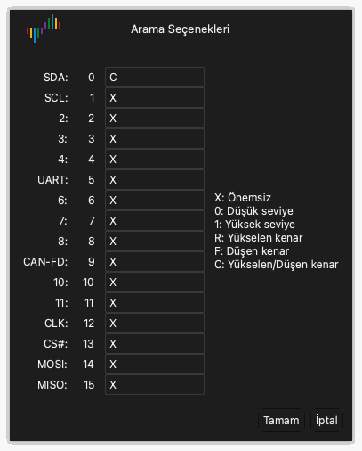

# Dalga biçimini inceleme

Yakalamadan sonra dalga biçimi alanı her kanalın verilerini bir dalga biçimi olarak gösterir.

## Dalga biçimini sola veya sağa taşıma

Şu yöntemlerden birini kullanın:

- **Sürükleme.** Fare işaretçisini dalga biçiminin üzerine getirin. Sol fare düğmesini basılı tutun ve fareyi sola veya sağa hareket ettirin.
- **Hızlı sürükleme.** Dalga biçimini hızla sürükleyin ve fare düğmesini bırakın. Dalga biçimi hareket etmeye devam eder. Sonra yavaşlar ve durur. Bu işlevi açmak veya kapatmak için görünüm seçeneklerindeki **Fareyle Sürükleyerek Dalga Biçimini Kaydır** ayarını kullanın. Bkz. [Uygulamayı yükleme ve başlatma](02-install.md).
- **Kaydırma çubuğu.** Pencerenin altındaki kaydırma çubuğunu sürükleyin.
- **Klavye.** `Page Up` veya `Page Down` tuşuna basın. Dalga biçimi bir pencere genişliği kadar hareket eder.

## Yakınlaştırma ve uzaklaştırma

Şu yöntemlerden birini kullanın:

- **Fare tekerleği.** Fare işaretçisini dalga biçiminin üzerine getirin ve fare tekerleğini çevirin. Fare işaretçisi yakınlaştırmanın ortasında kalır.
- **Alan yakınlaştırma.** Sağ fare düğmesini basılı tutun ve dalga biçiminin üzerinde sürükleyin. Düğmeyi bırakın. Uygulama seçtiğiniz alanı yakınlaştırır.
- **Tam görünüm.** Dalga biçimine sağ fare düğmesiyle çift tıklayın. Uygulama tüm verileri gösterir. Önceki yakınlaştırmaya dönmek için sağ fare düğmesiyle yeniden çift tıklayın.
- **Klavye.** Yakınlaştırmak için `←` tuşuna basın. Uzaklaştırmak için `→` tuşuna basın.

## Bir desen bulma

Arama, kanallarda seviyelerden ve kenarlardan oluşan bir desen bulur.

1. Araç çubuğunda **Ara** düğmesine tıklayın veya `R` tuşuna basın. Arama çubuğu pencerenin altında açılır.
2. Arama alanına tıklayın. **Arama Seçenekleri** penceresi açılır.
3. Her kanal için `X`, `0`, `1`, `R`, `F` veya `C` karakterlerinden birini yazın. [Tetikleme](07-trigger.md) bölümü her karakterin işlevini verir.
4. **Tamam** düğmesine tıklayın.
5. Önceki sonuca veya sonraki sonuca gitmek için arama çubuğundaki ok düğmelerine tıklayın.

Örneğin kanal 0 için `C`, diğer tüm kanallar için `X` yazın. Arama bu durumda kanal 0'daki her kenarı bulur.

## Bir kanalı değiştirme

Her kanalın dalga biçimi alanının solunda bir etiketi vardır. Etiket kanalın rengini, adını ve numarasını gösterir.

### Rengi değiştirme

1. Kanal etiketindeki renk alanına tıklayın.
2. Bir renk seçin.
3. **Tamam** düğmesine tıklayın.

### Adı değiştirme

1. Kanal etiketindeki ada tıklayın.
2. Yeni bir ad yazın.
3. `Return` tuşuna basın.

### Kanalların sırasını değiştirme

Fare işaretçisini bir kanal etiketinin üzerine getirdiğinizde işaretçi bir ok gösterir. Kanalı taşımak için şu yöntemlerden birini kullanın:

- Etiketin üzerinde sol fare düğmesini basılı tutun ve kanalı yukarı veya aşağı sürükleyin. Düğmeyi yeni konumda bırakın.
- Kanalı seçmek için etikete tıklayın. Fareyi hareket ettirin. Kanal fareyle birlikte hareket eder. Kanalı yeni konumda bırakmak için yeniden tıklayın.
- `Command` tuşunu basılı tutun ve birden çok etikete tıklayın. Fareyi hareket ettirin. Seçili kanallar fareyle birlikte hareket eder. Onları bırakmak için yeniden tıklayın.
