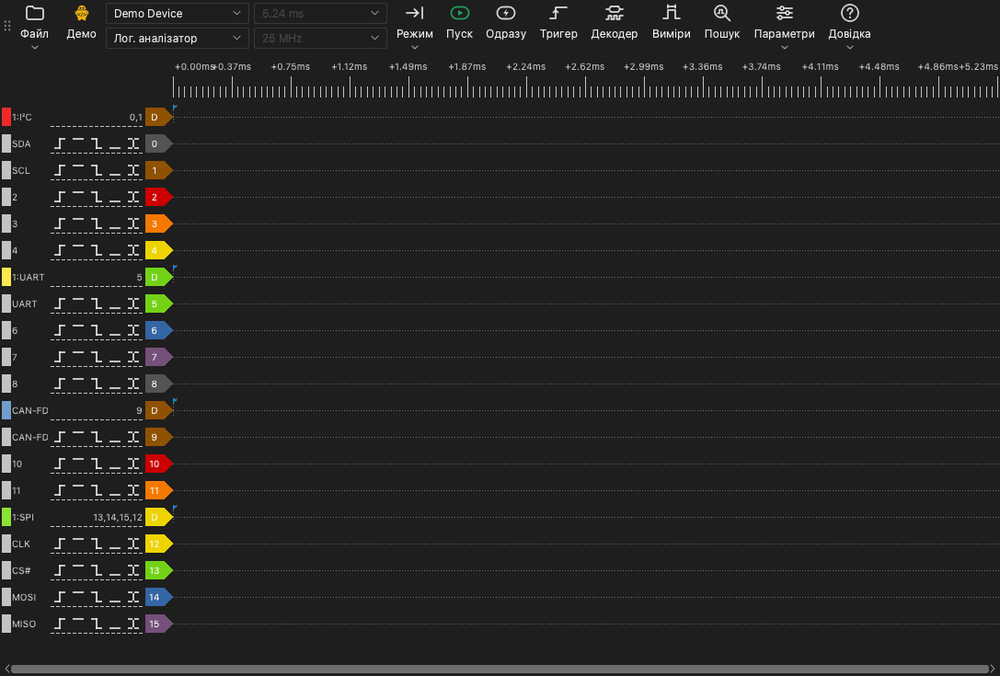

# Головне вікно

## Частини головного вікна

Головне вікно складається з таких частин:

- **Панель інструментів.** На панелі інструментів розміщено елементи керування пристроєм, захопленням та інструментами.
- **Область осцилограм.** Область осцилограм показує один рядок для кожного каналу. Над рядками розміщено шкалу часу.
- **Мітки каналів.** Мітка ліворуч від кожного рядка показує номер каналу, ім'я та кнопки тригера.
- **Бічні панелі.** Бічна панель розміщена збоку від області осцилограм. Інструменти тригера, декодерів, вимірювань і пошуку відкриваються на бічних панелях.

## Панель інструментів

На панелі інструментів розміщено такі елементи, від початку до кінця:

| Елемент | Функція |
| --- | --- |
| **Файл** | Меню для відкриття, збереження й експорту даних і для збереження сеансів. Див. [Файли та сеанси](12-files.md). |
| Тип пристрою | Мітка, яка показує підключення: **USB 2.0**, **USB 3.0**, **Демо** або **Файл**. |
| Список пристроїв | Пристрій, який використовує застосунок. Тут можна вибрати інший пристрій або демопристрій. |
| Режим пристрою | **Лог. аналізатор**, **Осцилограф** або **Збір даних**. Список показує лише режими, доступні для пристрою. |
| Тривалість захоплення | Час одного захоплення. |
| Частота дискретизації | Кількість відліків за секунду для кожного каналу. |
| **Режим** | Режим захоплення: **Одиночний**, **Повторний** або **Цикл**. |
| **Пуск** | Запускає захоплення. Під час захоплення ця кнопка змінюється на **Стоп**. |
| **Одразу** | Запускає захоплення, яке не чекає тригера. |
| **Тригер** | Відкриває панель тригера. |
| **Декодер** | Відкриває панель декодерів. |
| **Виміри** | Відкриває панель вимірювань. |
| **Пошук** | Відкриває рядок пошуку. |
| **Параметри** | Меню з пунктом **Параметри пристрою...** і меню **Дисплей**. |
| **Довідка** | Меню з вибором мови, цим посібником, сторінкою оновлень, параметрами журналу та сторінкою звітів про проблеми. |

Мітка типу пристрою показує такі значення:

- **USB 3.0**: Пристрій використовує підключення USB 3.0.
- **USB 2.0**: Пристрій використовує підключення USB 2.0. Якщо пристрій підтримує USB 3.0, підключіть його до порту USB 3.0. Підключення USB 2.0 зменшує максимальну частоту дискретизації в потоковому режимі.
- **Демо**: Пристрій — це демопристрій. Демопристрій створює тестові сигнали. Використовуйте його, щоб спробувати функції застосунку.
- **Файл**: Застосунок показує дані з файлу. Пристрою немає.

## Сполучення клавіш

| Клавіша | Функція |
| --- | --- |
| `S` | Запустити або зупинити захоплення. |
| `I` | Запустити або зупинити миттєве захоплення. У режимі осцилографа виконати одне захоплення й зупинитися. |
| `T` | Відкрити або закрити панель тригера. |
| `D` | Відкрити або закрити панель декодерів. |
| `M` | Відкрити або закрити панель вимірювань. |
| `R` | Відкрити або закрити рядок пошуку. |
| `O` | Відкрити вікно **Параметри пристрою**. |
| `Page Up` | Зсунути осцилограму на одну ширину вікна ліворуч. |
| `Page Down` | Зсунути осцилограму на одну ширину вікна праворуч. |
| `←` | Збільшити масштаб. |
| `→` | Зменшити масштаб. |
| `0`, `1` | У режимі осцилографа вибрати або відпустити регулятор масштабу каналу 0 або каналу 1. |
| `↑`, `↓` | У режимі осцилографа змінити вертикальний масштаб вибраного каналу. |

Сполучення клавіш працюють, коли область осцилограм має фокус клавіатури.
