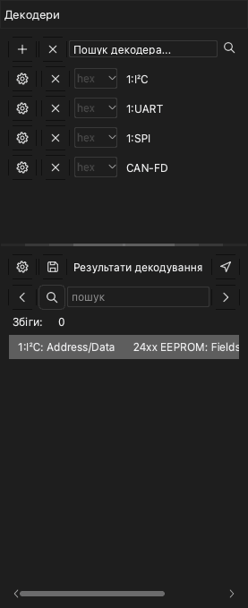

# Декодери протоколів

Декодер протоколу читає дані захоплення й знаходить кадри протоколу, наприклад UART, I2C або SPI. Застосунок показує результат у новому рядку над каналами. У застосунку понад 100 декодерів.

Щоб відкрити панель декодерів, клацніть **Декодер** на панелі інструментів або натисніть `D`. Панель складається з двох частин:

- Список декодерів із полем **Пошук декодера...** угорі.
- Список **Результати декодування**. Цей список показує кожен елемент декодера як рядок тексту.

## Додайте декодер

> [!NOTE]
> Декодер із префіксом `0:` — це спрощена версія. Вона не показує біти. На неї не можна додати протокол вищого рівня. Вона декодує швидше й використовує менше пам'яті.

1. Клацніть поле **Пошук декодера...**. Відкривається список декодерів.
2. Введіть частину імені протоколу, наприклад `I2C`. Список показує лише декодери, які відповідають тексту.
3. Клацніть декодер. Відкривається вікно **Параметри декодера**.
4. Задайте канали протоколу. Наприклад, задайте **SCL** і **SDA** для I2C.
5. Задайте параметри протоколу, наприклад швидкість UART у бодах.
6. Виберіть рядки результатів, які показує застосунок.
7. Якщо потрібно, задайте область декодування. Див. [Декодуйте частину захоплення](#decode-region).
8. Клацніть **OK**.

Застосунок декодує дані й показує результати в новому рядку в області осцилограм.

Щоб додати інші декодери, повторіть процедуру для кожного декодера.

Щоб змінити налаштування декодера, клацніть кнопку налаштувань цього декодера на панелі.

## Додайте багаторівневий декодер

Деякі протоколи використовують протокол нижчого рівня. Наприклад, протокол 24xx EEPROM використовує I2C. Коли ви додаєте протокол вищого рівня, застосунок також додає протоколи нижчого рівня.

1. У полі **Пошук декодера...** введіть ім'я протоколу вищого рівня, наприклад `24xx`.
2. Клацніть декодер.
3. У вікні **Параметри декодера** задайте параметри для кожного рівня протоколу.
4. Клацніть **OK**.

Результати показують кадри протоколу нижчого рівня, а також команди й дані протоколу вищого рівня.

## Декодуйте частину захоплення {#decode-region}

Зазвичай застосунок декодує всі дані. Щоб декодувати лише частину, задайте курсор початку й курсор кінця. Наприклад, так можна пропустити шум під час скидання кола. Менша область також зменшує час декодування.

1. Додайте два курсори на початку й у кінці області. Див. [Вимірювання](10-measure.md).
2. Відкрийте вікно **Параметри декодера** цього декодера.
3. У списку **Початок** виберіть курсор початку.
4. У списку **Кінець** виберіть курсор кінця.
5. Клацніть **OK**.

## Читайте список результатів

Список **Результати декодування** показує елементи декодера в порядку часу. Клацніть рядок, щоб зсунути осцилограму до цього елемента.

Щоб змінити стовпці списку, клацніть кнопку налаштувань угорі списку.

## Знайдіть текст у результатах

1. Введіть текст у поле пошуку списку **Результати декодування**.
2. Клацніть праву стрілку, щоб перейти до наступного рядка з цим текстом. Клацніть ліву стрілку, щоб перейти до попереднього рядка.

Осцилограма зсувається до елемента кожного рядка, який знаходить пошук. Якщо ви спочатку клацнете рядок, пошук починається з цього рядка.

Щоб знайти послідовність байтів, поставте знак `-` між байтами. Наприклад, `70-70-70` знаходить три байти поспіль зі значенням 70.

> [!NOTE]
> Пошук послідовності байтів працює лише з декодерами UART, I2C і SPI.

## Експортуйте результати

1. Клацніть кнопку збереження вгорі списку **Результати декодування**. Відкривається вікно **Експорт протоколу**.
2. У полі **Формат експорту** виберіть CSV або TXT.
3. Виберіть кожен стовпець, який ви хочете експортувати. Застосунок поміщає всі стовпці в один файл у порядку часу.
4. Клацніть **OK**.
5. Виберіть папку й введіть ім'я файлу.
6. Клацніть **Зберегти**.

## Видаліть декодер

- Щоб видалити один декодер, клацніть кнопку **×** у рядку цього декодера.
- Щоб видалити всі декодери, клацніть кнопку **×** угорі панелі, поруч із кнопкою **+**.
