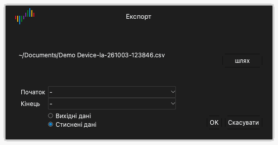

# Файли та сеанси

Клацніть **Файл** на панелі інструментів, щоб відкрити меню файлу. Меню містить такі пункти:

- **Сеанс**: меню для завантаження й збереження сеансів.
- **Відкрити...**: відкрити файл даних.
- **Зберегти...**: зберегти дані захоплення.
- **Експорт...**: експортувати дані в інший формат.
- **Знімок...**: зберегти зображення вікна.

## Сеанси

Файл сеансу містить налаштування, але не містить даних захоплення. Сеанс містить параметри пристрою, увімкнені канали, імена й кольори каналів і налаштування тригера. Файл сеансу має розширення `.dsc`.

### Збережіть сеанс

1. Клацніть **Файл** › **Сеанс** › **Зберегти сеанс**.
2. Виберіть папку й введіть ім'я файлу.
3. Клацніть **Зберегти**.

### Завантажте сеанс

1. Клацніть **Файл** › **Сеанс** › **Відкрити сеанс**.
2. Виберіть файл сеансу.
3. Клацніть **Відкрити**.

### Поверніться до початкових налаштувань

Клацніть **Файл** › **Сеанс** › **Сеанс за замовчуванням**. Застосунок повертає всі налаштування пристрою до початкових значень.

Застосунок автоматично зберігає налаштування, коли ви його закриваєте. Під час наступного запуску застосунок завантажує налаштування останнього сеансу.

## Збережіть дані

1. Клацніть **Файл** › **Зберегти...**.
2. Виберіть папку й введіть ім'я файлу.
3. Клацніть **Зберегти**.

Застосунок зберігає дані й налаштування у файл із розширенням `.dsl`. Цей файл можна знову відкрити в Logic Analyze.

> [!CAUTION]
> Застосунок не зберігає дані автоматично. Збережіть дані перед новим захопленням або перед закриттям застосунку. Нове захоплення замінює дані попереднього захоплення.

## Відкрийте файл даних

1. Клацніть **Файл** › **Відкрити...**.
2. Виберіть файл із розширенням `.dsl`.
3. Клацніть **Відкрити**.

Застосунок показує дані в області осцилограм. Мітка типу пристрою показує **Файл**.

## Експортуйте дані

Експорт створює файл, який можуть читати інші програми.

1. Клацніть **Файл** › **Експорт...**. Відкривається вікно **Експорт**.
2. Клацніть **шлях**.
3. Виберіть папку, введіть ім'я файлу й виберіть формат.
4. Клацніть **Зберегти**.
5. Якщо формат CSV, виберіть **Вихідні дані** або **Стиснені дані**. Стиснені дані містять рядок лише для кожної зміни значення.
6. Клацніть **OK**.

У режимі логічного аналізатора доступні такі формати:

| Формат | Розширення | Призначення |
| --- | --- | --- |
| CSV | `.csv` | Програми електронних таблиць і скрипти. |
| VCD | `.vcd` | Програми для перегляду осцилограм, наприклад GTKWave. |
| Gnuplot | `.gnuplot` | Програма Gnuplot. |
| srzip | `.srzip` | Програми sigrok, наприклад PulseView. |

У режимі осцилографа й у режимі збору даних доступний лише CSV.

## Збережіть зображення вікна

1. Клацніть **Файл** › **Знімок...**.
2. Виберіть папку й введіть ім'я файлу.
3. Виберіть PNG або JPEG.
4. Клацніть **Зберегти**.
