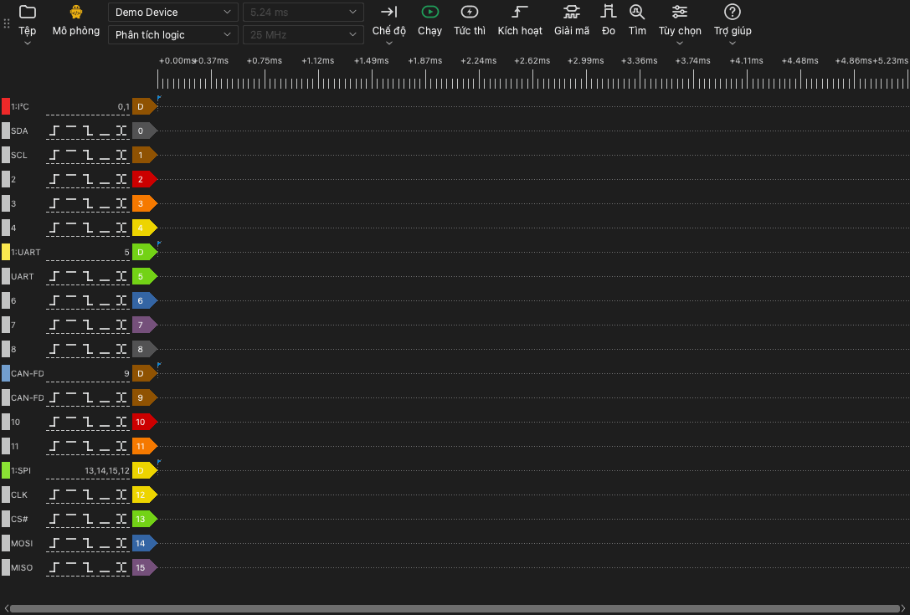

# Cửa sổ chính

## Các phần của cửa sổ chính

Cửa sổ chính có các phần sau:

- **Thanh công cụ.** Thanh công cụ có các điều khiển cho thiết bị, lần thu và công cụ.
- **Vùng dạng sóng.** Vùng dạng sóng hiển thị một hàng cho mỗi kênh. Thước thời gian nằm phía trên các hàng.
- **Nhãn kênh.** Nhãn bên trái mỗi hàng hiển thị số kênh, tên và các nút kích hoạt.
- **Khung neo.** Khung neo là bảng ở cạnh vùng dạng sóng. Các công cụ kích hoạt, bộ giải mã, phép đo và tìm kiếm mở trong khung neo.

## Thanh công cụ

Thanh công cụ có các mục sau, từ đầu đến cuối:

| Mục | Chức năng |
| --- | --- |
| **Tệp** | Menu để mở, lưu, xuất dữ liệu và lưu phiên. Xem [Tệp và phiên](12-files.md). |
| Loại thiết bị | Nhãn hiển thị kết nối: **USB 2.0**, **USB 3.0**, **Mô phỏng** hoặc **Tệp**. |
| Danh sách thiết bị | Thiết bị mà ứng dụng dùng. Chọn thiết bị khác hoặc thiết bị mô phỏng tại đây. |
| Chế độ thiết bị | **Máy phân tích logic**, **Máy hiện sóng** hoặc **Thu thập dữ liệu**. Danh sách chỉ hiển thị các chế độ có trên thiết bị. |
| Thời lượng lấy mẫu | Độ dài thời gian của một lần thu. |
| Tốc độ lấy mẫu | Số mẫu trong mỗi giây, cho mỗi kênh. |
| **Chế độ** | Chế độ thu: **Một lần**, **Lặp lại** hoặc **Vòng lặp**. |
| **Chạy** | Bắt đầu lần thu. Trong lần thu, nút này đổi thành **Dừng**. |
| **Tức thì** | Bắt đầu lần thu không chờ kích hoạt. |
| **Kích hoạt** | Mở khung neo kích hoạt. |
| **Giải mã** | Mở khung neo bộ giải mã. |
| **Đo** | Mở khung neo phép đo. |
| **Tìm** | Mở thanh tìm kiếm. |
| **Tùy chọn** | Menu có **Tùy chọn thiết bị...** và menu **Hiển thị**. |
| **Trợ giúp** | Menu có ngôn ngữ, hướng dẫn này, trang cập nhật, tùy chọn nhật ký và trang báo cáo sự cố. |

Nhãn loại thiết bị hiển thị các giá trị sau:

- **USB 3.0**: Thiết bị dùng kết nối USB 3.0.
- **USB 2.0**: Thiết bị dùng kết nối USB 2.0. Nếu thiết bị có kết nối USB 3.0, nối thiết bị với cổng USB 3.0. Kết nối USB 2.0 làm giảm tốc độ lấy mẫu tối đa ở chế độ luồng.
- **Mô phỏng**: Thiết bị là thiết bị mô phỏng. Thiết bị mô phỏng tạo tín hiệu thử. Dùng nó để thử các chức năng của ứng dụng.
- **Tệp**: Ứng dụng hiển thị dữ liệu từ tệp. Không có thiết bị.

## Phím tắt

| Phím | Chức năng |
| --- | --- |
| `S` | Bắt đầu hoặc dừng lần thu. |
| `I` | Bắt đầu hoặc dừng lần thu tức thì. Ở chế độ máy hiện sóng, thu một lần rồi dừng. |
| `T` | Mở hoặc đóng khung neo kích hoạt. |
| `D` | Mở hoặc đóng khung neo bộ giải mã. |
| `M` | Mở hoặc đóng khung neo phép đo. |
| `R` | Mở hoặc đóng thanh tìm kiếm. |
| `O` | Mở cửa sổ **Tùy chọn thiết bị**. |
| `Page Up` | Di chuyển dạng sóng sang trái một độ rộng cửa sổ. |
| `Page Down` | Di chuyển dạng sóng sang phải một độ rộng cửa sổ. |
| `←` | Phóng to. |
| `→` | Thu nhỏ. |
| `0`, `1` | Ở chế độ máy hiện sóng, chọn hoặc bỏ chọn điều khiển thang đo của kênh 0 hoặc kênh 1. |
| `↑`, `↓` | Ở chế độ máy hiện sóng, đổi thang đo dọc của kênh đã chọn. |

Phím tắt hoạt động khi vùng dạng sóng có tiêu điểm bàn phím.
