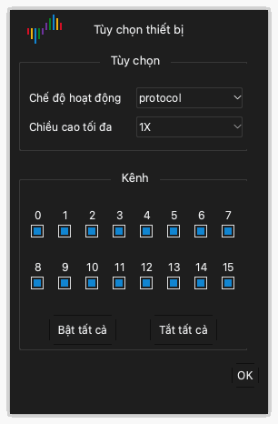

# Tùy chọn thiết bị

## Mở tùy chọn thiết bị

1. Nhấp **Tùy chọn** › **Tùy chọn thiết bị...** trên thanh công cụ. Bạn cũng có thể nhấn `O`.
2. Đổi cài đặt trong cửa sổ **Tùy chọn thiết bị**.
3. Nhấp **OK**.

Cài đặt trong cửa sổ khác nhau theo mẫu thiết bị. Chương này trình bày cài đặt của DSLogic Plus.

> [!NOTE]
> Bạn không thể đổi tùy chọn thiết bị trong khi thu.

## Chế độ hoạt động

Cài đặt **Chế độ hoạt động** chọn cách thiết bị gửi dữ liệu đến máy tính.

**Chế độ bộ đệm.** Trong lần thu, thiết bị giữ các mẫu trong bộ nhớ trong. Sau lần thu, thiết bị gửi dữ liệu đến máy tính qua USB. Bộ nhớ nhanh hơn USB. Vì vậy, chế độ bộ đệm cho tốc độ lấy mẫu cao nhất. Dung lượng bộ nhớ giới hạn độ dài lần thu. Dùng chế độ bộ đệm cho tín hiệu nhanh và lần thu ngắn.

**Chế độ luồng.** Trong lần thu, thiết bị gửi các mẫu đến máy tính. Bộ nhớ của máy tính giới hạn độ dài lần thu. Bạn có thể xem dữ liệu trong khi thu. Tốc độ kết nối USB giới hạn tốc độ lấy mẫu. Dùng chế độ luồng cho tín hiệu chậm và lần thu dài.

**Kiểm tra nội bộ.** Chế độ này chỉ dùng để kiểm tra thiết bị. Không dùng chế độ này để đo.

## Tùy chọn dừng

Cài đặt **Tùy chọn dừng** chỉ áp dụng cho chế độ bộ đệm. Cài đặt này đặt cách ứng dụng hoạt động khi bạn dừng lần thu trước khi kết thúc.

- **Dừng ngay lập tức**: Ứng dụng không lấy dữ liệu từ thiết bị. Ứng dụng không hiển thị dữ liệu.
- **Tải lên dữ liệu đã thu**: Ứng dụng lấy dữ liệu mà thiết bị đã ghi trước khi dừng. Ứng dụng hiển thị dữ liệu này.

## Mức ngưỡng

Cài đặt **Mức ngưỡng** là điện áp phân chia mức thấp và mức cao. Tín hiệu trên ngưỡng là mức cao. Tín hiệu dưới ngưỡng là mức thấp.

Bạn có thể đặt giá trị từ 0.0 V đến 5.0 V, mỗi bước 0.1 V. Đặt ngưỡng khoảng 50% điện áp logic của mạch. Với mạch 3.3 V, đặt khoảng 1.6 V.

## Đối tượng lọc

Cài đặt **Đối tượng lọc** loại bỏ các xung ngắn khỏi dữ liệu.

- **Không**: Ứng dụng hiển thị tất cả các mẫu.
- **1 chu kỳ lấy mẫu**: Ứng dụng loại bỏ mỗi xung ngắn hơn một chu kỳ lấy mẫu.

## Chiều cao tối đa

Cài đặt **Chiều cao tối đa** đặt chiều cao tối đa của mỗi hàng kênh trong vùng dạng sóng. **1X** là một đơn vị chiều cao. Dùng giá trị lớn hơn khi bạn chỉ hiển thị ít kênh.

## Bật nén RLE

Khi bạn chọn **Bật nén RLE**, thiết bị nén dữ liệu trong bộ nhớ (mã hóa độ dài loạt). Cài đặt này chỉ áp dụng cho chế độ bộ đệm. Nếu tín hiệu có ít sườn, thiết bị có thể giữ lần thu dài hơn trong bộ nhớ. Nếu tín hiệu có nhiều sườn, việc nén không làm tăng độ dài.

## Dùng xung nhịp ngoài

Khi bạn chọn **Dùng xung nhịp ngoài**, thiết bị lấy mẫu các kênh tại mỗi sườn xung nhịp trên dây CK. Thiết bị không dùng xung nhịp trong. Dùng cài đặt này để ghi một bus có tín hiệu xung nhịp.

## Dùng sườn xuống xung nhịp

Cài đặt này chỉ áp dụng cùng với **Dùng xung nhịp ngoài**. Thông thường, thiết bị lấy mẫu các kênh tại sườn lên của xung nhịp. Khi bạn chọn **Dùng sườn xuống xung nhịp**, thiết bị lấy mẫu các kênh tại sườn xuống của xung nhịp.

## Chế độ kênh

Chế độ kênh đặt số kênh mà thiết bị có thể dùng. Chế độ kênh cũng đặt tốc độ lấy mẫu tối đa. Số kênh càng ít thì tốc độ lấy mẫu tối đa càng cao. Chọn chế độ kênh phù hợp với số lượng và tần số của tín hiệu.

Với DSLogic Plus, các chế độ kênh là:

| Chế độ hoạt động | Chế độ kênh | Tốc độ lấy mẫu tối đa |
| --- | --- | --- |
| Chế độ bộ đệm | Kênh 0 đến 15 | 100 MHz |
| Chế độ bộ đệm | Kênh 0 đến 7 | 200 MHz |
| Chế độ bộ đệm | Kênh 0 đến 3 | 400 MHz |
| Chế độ luồng | 16 kênh | 20 MHz |
| Chế độ luồng | 12 kênh | 25 MHz |
| Chế độ luồng | 6 kênh | 50 MHz |
| Chế độ luồng | 3 kênh | 100 MHz |

## Bật và tắt kênh

Bên dưới các chế độ kênh, cửa sổ hiển thị một ô đánh dấu cho mỗi kênh.

1. Đánh dấu ô của mỗi kênh bạn dùng.
2. Bỏ đánh dấu ô của mỗi kênh bạn không dùng.
3. Để chọn tất cả các kênh, nhấp **Bật tất cả**. Để bỏ chọn tất cả các kênh, nhấp **Tắt tất cả**.

Ở chế độ luồng, bật ít kênh hơn có thể cho phép bạn dùng tốc độ lấy mẫu cao hơn.
